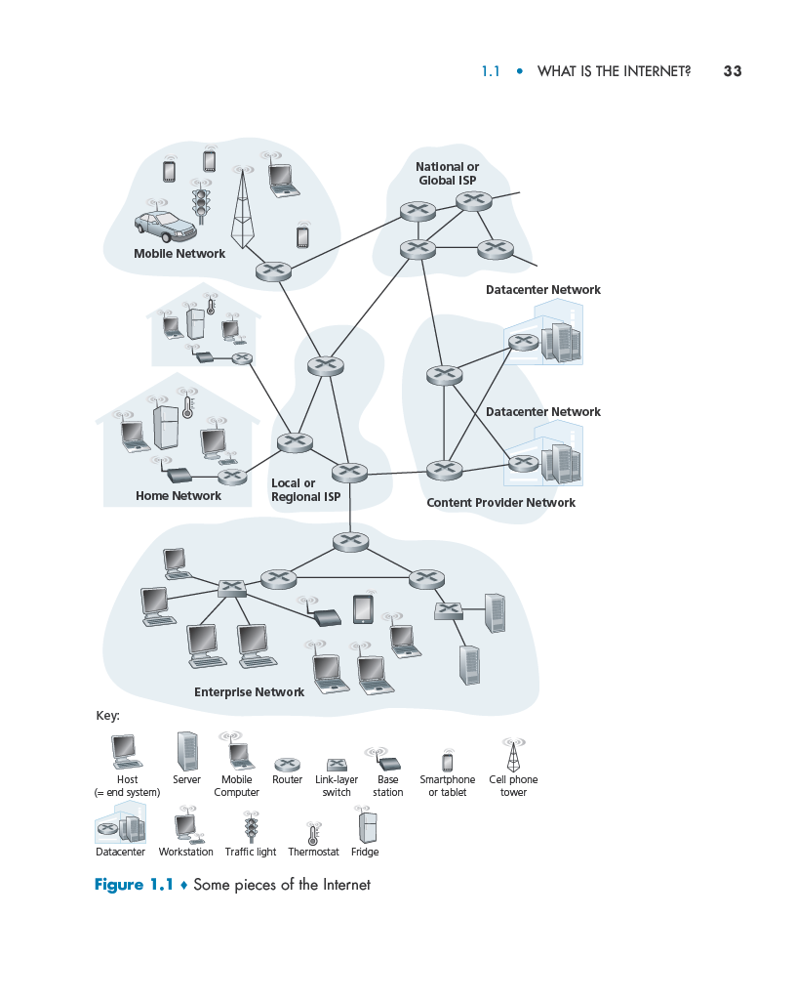

# 🌐 **A Nuts-and-Bolts Description of the Internet**

## 🖥️ **What is the Internet?**

The Internet is an expansive **computer network** that interconnects billions of devices across the globe. Initially, it primarily linked **desktop computers**, **Linux workstations**, and **servers** that hosted and transmitted data like web pages and email messages. However, in today’s world, the Internet extends its reach to:  

- **📱 Mobile Devices**: Smartphones and tablets now make up almost half of the world's Internet users. This number is projected to grow, with **75% of the global population** becoming mobile Internet users by **2025**.  
- **🌐 Internet of Things (IoT)**: A wide range of non-traditional devices are now Internet-connected, including:  
  - **Home Devices**: TVs, gaming consoles, thermostats, and refrigerators.  
  - **Wearable Tech**: Watches and smart glasses.  
  - **Transportation**: Cars and traffic control systems.  

The term "computer network" might seem outdated given the sheer variety of devices connecting to the Internet. All these devices, both traditional and non-traditional, are referred to as **hosts or end systems** in Internet jargon.  

By **2017**, there were an estimated **18 billion connected devices**, and this number is predicted to increase to **28.5 billion by 2022**.  

## 🔗 **How End Systems Connect**
End systems communicate via a **network of communication links and packet switches**. Let’s break this down:  

### 1. **Communication Links**
- **Definition**: Physical pathways that connect devices, consisting of various media types:  
  - **Copper Wire**: Traditional cables used in telephone systems.  
  - **Optical Fiber**: High-speed data transfer cables.  
  - **Radio Spectrum**: Wireless communication like WiFi and cellular networks.  

- **Transmission Speed**:  
  - Links transmit data at different speeds, measured in **bits per second (bps)**.  

### 2. **Packet Switching**
- **Process**:  
  - Data from the sending device is segmented into small units called **packets**.  
  - Each packet is assigned a **header** for identification.  
  - These packets are transmitted independently through the network and reassembled at the destination.  

- **Packet Switches**:  
  - Devices that forward packets through the network.  
  - **Two Main Types**:  
    - **Routers**: Used in the network core.  
    - **Link-Layer Switches**: Common in access networks.  

- **Path Through the Network**:  
  - The sequence of links and switches a packet traverses is called a **route** or **path**.  

## 🛣️ **Analogy: Transportation System**
Think of the Internet as a **transportation network**:  
- **Packets**: Trucks carrying cargo.  
- **Communication Links**: Highways and roads.  
- **Packet Switches**: Intersections.  
- **End Systems**: Buildings receiving or sending cargo.  

Just as trucks independently travel through roads and intersections to deliver goods, packets travel through links and switches to deliver data.  

## 🌐 **Role of Internet Service Providers (ISPs)**

### 1. **What Are ISPs?**
ISPs are organizations that provide Internet access to end systems. They offer a range of services, including:  
- **Residential Broadband**: Cable modem or DSL connections.  
- **Corporate and University Networks**: High-speed LAN access.  
- **Public WiFi**: Airports, hotels, and cafes.  
- **Cellular Networks**: Mobile data services.  

### 2. **Structure of ISPs**
- **Lower-Tier ISPs**: Provide direct access to end systems.  
- **Upper-Tier ISPs**: Interconnect lower-tier ISPs via high-speed routers and **fiber-optic links**.  

### 3. **Key Characteristics**
- Each ISP operates independently while adhering to the **IP protocol** and specific naming/address conventions.  
- All ISPs, whether lower-tier or upper-tier, must be interconnected to provide seamless global access.  

## 📜 **Protocols and Standards**

### 1. **What Are Protocols?**
Protocols are rules that govern how data is sent and received across networks. Some of the most important protocols include:  
- **TCP (Transmission Control Protocol)**: Ensures reliable data transfer.  
- **IP (Internet Protocol)**: Defines packet structures and routing.  

These protocols form the basis of the **TCP/IP stack**, the core of Internet communication.  

### 2. **Why Are Standards Important?**
To ensure devices and systems from different organizations can interoperate, protocols must follow established standards.  

- **IETF (Internet Engineering Task Force)**:  
  - Develops Internet standards through **Requests for Comments (RFCs)**.  
  - These documents define protocols like TCP, IP, HTTP (web), and SMTP (email).  
  - There are nearly **9000 RFCs** today.  

- **IEEE 802 Standards**:  
  - Define **Ethernet** and **WiFi** standards for network links.  

## 🖼️ **Visual Representation: Figure 1.1**
The uploaded **Figure 1.1** illustrates the components of the Internet, including:  
- **End Systems**: Devices like desktops, smartphones, and IoT gadgets.  
- **Networks**: Home, enterprise, mobile, and content provider networks.  
- **ISPs**: Local and global providers, interconnected for seamless communication.  
- **Core Components**: Routers, switches, and data centers.  

## 🚀 **Why It Matters**
Understanding the fundamental components, protocols, and structure of the Internet equips you to:  
- **🌟 Build Future Innovations**: Design applications that harness the Internet’s power.  
- **🔧 Troubleshoot Effectively**: Solve networking issues with a deeper understanding.  
- **📈 Explore Networking**: Lay a foundation for advanced topics in computer networks.  

