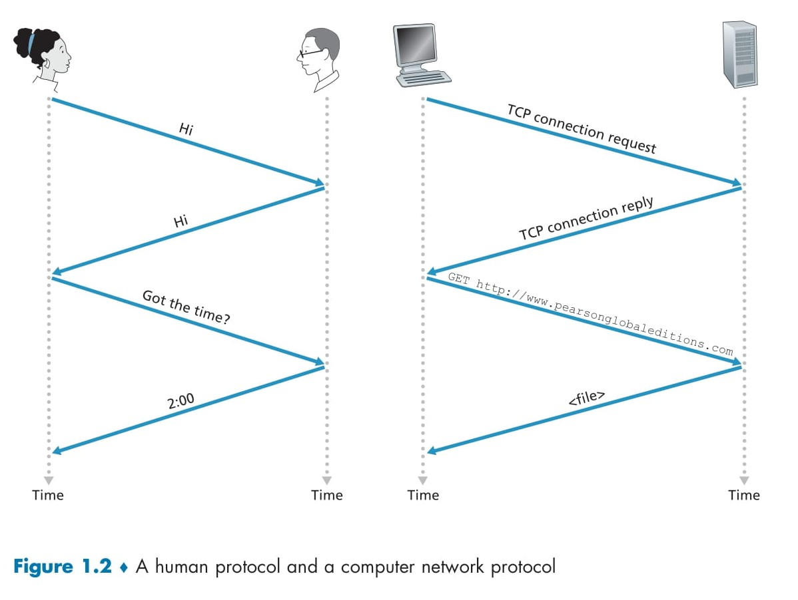

# 🌐 **What Is a Protocol?**

## 📑 **Table of Contents**
- [🌐 **What Is a Protocol?**](#-what-is-a-protocol)
  - [📑 **Table of Contents**](#-table-of-contents)
  - [🤔 **Definition of a Protocol**](#-definition-of-a-protocol)
  - [🧑‍🤝‍🧑 **Understanding Protocols Through Human Analogies**](#-understanding-protocols-through-human-analogies)
    - [🖐️ **Analogy 1: Asking for the Time**](#️-analogy-1-asking-for-the-time)
      - [Key Observations:](#key-observations)
    - [🎓 **Analogy 2: Asking a Question in Class**](#-analogy-2-asking-a-question-in-class)
      - [Key Observations:](#key-observations-1)
  - [💻 **How Does This Relate to Computer Networking?**](#-how-does-this-relate-to-computer-networking)
    - [🔑 Key Features of Networking Protocols:](#-key-features-of-networking-protocols)
  - [🖼️ **Visual Representation: Human vs. Computer Protocols**](#️-visual-representation-human-vs-computer-protocols)
  - [🚀 **Why Protocols Are Essential**](#-why-protocols-are-essential)

## 🤔 **Definition of a Protocol**
A **protocol** in computer networking is a set of rules that define how two or more entities communicate. These rules govern:  
- The **format** of messages.  
- The **order** of message exchange.  
- The **actions** taken when messages are sent, received, or events occur.

In simpler terms, a protocol ensures seamless communication between devices, much like how humans follow rules to communicate effectively.

**Figure 1.2**

## 🧑‍🤝‍🧑 **Understanding Protocols Through Human Analogies**

### 🖐️ **Analogy 1: Asking for the Time**
Imagine you want to ask someone for the time of day. The interaction involves specific steps, illustrated in **Figure 1.2 (left side)**:

1. **Greeting**:  
   - You say "Hi" to initiate communication.  
   - If the other person responds with "Hi," it indicates they’re willing to interact.  

2. **Request**:  
   - You ask, "Got the time?"  

3. **Reply**:  
   - The person responds with the time, e.g., "2:00."  

4. **Unusual Scenarios**:  
   - If the person responds rudely (e.g., "Don’t bother me!") or doesn’t reply, you stop the interaction.  
   - If there’s no response within a certain period, you give up asking.  

#### Key Observations:
- Communication involves **specific messages** (e.g., "Hi," "Got the time?").  
- Actions depend on the received reply or lack thereof.  
- Both parties must follow the **same protocol** for successful interaction.  
  - Example: If one person doesn’t understand the concept of time, the interaction fails.

### 🎓 **Analogy 2: Asking a Question in Class**
Consider a classroom scenario where you want to ask your teacher a question. This is another example of a protocol:

1. **Teacher's Broadcast**:  
   - The teacher asks, "Are there any questions?" This is a message sent to all students.  

2. **Your Response**:  
   - You raise your hand, signaling that you have a question.  

3. **Teacher’s Acknowledgment**:  
   - The teacher smiles and says, "Yes..." to encourage you to ask your question.  

4. **Your Question**:  
   - You ask the question, transmitting a message to the teacher.  

5. **Teacher’s Reply**:  
   - The teacher answers, sending a message back to you.  

#### Key Observations:
- Communication relies on **messages** (e.g., "Are there any questions?").  
- Specific actions are triggered by these messages (e.g., raising your hand, responding).  
- Successful interaction depends on all participants following the **same protocol**.

## 💻 **How Does This Relate to Computer Networking?**

Just as humans follow protocols to communicate, computers rely on networking protocols for effective interaction.  

### 🔑 Key Features of Networking Protocols:
1. **Message Exchange**:  
   - Example: A client requests a file from a server using specific messages (e.g., "GET http://...").  
2. **Defined Actions**:  
   - Specific responses are triggered by received messages (e.g., sending the requested file).  
3. **Interoperability**:  
   - Both entities (e.g., client and server) must follow the same protocol to accomplish the task.  

## 🖼️ **Visual Representation: Human vs. Computer Protocols**

Refer to **Figure 1.2** for a comparison:
1. **Human Protocol (Left Side)**:  
   - A simple interaction involving greetings, requests, and responses (e.g., "Hi," "Got the time?").  
2. **Computer Protocol (Right Side)**:  
   - A **client-server interaction** where:  
     - The client sends a **TCP connection request**.  
     - The server responds with a **TCP connection reply**.  
     - The client requests a file (e.g., "GET http://...").  
     - The server delivers the file.

Both types of protocols rely on structured message exchanges and predefined actions.

## 🚀 **Why Protocols Are Essential**
Protocols are the foundation of all communication in computer networks. Without them:  
- Devices wouldn’t understand how to communicate.  
- Tasks like browsing websites, sending emails, or streaming videos would be impossible.  

In upcoming sections, we’ll explore how specific protocols (like **TCP/IP** and **HTTP**) are designed and implemented.
