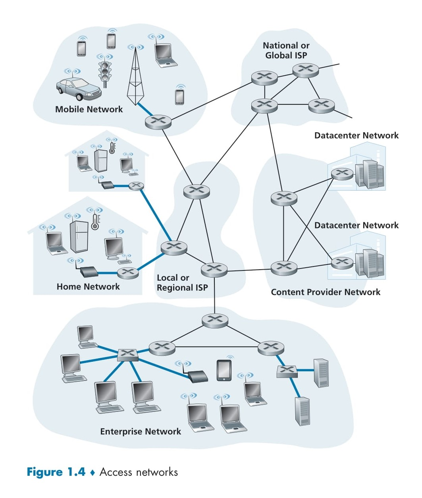

# 🌐 **Access Networks**

## 🖥️ **Introduction to Access Networks**
Access networks form the critical connection between **end systems** and the **network core**. They physically link end systems (like your computer, smartphone, or IoT device) to the **first router** on the path toward communicating with another distant end system.

  

## 📌 **Key Components of Access Networks**
### **Edge Router**:
- The **first router** in the communication path is referred to as the **edge router**.  
- It connects the access network to the **broader Internet infrastructure**.  

### **Access Network Types**:
- **Access networks** are the physical means by which an end system is connected to the Internet.  
- Examples of access networks are shown in **Figure 1.4** (thick, shaded lines).  

## 🏠 **Types of Access Networks and Their Use Cases**

### 1. **Home Networks**:
- Commonly found in residential settings.  
- Typical components:  
  - **WiFi routers** for wireless access.  
  - **Ethernet connections** for wired devices like desktop computers or smart TVs.  

### 2. **Enterprise Networks**:
- Found in businesses, schools, and other large organizations.  
- Designed for high-speed, reliable connectivity for multiple users.  
- Includes:  
  - Wired connections for desktops and servers.  
  - Wireless access for mobile devices like laptops and smartphones.  

### 3. **Mobile Networks**:
- Provide wide-area wireless connectivity for mobile devices, including smartphones, tablets, and connected vehicles.  
- Includes infrastructure like:  
  - **Cell towers**.  
  - **Base stations**.  
  - **Mobile ISPs** for global connectivity.  

## 🖼️ **Visualization of Access Networks**
Refer to **Figure 1.4** for a detailed illustration of various access networks and their connection to the broader Internet infrastructure:  

1. **Home Networks**:  
   - Connected through local or regional ISPs.  
   - Support end-user devices like PCs, smart refrigerators, and thermostats.  

2. **Enterprise Networks**:  
   - Feature high-performance switches and routers to support many users.  

3. **Mobile Networks**:  
   - Use cell towers and mobile ISPs to connect vehicles, phones, and tablets.  

4. **Datacenter Networks**:  
   - Connect large-scale computing infrastructure to deliver data to end users.  

## 🚀 **Why Access Networks Are Important**
- They are the **starting point** for all data communication from end systems.  
- They determine the **speed** and **reliability** of Internet access for users.  
- They play a crucial role in connecting diverse environments like homes, enterprises, and mobile users to the **network core**.
