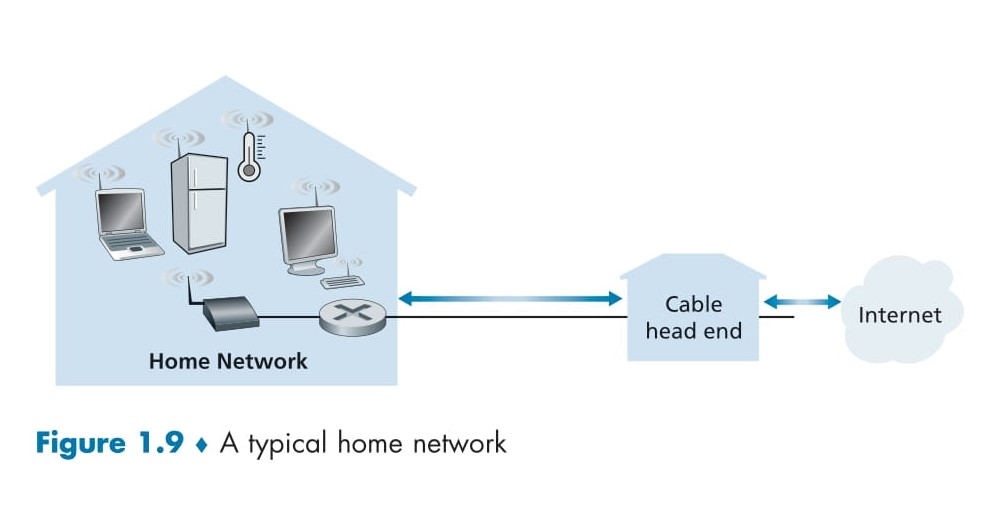

# 🌐 **Home Access Networks**

## 📑 **Table of Contents**
- [🖥️ Overview](#-overview)
- [📌 DSL Internet Access](#-dsl-internet-access)
  - [What Is DSL?](#-what-is-dsl)
  - [How DSL Works](#-how-dsl-works)
  - [Frequency Allocation in DSL](#-frequency-allocation-in-dsl)
  - [Transmission Rates](#-transmission-rates)
- [🌐 Cable Internet Access](#-cable-internet-access)
  - [How Cable Internet Works](#-how-cable-internet-works)
  - [Transmission Rates](#-transmission-rates-1)
  - [Shared Broadcast Medium](#️-shared-broadcast-medium)
- [🌐 Fiber to the Home (FTTH) and 5G Fixed Wireless](#-fiber-to-the-home-ftth-and-5g-fixed-wireless)
  - [Fiber to the Home (FTTH)](#-fiber-to-the-home-ftth)
  - [5G Fixed Wireless](#-5g-fixed-wireless)
- [🌐 Ethernet and WiFi](#-ethernet-and-wifi)
  - [Ethernet Internet Access](#-ethernet-internet-access)
  - [WiFi Internet Access](#-wifi-internet-access)
- [🌐 Wide-Area Wireless Access](#-wide-area-wireless-access)
  - [Home Networks](#-home-networks)
  - [Wide-Area Wireless Access](#-wide-area-wireless-access-1)

## 🖥️ **Overview**
By 2020, over **80% of households** in Europe and the USA had Internet access, highlighting the significance of home access networks in modern connectivity. This section focuses on how homes connect to the Internet, exploring **DSL (Digital Subscriber Line)**, one of the most widely used broadband technologies.

## 📌 **DSL Internet Access**
### 🌟 **What Is DSL?**
**DSL** enables Internet access through the same telephone line that provides local phone service. When using DSL:  
- The **telephone company (telco)** acts as both the **Internet Service Provider (ISP)** and telephone service provider.  
- A **DSL modem** at the customer’s home communicates with a **DSL Access Multiplexer (DSLAM)** at the telco’s central office (CO).  

  

### 📊 **How DSL Works**  
Refer to **Figure 1.5** for a visualization of the DSL setup:

1. **Customer Side (Home)**:  
   - The home’s **DSL modem** converts **digital data** into **high-frequency tones** for transmission over telephone wires.  
   - A **splitter** separates telephone and Internet signals, ensuring simultaneous phone and Internet usage.  

2. **Telco Side (Central Office)**:  
   - At the **CO**, the **DSLAM** translates the analog signals back into digital format.  
   - The data is then forwarded to the **Internet**, while phone signals are directed to the **telephone network**.  
   - Hundreds or thousands of homes connect to a single DSLAM.

### 🔧 **Frequency Allocation in DSL**
The residential telephone line supports **three distinct frequency bands** for simultaneous phone and Internet usage:
1. **0–4 kHz**: Two-way telephone communication.  
2. **4–50 kHz**: Upstream data transmission (from home to CO).  
3. **50 kHz–1 MHz**: Downstream data transmission (from CO to home).  

This technique, called **frequency-division multiplexing**, allows the DSL link to behave as if it were three separate links.

### 🚀 **Transmission Rates**
DSL standards support a range of transmission rates:  
- **Downstream**:  
  - Speeds of **24 Mbps** to **52 Mbps**.  
  - The latest standards allow downstream rates up to **1 Gbps**.  
- **Upstream**:  
  - Speeds of **3.5 Mbps** to **16 Mbps**.  

#### **Asymmetric Access**:
- **Downstream rates** are typically higher than **upstream rates**, making DSL an **asymmetric technology**.  

#### **Limitations**:
- The actual transmission rates may vary based on:  
  - **Distance**: DSL is designed for homes within **5 to 10 miles** of the central office.  
  - **Line Quality**: The gauge of the twisted-pair line and electrical interference can affect speeds.  
  - **Tiered Services**: Providers may cap speeds based on the subscribed service tier.  

## 🖼️ **Visualization**
Refer to **Figure 1.5** for the DSL architecture:  
1. **Home Setup**: Includes a **DSL modem** and **splitter** for separating Internet and telephone signals.  
2. **Central Office**: Features the **DSLAM**, which manages data and telephone signal separation.  
3. **Data Flow**: Internet data is routed to the Internet, while telephone signals are sent to the telephone network.

## 🚀 **Why DSL Matters**
DSL is one of the most accessible broadband technologies, providing simultaneous telephone and Internet services to millions of homes. Its widespread use and evolving standards have made it a cornerstone of home connectivity.

---

# 🌐 **Cable Internet Access**

## 🖥️ **Overview**
**Cable Internet access** is another widely used broadband technology. Unlike DSL, which uses the telephone infrastructure, cable Internet leverages the **cable television company's existing infrastructure**.  

A residence obtains cable Internet from the same company that provides its cable TV service. This setup is commonly referred to as **Hybrid Fiber Coax (HFC)** due to its combination of **fiber-optic** and **coaxial cable** connections.

  

## 📌 **How Cable Internet Works**

Refer to **Figure 1.6** for a visual representation of the cable Internet infrastructure.

### 🧩 **Components and Architecture**
1. **Fiber Cable**:  
   - Connects the **cable head end** to neighborhood-level junctions, known as **fiber nodes**.  

2. **Coaxial Cable**:  
   - Extends from the fiber nodes to individual homes or apartments.  
   - A single node typically supports **500 to 5,000 homes**.

3. **Cable Modem Termination System (CMTS)**:  
   - Located at the **cable head end**.  
   - Converts analog signals from downstream cable modems back into digital data for transmission over the Internet.

4. **Cable Modem**:  
   - A specialized modem located in homes that connects to the **home PC** via an Ethernet port.  

### 🔧 **Data Flow in Cable Internet**
1. **Downstream Channel**:  
   - Transfers data from the Internet to homes.  
   - Typically allocated a higher transmission rate than the upstream channel.  

2. **Upstream Channel**:  
   - Transfers data from homes to the Internet.  

## 📊 **Transmission Rates**

Cable Internet is generally **asymmetric**, with higher downstream rates than upstream rates. Standards such as **DOCSIS (Data Over Cable Service Interface Specification)** define the achievable speeds:

1. **DOCSIS 2.0**:  
   - Downstream: **40 Mbps**.  
   - Upstream: **30 Mbps**.  

2. **DOCSIS 3.0**:  
   - Downstream: Up to **1.2 Gbps**.  
   - Upstream: Up to **100 Mbps**.  

However, the **actual achievable rates** may be lower due to:  
- Contracted data rate limitations.  
- Signal impairments in the media.  

## 🛠️ **Shared Broadcast Medium**
One defining characteristic of cable Internet is that it operates as a **shared broadcast medium**:  

1. **Downstream Communication**:  
   - Every packet sent by the cable head end is broadcast to **all homes** on the network.  
   - If multiple users are downloading simultaneously, the **effective rate per user** decreases.  

2. **Upstream Communication**:  
   - Every packet sent by a home is sent upstream to the head end.  
   - A **distributed multiple access protocol** is required to manage transmissions and prevent collisions (discussed further in Chapter 6).

## 🖼️ **Visualization: Hybrid Fiber-Coaxial Network**
Refer to **Figure 1.6** for a detailed architecture:  
- **Fiber Nodes**: Interconnect neighborhoods via fiber-optic cables.  
- **Coaxial Cables**: Extend the network to individual homes.  
- **Cable Head End**: Manages data transmission and communication with the Internet.

## 🚀 **Advantages of Cable Internet**
1. **High Speeds**:  
   - Supports gigabit speeds with newer DOCSIS standards.  
2. **Existing Infrastructure**:  
   - Utilizes pre-existing cable TV infrastructure, reducing installation costs.  

## ⚠️ **Limitations**
1. **Shared Bandwidth**:  
   - Users share the same broadcast medium, resulting in reduced speeds during peak usage times.  

2. **Collision Management**:  
   - Requires protocols to avoid upstream data collisions due to shared access.  

## 🌟 **Conclusion**
Cable Internet access is a robust broadband solution leveraging hybrid fiber-coaxial technology. While its shared nature can lead to performance bottlenecks, its high speeds and widespread adoption make it a key player in residential broadband connectivity.

---

# 🌐 **Fiber to the Home (FTTH) and 5G Fixed Wireless**

## 🖥️ **Introduction**
While **DSL** and **cable networks** dominate residential broadband in the United States, **Fiber to the Home (FTTH)** is an emerging technology offering significantly higher speeds. Additionally, **5G Fixed Wireless** is becoming a promising alternative for high-speed residential access, eliminating the need for physical cabling.

  

## 📌 **Fiber to the Home (FTTH)**

### 🌟 **What Is FTTH?**
FTTH provides a **dedicated optical fiber connection** from the **Central Office (CO)** directly to individual homes. This technology enables **Internet access speeds in the gigabits per second range**, far surpassing DSL and cable.

### 🧩 **FTTH Architecture**
Refer to **Figure 1.7** for a visualization of FTTH using the **Passive Optical Network (PON)** architecture.

1. **Optical Network Terminator (ONT)**:  
   - Located at the customer’s home.  
   - Connects to an **optical splitter** through a dedicated optical fiber.  

2. **Optical Splitter**:  
   - Combines signals from multiple homes (typically fewer than 100) onto a **single shared optical fiber**.  

3. **Optical Line Terminator (OLT)**:  
   - Located at the **telco’s Central Office (CO)**.  
   - Provides **conversion** between optical and electrical signals.  
   - Connects to the **Internet** through a telco router.  

4. **Home Router**:  
   - At home, users connect a **wireless router** to the ONT for Internet access.  

### 🔧 **Key FTTH Technologies**
1. **Direct Fiber**:  
   - Each home has its own **dedicated optical fiber** from the CO.  

2. **Passive Optical Network (PON)**:  
   - Shared optical fiber architecture (as described above).  
   - Used in services like **Verizon FiOS**.  

3. **Active Optical Network (AON)**:  
   - Uses **switched Ethernet**, discussed further in Chapter 6.

### 🚀 **Advantages of FTTH**
1. **High Speeds**:  
   - Supports gigabit-level Internet access, ideal for data-heavy applications like streaming and cloud computing.  

2. **Scalability**:  
   - Optical fiber infrastructure can handle increasing bandwidth demands.  

3. **Reliability**:  
   - Less prone to interference compared to traditional copper or coaxial cable networks.  

### ⚠️ **Limitations of FTTH**
1. **High Deployment Costs**:  
   - Installing fiber directly to homes requires significant investment.  

2. **Limited Availability**:  
   - FTTH is still being rolled out and is not yet widely available in all areas.

## 📌 **5G Fixed Wireless**

### 🌟 **What Is 5G Fixed Wireless?**
5G Fixed Wireless provides high-speed Internet access **without the need for cabling** between the CO and the home. It uses **beam-forming technology** to send data wirelessly from a provider’s **base station** to a **home modem**.

### 🧩 **5G Fixed Wireless Architecture**
1. **Base Station**:  
   - Sends data wirelessly to homes using 5G beam-forming technology.  

2. **Home Modem**:  
   - Receives the 5G signal and connects to a **WiFi wireless router** (sometimes bundled together).  

### 🚀 **Advantages of 5G Fixed Wireless**
1. **Cost-Effective**:  
   - Eliminates the need for costly cabling infrastructure.  

2. **Ease of Deployment**:  
   - Faster rollout compared to FTTH.  

3. **High Speeds**:  
   - Comparable to FTTH in terms of performance.  

### ⚠️ **Limitations of 5G Fixed Wireless**
1. **Line-of-Sight Requirement**:  
   - Performance can be affected by obstacles between the base station and the home.  

2. **Coverage**:  
   - Deployment is currently limited to urban and suburban areas.  

## 🖼️ **Visualization**
Refer to **Figure 1.7** for the FTTH PON setup:  
- Optical fibers connect the **CO** to homes via **splitters** and **ONTs**.  
- The OLT at the CO facilitates the conversion of optical signals to digital data.  

## 🌟 **Conclusion**
FTTH and 5G Fixed Wireless are paving the way for the next generation of high-speed residential broadband. While FTTH offers unparalleled speeds and reliability, 5G Fixed Wireless provides a cost-effective and flexible alternative. Both technologies are vital in meeting the growing demand for bandwidth-intensive applications.

---

# 🌐 **Ethernet and WiFi**

## 🖥️ **Introduction**
In **corporate**, **university campuses**, and increasingly in **homes**, **Local Area Networks (LANs)** are used to connect end systems to the **edge router**. Among LAN technologies, **Ethernet** is the most widely used in these environments, providing fast, reliable connectivity. Meanwhile, **WiFi** has become the dominant wireless access technology, offering flexibility and mobility for end systems.

## 📌 **Ethernet Internet Access**

### 🌟 **What Is Ethernet?**
Ethernet is a wired LAN technology that connects end systems to an **Ethernet switch** using **twisted-pair copper wires**. These switches connect to the broader Internet infrastructure.

  

### 🧩 **How Ethernet Works**
Refer to **Figure 1.8** for the Ethernet Internet access architecture:  

1. **End Systems**:  
   - Devices such as desktop PCs, laptops, and servers connect to the network via Ethernet cables.  

2. **Ethernet Switch**:  
   - Acts as a hub to connect multiple devices within the LAN.  
   - Switches may be interconnected to form a larger network.  

3. **Institutional Router**:  
   - Connects the Ethernet LAN to the **institution's ISP** and ultimately to the Internet.

### 🔧 **Ethernet Speeds**
- **User Devices**: Typically connect to the Ethernet switch at speeds ranging from **100 Mbps** to **10 Gbps**.  
- **Servers**: Often connect at higher speeds, such as **1 Gbps** or **10 Gbps**, to handle large amounts of data traffic.  

## 📌 **WiFi Internet Access**

### 🌟 **What Is WiFi?**
WiFi, based on **IEEE 802.11 technology**, is a wireless LAN access technology widely used in homes, offices, universities, cafes, and even airplanes.  

### 🧩 **How WiFi Works**
1. **Wireless Devices**:  
   - Devices like laptops, smartphones, and tablets connect wirelessly to an **access point (AP)**.  

2. **Access Point (AP)**:  
   - Acts as a bridge between wireless devices and the Ethernet-based wired network.  
   - APs are connected to the enterprise network using Ethernet cables.  

3. **Enterprise Network**:  
   - The AP transmits/receives packets to/from wireless devices and forwards them through the enterprise network to the Internet.

### 🔧 **WiFi Characteristics**
- **Range**: Typically supports devices within **tens of meters** from the AP.  
- **Speeds**: Modern WiFi networks offer shared transmission rates exceeding **100 Mbps**.

## 🖼️ **Visualization: Ethernet and WiFi Access**
Refer to **Figure 1.8** for Ethernet architecture:  
- **Devices** connect to an **Ethernet switch** at high speeds (e.g., 1 Gbps).  
- The switch forwards data to the **institutional router**, which connects to the **institution’s ISP** and the Internet.

For WiFi access:
- Wireless devices connect to an **access point**.  
- The AP interfaces with the **Ethernet LAN**, providing wireless users access to the Internet.

## 🚀 **Advantages of Ethernet and WiFi**

### **Ethernet**:
1. **High Speeds**:  
   - Provides stable and fast connections, ideal for data-intensive tasks.  

2. **Reliability**:  
   - Less prone to interference compared to wireless technologies.  

3. **Scalability**:  
   - Supports large numbers of devices within an enterprise network.  

### **WiFi**:
1. **Mobility**:  
   - Allows users to connect from any location within the network's range.  

2. **Ease of Deployment**:  
   - Requires minimal infrastructure for adding new devices.  

3. **Ubiquity**:  
   - WiFi is available in nearly all public and private spaces.  

## ⚠️ **Limitations**

### **Ethernet**:
1. **Limited Mobility**:  
   - Devices must be physically connected to the network via cables.  

2. **Deployment Costs**:  
   - Requires structured cabling, which may not be feasible in some environments.  

### **WiFi**:
1. **Interference**:  
   - Prone to signal degradation due to obstacles or overlapping frequencies.  

2. **Shared Medium**:  
   - Transmission rates are shared among connected devices, reducing individual performance during heavy usage.  

## 🌟 **Conclusion**
**Ethernet** and **WiFi** play complementary roles in enterprise and home networks. Ethernet offers high-speed, reliable wired connectivity for stationary devices, while WiFi provides the flexibility and mobility needed for modern wireless devices. Together, they form the backbone of Internet access in most settings.

---

# 🌐 **Wide-Area Wireless Access**

## 🖥️ **Introduction**
Modern homes integrate technologies like **Ethernet** and **WiFi**, initially designed for enterprises, into powerful **home networks**. These networks combine **broadband residential access** (e.g., DSL or cable modems) with **wireless LAN technologies**, allowing seamless Internet connectivity for multiple devices.

In addition, **wide-area wireless access technologies** like **3G**, **4G LTE**, and **5G** enable mobile users to connect to the Internet from virtually anywhere.

## 📌 **Home Networks**

### 🌟 **What Is a Home Network?**
A **home network** combines wired and wireless technologies to connect multiple devices within a household to the Internet.  

### 🧩 **Components of a Home Network**
Refer to **Figure 1.9** for a visual representation of a typical home network.

1. **Wired and Wireless Devices**:  
   - **Laptops, PCs, and smart appliances** connect to the home network via WiFi or Ethernet cables.  

2. **Wireless Access Point (Base Station)**:  
   - Enables wireless communication with laptops and other mobile devices.  

3. **Home Router**:  
   - Connects the access point and wired devices to the Internet through a **cable modem** or **DSL**.  

4. **Broadband Residential Access**:  
   - Provides high-speed Internet connectivity using technologies like DSL, cable, or fiber.  

### 🔧 **Key Features of a Home Network**
1. **Roaming**:  
   - Users can move from the kitchen to the backyard while staying connected to the Internet through WiFi.  

2. **Multiple Devices**:  
   - Supports a wide range of devices, including smart appliances, thermostats, and wired PCs.  

## 📌 **Wide-Area Wireless Access**

### 🌟 **What Is Wide-Area Wireless Access?**
Wide-area wireless access technologies enable **mobile devices** like smartphones and tablets to connect to the Internet from anywhere within the provider's network coverage. Unlike WiFi, these technologies cover larger areas, requiring users to be within a few tens of kilometers of a base station.

### 🧩 **Key Technologies**
1. **3G Networks**:  
   - Early-generation cellular networks offering basic mobile Internet services.  

2. **4G LTE (Long-Term Evolution)**:  
   - Provides download speeds of up to **60 Mbps**, supporting activities like streaming, mobile payments, and social networking.  

3. **5G Networks**:  
   - The next generation of wireless technology, offering even higher speeds and lower latency.  
   - Supports emerging applications like augmented reality (AR) and IoT.  

### 🔧 **How Wide-Area Wireless Works**
1. **Base Station**:  
   - Operated by the cellular network provider.  
   - Receives and transmits data packets to and from mobile devices.  

2. **Coverage Area**:  
   - Supports a range of **tens of kilometers**, making it suitable for mobile users on the go.  

  

## 🖼️ **Visualization**
Refer to **Figure 1.9** for a typical home network setup:  
- **Wireless Access Point** connects mobile devices to the Internet.  
- **Home Router** links wired and wireless devices to the Internet through a broadband connection.  

Wide-area wireless access uses base stations to connect mobile devices like smartphones to the Internet over larger distances.

## 🚀 **Advantages of Home Networks and Wide-Area Wireless Access**

### **Home Networks**:
1. **Convenience**:  
   - Combine wired and wireless connectivity for flexible access.  
2. **Device Support**:  
   - Accommodates a wide variety of devices, including smart appliances.  
3. **High Speeds**:  
   - Leverages broadband technologies like DSL and cable.  

### **Wide-Area Wireless**:
1. **Mobility**:  
   - Enables Internet access while on the move.  
2. **Wide Coverage**:  
   - Operates over distances much larger than WiFi.  
3. **High-Speed Connectivity**:  
   - Advanced networks like 5G support gigabit-level speeds.  

## ⚠️ **Limitations**

### **Home Networks**:
1. **Signal Interference**:  
   - WiFi signals can degrade due to walls or other obstacles.  
2. **Shared Bandwidth**:  
   - Multiple users may reduce individual speeds.  

### **Wide-Area Wireless**:
1. **Coverage Gaps**:  
   - Network performance may vary in rural or remote areas.  
2. **Cost**:  
   - Data plans for wide-area wireless access can be expensive.  

## 🌟 **Conclusion**
**Home networks** offer a flexible, high-speed solution for connecting multiple devices to the Internet, while **wide-area wireless technologies** enable mobility and connectivity on the go. Together, these technologies ensure seamless Internet access for both stationary and mobile users.
