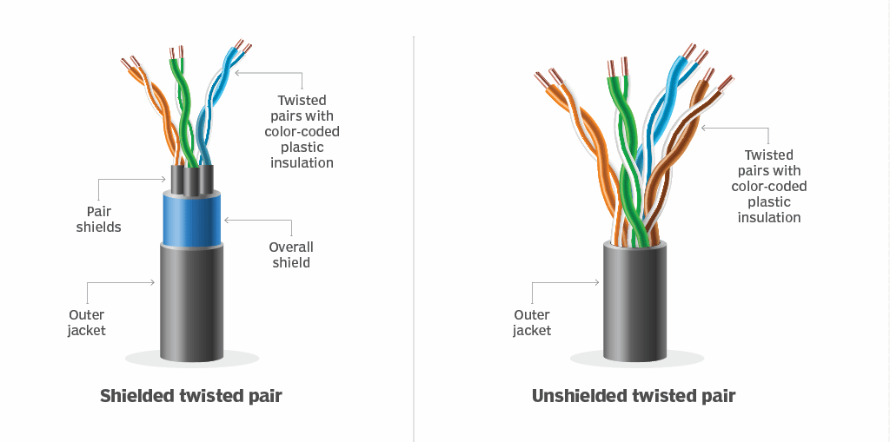

# 🌐 **Twisted-Pair Copper Wire**

## 🖥️ **Introduction**
**Twisted-pair copper wire** is the most inexpensive and widely used **guided transmission medium**. For over a century, it has been the backbone of telephone networks, connecting telephones to local telephone switches. Despite the emergence of advanced technologies like **fiber optics**, twisted-pair copper wire continues to dominate **high-speed LAN networking** due to its reliability, cost-effectiveness, and technological advancements.

## 📌 **What Is Twisted-Pair Copper Wire?**

### 🌟 **Structure**:
1. **Composition**:  
   - Two **insulated copper wires**, each about **1 mm thick**.  
   - Wires are twisted into a **spiral pattern** to minimize electrical interference.  

2. **Bundling**:  
   - Multiple twisted pairs are grouped together in a cable and covered with a **protective shield**.  

3. **Communication Link**:  
   - A single twisted pair forms one **communication link**.  

## 📊 **Types of Twisted-Pair Copper Wire**

### 1. **Unshielded Twisted Pair (UTP)**:
- Commonly used in **LANs (Local Area Networks)** within buildings.  
- Example: Ethernet networks.  

## 🔧 **Data Rates**
- Twisted pair supports data rates ranging from **10 Mbps** to **10 Gbps**.  
- The achievable speed depends on:  
  - **Wire thickness**.  
  - **Distance** between the transmitter and receiver.  

  

## 🧩 **Applications of Twisted-Pair Copper Wire**

### 1. **LANs**:
- UTP is the **dominant solution** for high-speed LANs.  
- Modern twisted-pair cables, such as **Category 6a**, can achieve speeds of **10 Gbps** for distances up to **100 meters**.  

### 2. **Residential Internet Access**:
- **Dial-Up Modem Technology**:  
  - Provides Internet access at speeds up to **56 kbps** over twisted pair.  

- **DSL (Digital Subscriber Line)**:  
  - Enables Internet speeds of **tens of Mbps** for users close to the ISP’s central office.  

## 📖 **Historical Context**

### 🌟 **Twisted Pair vs. Fiber Optics**:
- When **fiber-optic technology** emerged in the 1980s, it was predicted that twisted pair would become obsolete due to its **lower bit rates**.  
- However, twisted pair evolved with advanced technologies like **Category 6a cables**, enabling it to achieve competitive speeds.  

### **Outcome**:  
Twisted-pair copper wire remains a **cost-effective** and **dominant solution** for high-speed LANs and residential Internet access.

## 🖼️ **Visualization**

| **Type**            | **Data Rates**     | **Distance**            | **Application**                          |
|----------------------|--------------------|-------------------------|------------------------------------------|
| Dial-Up (Legacy)     | Up to 56 kbps     | Long (residential lines)| Residential Internet access.             |
| DSL                  | Tens of Mbps      | Short (to ISP CO)       | Residential broadband Internet.          |
| LAN (Category 6a)    | Up to 10 Gbps     | 100 meters              | High-speed enterprise/local networking.  |

---

## 🚀 **Advantages of Twisted-Pair Copper Wire**
1. **Cost-Effective**:  
   - The least expensive guided transmission medium.  

2. **Widespread Use**:  
   - Backbone of telephone networks and LANs.  

3. **Flexible**:  
   - Supports a range of data rates and applications.  

4. **Improved Performance**:  
   - Advanced technologies like **Category 6a** cables provide competitive speeds for modern networks.  

## ⚠️ **Limitations**
1. **Interference**:  
   - Prone to electrical interference without proper shielding.  

2. **Distance Constraints**:  
   - Performance decreases as the distance between transmitter and receiver increases.  

3. **Speed Limitations**:  
   - Cannot match the performance of fiber-optic cables for long distances or extremely high speeds.  

## 🌟 **Conclusion**
Despite technological advancements like **fiber optics**, **twisted-pair copper wire** continues to thrive as a reliable and cost-effective solution for **LANs** and **residential Internet access**. Its adaptability, coupled with advances in cable technology, ensures its relevance in modern networking.

