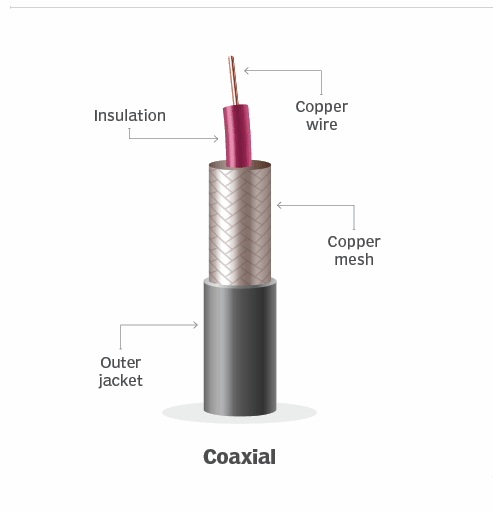

# 🌐 **Coaxial Cable**

## 📑 **Table of Contents**
- [🌐 **Coaxial Cable**](#-coaxial-cable)
  - [📑 **Table of Contents**](#-table-of-contents)
  - [🖥️ **Introduction**](#️-introduction)
  - [📌 **What Is Coaxial Cable?**](#-what-is-coaxial-cable)
    - [🌟 **Structure**:](#-structure)
  - [📊 **Characteristics of Coaxial Cable**](#-characteristics-of-coaxial-cable)
    - [1. **High Data Transmission Rates**:](#1-high-data-transmission-rates)
    - [2. **Shared Medium**:](#2-shared-medium)
  - [🧩 **Applications of Coaxial Cable**](#-applications-of-coaxial-cable)
    - [1. **Cable Television Systems**:](#1-cable-television-systems)
    - [2. **Cable Internet Access**:](#2-cable-internet-access)
    - [3. **Shared Communication**:](#3-shared-communication)
  - [📖 **How Coaxial Cable Works**](#-how-coaxial-cable-works)
  - [🖼️ **Visualization**](#️-visualization)
  - [🚀 **Advantages of Coaxial Cable**](#-advantages-of-coaxial-cable)
  - [⚠️ **Limitations**](#️-limitations)
  - [🌟 **Conclusion**](#-conclusion)

## 🖥️ **Introduction**
**Coaxial cable** is a widely used **guided transmission medium** that consists of **two concentric copper conductors**, unlike the parallel arrangement in twisted-pair cables. Its unique design, combined with **special insulation and shielding**, allows for **high data transmission rates**. Coaxial cable is commonly utilized in **cable television systems** and **residential Internet access**.

## 📌 **What Is Coaxial Cable?**

### 🌟 **Structure**:
1. **Concentric Conductors**:  
   - Coaxial cable features **two copper conductors**:  
     - An **inner conductor** carries the signal.  
     - An **outer conductor**, or shield, provides insulation and protects against interference.  

2. **Insulation and Shielding**:  
   - The conductors are separated by a **dielectric insulator** and encased in a protective outer jacket, minimizing signal loss and external interference.

  

## 📊 **Characteristics of Coaxial Cable**

### 1. **High Data Transmission Rates**:
- Coaxial cable can support data rates in the range of **hundreds of Mbps**, making it suitable for modern Internet access.  

### 2. **Shared Medium**:
- Coaxial cable can act as a **shared guided medium**, allowing multiple end systems to connect directly and share the same transmission line.  
- Each end system can **send and receive signals**, and all connected systems can receive the transmitted data.

## 🧩 **Applications of Coaxial Cable**

### 1. **Cable Television Systems**:
- Coaxial cable is the primary medium for **cable TV systems**, transmitting analog or digital signals over specific frequency bands.  

### 2. **Cable Internet Access**:
- Coupled with **cable modems**, coaxial cables provide **broadband Internet access** to residential users.  
- Speeds typically range from **hundreds of Mbps** to even higher with newer technologies.  

### 3. **Shared Communication**:
- Enables multiple devices to communicate by connecting directly to the same cable.

## 📖 **How Coaxial Cable Works**

1. **Signal Transmission**:
   - Digital signals are converted to analog signals and transmitted over the cable.  
   - The **transmitter** shifts the signal to a specific **frequency band** for efficient delivery.  

2. **Reception**:
   - The analog signal is received by one or more receivers connected to the cable.  

3. **Shared Access**:
   - Multiple end systems can send and receive data over the same coaxial cable.

## 🖼️ **Visualization**

| **Feature**              | **Description**                                     |
|---------------------------|-----------------------------------------------------|
| **Structure**             | Two concentric copper conductors with shielding.    |
| **Data Transmission**     | High speeds (hundreds of Mbps).                     |
| **Applications**          | Cable TV, broadband Internet, shared communication. |

---

## 🚀 **Advantages of Coaxial Cable**

1. **High Speed**:  
   - Supports fast data rates, ideal for broadband Internet and cable TV.  

2. **Interference Protection**:  
   - Shielding minimizes signal loss and protects against electromagnetic interference.  

3. **Shared Medium**:  
   - Multiple systems can share the same cable, reducing installation complexity.  

## ⚠️ **Limitations**

1. **Shared Bandwidth**:  
   - Performance may decrease if too many devices are connected to the same cable.  

2. **Bulkiness**:  
   - Coaxial cables are thicker and less flexible compared to twisted-pair cables.  

3. **Installation Costs**:  
   - More expensive to install than twisted-pair cables due to shielding and structure.  

## 🌟 **Conclusion**
**Coaxial cable** remains a reliable and efficient medium for applications like **cable TV** and **Internet access**, offering **high speeds** and **interference protection**. Its ability to act as a **shared medium** makes it versatile for various networking scenarios. While more advanced technologies like **fiber optics** offer greater performance, coaxial cable continues to serve as a critical component in modern networking infrastructure.

