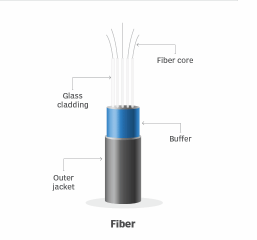

# 🌐 **Fiber Optics**
## 📑 **Table of Contents**
- [🌐 **Fiber Optics**](#-fiber-optics)
  - [📑 **Table of Contents**](#-table-of-contents)
  - [🖥️ **Introduction**](#️-introduction)
  - [📌 **What Are Fiber Optics?**](#-what-are-fiber-optics)
    - [🌟 **Definition**:](#-definition)
    - [🧩 **Key Features**:](#-key-features)
  - [📊 **Characteristics of Fiber Optics**](#-characteristics-of-fiber-optics)
  - [🧩 **Applications of Fiber Optics**](#-applications-of-fiber-optics)
    - [1. **Long-Haul Communication**:](#1-long-haul-communication)
    - [2. **Internet Backbone**:](#2-internet-backbone)
    - [3. **High-Speed Standards (Optical Carrier)**:](#3-high-speed-standards-optical-carrier)
    - [4. **Limited Short-Haul Use**:](#4-limited-short-haul-use)
  - [🔧 **Advantages of Fiber Optics**](#-advantages-of-fiber-optics)
  - [⚠️ **Limitations of Fiber Optics**](#️-limitations-of-fiber-optics)
  - [🖼️ **Visualization: Fiber Optic Standards**](#️-visualization-fiber-optic-standards)
  - [🚀 **Conclusion**](#-conclusion)

## 🖥️ **Introduction**
**Fiber-optic cables** are thin, flexible mediums that transmit data using **pulses of light**, where each pulse represents a **bit** of information. With their exceptional speed, immunity to interference, and long-distance reliability, fiber optics have become the **preferred transmission medium** for **long-haul communication** and **Internet backbones**.

## 📌 **What Are Fiber Optics?**

### 🌟 **Definition**:
Fiber optics are **guided transmission mediums** made of thin, flexible glass or plastic strands that transmit data as **light pulses**.  

  

### 🧩 **Key Features**:
1. **Data Transmission**:  
   - Each light pulse represents a **bit** of information.  

2. **High-Speed Capabilities**:  
   - Fiber optics support speeds up to **hundreds of gigabits per second**, making them ideal for high-demand applications.  

3. **Long-Distance Efficiency**:  
   - Minimal signal attenuation over distances of up to **100 kilometers** without requiring signal repeaters.  

## 📊 **Characteristics of Fiber Optics**

| **Feature**                        | **Description**                                           |
|------------------------------------|-----------------------------------------------------------|
| **High Data Rates**                | Supports speeds up to **hundreds of Gbps**.               |
| **Immunity to Interference**       | Immune to **electromagnetic interference**.               |
| **Low Signal Attenuation**         | Can transmit signals over **long distances**.             |
| **Security**                       | Difficult to **tap**, enhancing data privacy.             |

---

## 🧩 **Applications of Fiber Optics**

### 1. **Long-Haul Communication**:
- Fiber optics are the **preferred medium** for **long-distance telephone networks** and **overseas communication links**.  

### 2. **Internet Backbone**:
- The **core infrastructure** of the Internet relies on fiber optics due to their **high-speed and long-distance capabilities**.  

### 3. **High-Speed Standards (Optical Carrier)**:
- Fiber-optic links use the **OC (Optical Carrier)** standard for high-speed data transmission.  
- **OC-n Speeds**:
  - OC-1: **51.8 Mbps**.  
  - OC-3: **155.5 Mbps**.  
  - OC-12: **622 Mbps**.  
  - OC-48: **2.5 Gbps**.  
  - OC-192: **9.6 Gbps**.  
  - OC-768: **39.8 Gbps**.  

### 4. **Limited Short-Haul Use**:
- Due to high costs, fiber optics are less common for **LANs** or **residential access networks**, where twisted-pair copper or coaxial cables are often used instead.  

## 🔧 **Advantages of Fiber Optics**

1. **High Data Rates**:  
   - Can handle tremendous amounts of data, supporting high-bandwidth applications.  

2. **Low Interference**:  
   - Immune to electromagnetic interference, ensuring reliable data transmission.  

3. **Long-Distance Performance**:  
   - Maintains signal quality over large distances without significant attenuation.  

4. **Secure Communication**:  
   - Hard to tap, making it suitable for sensitive data transmission.  

## ⚠️ **Limitations of Fiber Optics**

1. **High Cost**:  
   - **Optical devices** (transmitters, receivers, and switches) are expensive, making fiber optics costly for **short-haul applications** like LANs.  

2. **Fragility**:  
   - Optical fibers are more delicate compared to copper cables.  

3. **Specialized Installation**:  
   - Requires skilled labor for deployment and maintenance.  

## 🖼️ **Visualization: Fiber Optic Standards**

| **Standard**       | **Speed**              |
|---------------------|------------------------|
| **OC-1**           | 51.8 Mbps             |
| **OC-3**           | 155.5 Mbps           |
| **OC-12**          | 622 Mbps             |
| **OC-48**          | 2.5 Gbps             |
| **OC-192**         | 9.6 Gbps             |
| **OC-768**         | 39.8 Gbps            |

## 🚀 **Conclusion**
**Fiber-optic cables** have revolutionized the world of networking with their **high-speed transmission**, **low interference**, and **long-distance reliability**. While their high cost limits their use in short-haul applications like LANs, they remain the backbone of **long-haul communication** and **Internet infrastructure**.

In the next sections, we’ll explore other guided and unguided transmission media, such as **radio waves** and **satellite communication**.
