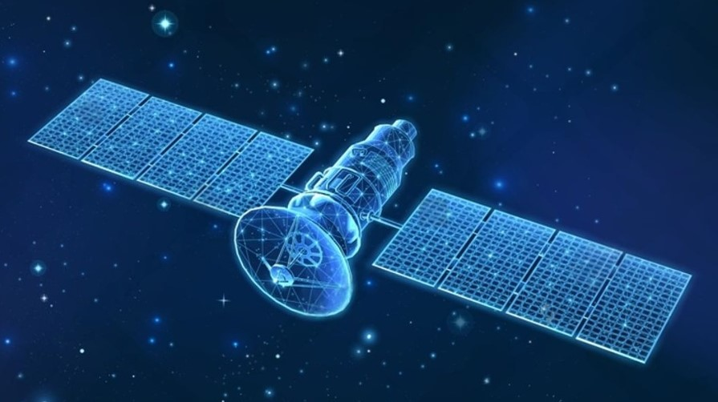

# **🌟 Unguided Transmission Media 🌟**

# 🌐 **Terrestrial Radio Channels**

## 🖥️ **Introduction**
**Terrestrial radio channels** are a type of **unguided transmission medium** that use the **electromagnetic spectrum** to carry signals. Unlike guided media like fiber optics or twisted-pair copper, radio channels do not require physical wires. This makes them a popular choice for applications requiring mobility, wall penetration, and long-distance communication.

  

## 📌 **What Are Terrestrial Radio Channels?**

### 🌟 **Definition**:
Radio channels transmit data using **radio waves** in the **electromagnetic spectrum**.  

### 🧩 **Key Features**:
1. **No Physical Wires**:  
   - Eliminates the need for cable installation.  

2. **Wall Penetration**:  
   - Signals can pass through obstacles like walls and buildings.  

3. **Mobility**:  
   - Ideal for **mobile users** and applications.  

4. **Long-Distance Communication**:  
   - Can carry signals over a **wide range of distances**, depending on the application.

## 📊 **Characteristics of Terrestrial Radio Channels**

### 1. **Path Loss and Shadow Fading**:
- **Path Loss**:  
  - Signal strength decreases as the signal travels farther.  
- **Shadow Fading**:  
  - Obstacles like buildings and trees further weaken the signal.  

### 2. **Multipath Fading**:
- Signal reflections from objects (e.g., walls, vehicles) cause interference and variations in signal strength.  

### 3. **Interference**:
- Other electromagnetic signals and transmissions can disrupt communication.

## 🧩 **Types of Terrestrial Radio Channels**

Terrestrial radio channels are classified based on the distance they operate over:

### 1. **Short-Distance Channels**:
- Range: **1–2 meters**.  
- Applications:  
  - **Personal devices** like wireless headsets, keyboards, and medical devices.  

### 2. **Local-Area Channels**:
- Range: **10–100 meters**.  
- Applications:  
  - **Wireless LANs** (e.g., WiFi).  

### 3. **Wide-Area Channels**:
- Range: **Tens of kilometers**.  
- Applications:  
  - **Cellular networks** (e.g., 4G, 5G).  

## 🔧 **Advantages of Terrestrial Radio Channels**

1. **No Wiring Required**:  
   - Simplifies deployment and reduces infrastructure costs.  

2. **Support for Mobility**:  
   - Enables communication for **mobile users**.  

3. **Flexible Deployment**:  
   - Effective in both **urban** and **rural** areas.  

4. **Wide Coverage**:  
   - Can support short, local, and wide-area applications.  

## ⚠️ **Challenges of Terrestrial Radio Channels**

1. **Signal Degradation**:  
   - **Path loss** and **shadow fading** reduce signal strength over distance and through obstacles.  

2. **Multipath Interference**:  
   - Reflections cause **fading** and **fluctuations** in signal quality.  

3. **Electromagnetic Interference**:  
   - Competes with other transmissions and devices using the same spectrum.  

## 🖼️ **Visualization: Types of Terrestrial Radio Channels**

| **Type**              | **Range**          | **Applications**                                |
|------------------------|--------------------|------------------------------------------------|
| **Short-Distance**     | 1–2 meters        | Wireless headsets, keyboards, medical devices. |
| **Local-Area**         | 10–100 meters     | Wireless LAN (WiFi).                           |
| **Wide-Area**          | Tens of kilometers| Cellular networks (4G, 5G).                    |

## 🌟 **Conclusion**
**Terrestrial radio channels** are a versatile, cost-effective medium that supports a wide range of applications, from **personal devices** to **wide-area cellular networks**. While they face challenges like **signal degradation** and **interference**, their flexibility, mobility support, and broad coverage make them indispensable in modern communication systems.

---

# 🌐 **Satellite Radio Channels**

## 🖥️ **Introduction**
**Satellite radio channels** use **communication satellites** to link Earth-based **microwave transmitters/receivers** (known as ground stations). Satellites play a vital role in communication systems, especially in remote areas without access to **DSL** or **cable-based Internet**. They operate by receiving signals, amplifying them using repeaters, and transmitting them back to Earth.

## 📌 **What Are Satellite Radio Channels?**

### 🌟 **Definition**:
A **communication satellite** serves as a relay station, receiving, amplifying, and retransmitting signals between ground stations.  

  

### 🧩 **Key Features**:
1. **Frequency Band Usage**:  
   - Signals are received on one frequency band and transmitted on another.  

2. **Wide Coverage**:  
   - Capable of providing communication services to vast, remote areas.  

3. **Two Satellite Types**:  
   - **Geostationary Satellites**.  
   - **Low-Earth Orbiting (LEO) Satellites**.

## 🧩 **Types of Satellites in Communication**

### 1. **Geostationary Satellites**
- **Orbit**:  
  - Positioned **36,000 km above Earth’s surface**.  
  - Remain stationary relative to a specific spot on Earth.  

- **Advantages**:  
  - Provides continuous coverage to the same area.  
  - Supports speeds of **hundreds of Mbps**.  

- **Limitations**:  
  - **Signal Propagation Delay**:  
    - The round trip (ground station → satellite → ground station) introduces a delay of **280 milliseconds**.  
  - High operational cost due to the satellite's positioning.

- **Applications**:  
  - Often used in remote areas without access to DSL or cable-based Internet.

### 2. **Low-Earth Orbiting (LEO) Satellites**
- **Orbit**:  
  - Placed much closer to Earth, typically at altitudes of **500 to 2,000 km**.  
  - Constantly move around Earth and do not stay stationary over one location.  

- **Advantages**:  
  - Lower signal propagation delay compared to geostationary satellites.  
  - Potential for **Internet access** in the future.  

- **Challenges**:  
  - Requires **multiple satellites** in orbit to ensure continuous coverage.  
  - Complex management and handoff between satellites as they move.  

- **Applications**:  
  - Communication systems under development for future **broadband Internet access**.  

## 📊 **Key Differences Between Geostationary and LEO Satellites**

| **Feature**              | **Geostationary Satellites**         | **LEO Satellites**                     |
|---------------------------|--------------------------------------|----------------------------------------|
| **Altitude**              | 36,000 km                          | 500–2,000 km                          |
| **Stationary?**           | Yes                                 | No (rotates around Earth)              |
| **Signal Delay**          | ~280 milliseconds                  | Minimal                                |
| **Coverage**              | Single satellite provides coverage  | Requires multiple satellites           |
| **Applications**          | Remote areas, broadband, TV         | Emerging Internet technologies         |

## 🔧 **Advantages of Satellite Radio Channels**

1. **Global Coverage**:  
   - Particularly useful in **remote or rural areas** without traditional connectivity.  

2. **High-Speed Communication**:  
   - Supports speeds of **hundreds of Mbps**.  

3. **Versatility**:  
   - Useful for **broadcasting TV**, **Internet services**, and **military communication**.  

4. **Mobility**:  
   - Enables communication for **ships**, **aircraft**, and **mobile users**.  

## ⚠️ **Challenges of Satellite Radio Channels**

1. **Propagation Delay**:  
   - Significant delays for **geostationary satellites** due to high altitude.  

2. **Cost**:  
   - High **development** and **maintenance costs**, particularly for launching and operating satellites.  

3. **Signal Interference**:  
   - Prone to interference from atmospheric conditions (e.g., rain, storms).  

4. **LEO Challenges**:  
   - Requires **large satellite constellations** for seamless coverage.  

## 🖼️ **Visualization: Satellite Types and Characteristics**

| **Satellite Type**        | **Altitude**    | **Applications**               | **Delay**    |
|---------------------------|-----------------|--------------------------------|--------------|
| **Geostationary**         | 36,000 km      | Broadband, remote access, TV   | ~280 ms      |
| **LEO**                   | 500–2,000 km   | Future Internet access         | Minimal      |

## 🌟 **Conclusion**
**Satellite radio channels** are indispensable in providing **global communication services**, especially in areas where traditional access methods like DSL or cable are unavailable. While **geostationary satellites** are commonly used for applications like TV broadcasting and remote Internet access, **LEO satellites** represent the future of **low-latency broadband Internet**. Despite challenges like propagation delay and high costs, satellite communication remains a vital part of the modern networking landscape.
