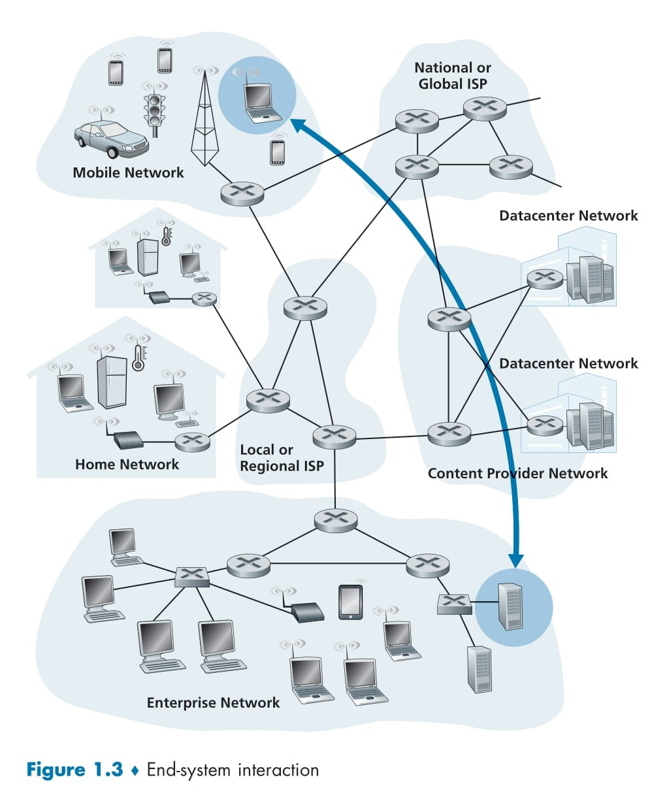

# 🌐 **The Network Edge**

## 📑 **Table of Contents**
- [🌐 **The Network Edge**](#-the-network-edge)
  - [📑 **Table of Contents**](#-table-of-contents)
  - [🖥️ **Introduction to the Network Edge**](#️-introduction-to-the-network-edge)
  - [📌 **What Are End Systems?**](#-what-are-end-systems)
    - [📄 **Types of End Systems**](#-types-of-end-systems)
  - [🖥️ **End Systems as Hosts**](#️-end-systems-as-hosts)
  - [👫 **Clients vs. Servers**](#-clients-vs-servers)
  - [🏢 **Role of Data Centers**](#-role-of-data-centers)
    - [🌟 **What Are Data Centers?**](#-what-are-data-centers)
    - [📄 **Functions of Data Centers**](#-functions-of-data-centers)
    - [🛠️ **Cloud Computing Example: Amazon Web Services (AWS)**](#️-cloud-computing-example-amazon-web-services-aws)
    - [🔧 **Components of a Data Center**](#-components-of-a-data-center)
  - [📊 **Visualization of the Network Edge**](#-visualization-of-the-network-edge)
  - [🚀 **Why the Network Edge Matters**](#-why-the-network-edge-matters)

## 🖥️ **Introduction to the Network Edge**
The **network edge** refers to the part of the Internet where users connect to the network. It consists of the devices we interact with daily, such as computers, smartphones, and other Internet-enabled devices.  

In this section, we’ll dive into the components of the **network edge**, exploring the **end systems**, **data centers**, and their role in the broader Internet infrastructure. The next section will move toward the **network core**, examining switching and routing mechanisms.

## 📌 **What Are End Systems?**
In computer networking terminology, the devices connected to the Internet are called **end systems** or **hosts**. These devices are located at the **edge of the network**, as shown in **Figure 1.3**.  

### 📄 **Types of End Systems**
End systems include:  
1. **Traditional Devices**:  
   - **Desktop Computers** (e.g., PCs, Macs, Linux systems).  
   - **Servers** (e.g., Web and email servers).  
   - **Mobile Devices** (e.g., laptops, smartphones, tablets).  

2. **Non-Traditional Devices**:  
   - Internet-connected "things" such as smart home appliances, IoT sensors, and wearable devices.  

## 🖥️ **End Systems as Hosts**
End systems are referred to as **hosts** because they run applications such as:  
- **Web Browsers** (e.g., Chrome, Firefox).  
- **Web Servers** (e.g., Nginx, Apache).  
- **Email Clients** (e.g., Gmail, Outlook).  
- **Email Servers** (e.g., SMTP servers).  

Throughout this explanation, the terms **end systems** and **hosts** are used interchangeably.

## 👫 **Clients vs. Servers**
End systems can be categorized into two types:  
1. **Clients**:  
   - Devices like desktops, laptops, smartphones.  
   - Request and consume data (e.g., visiting websites, streaming videos).  

2. **Servers**:  
   - More powerful machines storing and distributing data (e.g., Web pages, videos, email).  
   - Typically located in large **data centers**.

## 🏢 **Role of Data Centers**
### 🌟 **What Are Data Centers?**
**Data centers** are massive facilities housing tens to hundreds of thousands of servers. They power the Internet applications we use daily.  

### 📄 **Functions of Data Centers**
1. **Serving Web Pages**:  
   - Host and serve e-commerce pages (e.g., Amazon product pages).  
2. **Massive Data Processing**:  
   - Perform parallel computations for tasks like big data analytics.  
3. **Cloud Computing**:  
   - Provide infrastructure for other companies to run their services (e.g., Amazon Web Services, Microsoft Azure).  

### 🛠️ **Cloud Computing Example: Amazon Web Services (AWS)**
- Many companies, such as **Airbnb**, rely on cloud providers like Amazon to handle their IT infrastructure.  
- These companies run their entire web-based services in the **Amazon Cloud (AWS)** without managing their own data centers.

### 🔧 **Components of a Data Center**
1. **Hosts**:  
   - Often referred to as **blades**, these hosts resemble "pizza boxes."  
   - Each host contains **CPU, memory, and storage**.  

2. **Racks**:  
   - Hosts are stacked in racks, typically holding 20 to 40 blades each.  

3. **Internal Networks**:  
   - Racks are interconnected using advanced **data center network designs**.  

For example, Google, as of 2020, operates **19 data centers** across four continents, containing millions of servers.

  

## 📊 **Visualization of the Network Edge**
Refer to **Figure 1.3** for a detailed view of how end systems interact within the Internet infrastructure:  
- **Mobile Networks**: Devices like smartphones and cars connect through cellular networks.  
- **Home Networks**: Devices like PCs, tablets, and smart appliances connect via local ISPs.  
- **Enterprise Networks**: Larger systems within businesses or institutions.  
- **Data Centers**: Centralized locations for hosting servers and processing data.  

## 🚀 **Why the Network Edge Matters**
Understanding the network edge is essential because:  
1. **End Systems Drive Applications**:  
   - Applications like Web browsers, email clients, and streaming services operate on hosts at the edge.  
2. **Data Centers Power the Internet**:  
   - Content delivery and cloud services are managed through data centers.  
3. **IoT and Beyond**:  
   - The rapid growth of non-traditional end systems (IoT) is transforming how devices connect to the Internet.  

In the next section, we’ll explore the **network core**, focusing on switching, routing, and how data moves through the Internet.