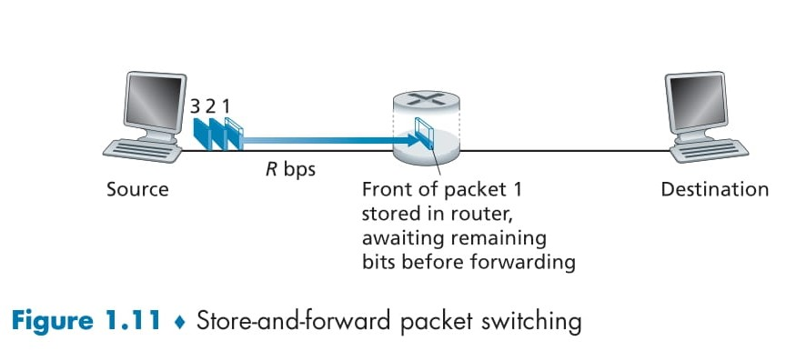
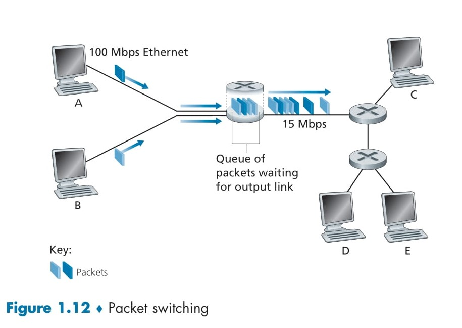

# 🌐 **Packet Switching**

## 📑 **Table of Contents**
- [🌐 **Packet Switching**](#-packet-switching)
  - [📑 **Table of Contents**](#-table-of-contents)
  - [🖥️ **Introduction**](#️-introduction)
  - [📌 **What Is Packet Switching?**](#-what-is-packet-switching)
    - [🌟 **Definition**:](#-definition)
  - [🧩 **Key Features of Packet Switching**](#-key-features-of-packet-switching)
  - [📊 **How Packet Switching Works**](#-how-packet-switching-works)
  - [🔧 **Packet Transmission Time**](#-packet-transmission-time)
    - [Example:](#example)
  - [📌 **Advantages of Packet Switching**](#-advantages-of-packet-switching)
  - [⚠️ **Challenges of Packet Switching**](#️-challenges-of-packet-switching)
- [🌐 **Store-and-Forward Transmission**](#-store-and-forward-transmission)
  - [🖥️ **Introduction**](#️-introduction-1)
  - [📌 **What Is Store-and-Forward Transmission?**](#-what-is-store-and-forward-transmission)
    - [🌟 **Definition**:](#-definition-1)
    - [🧩 **Key Characteristics**:](#-key-characteristics)
  - [📊 **How Store-and-Forward Transmission Works**](#-how-store-and-forward-transmission-works)
    - [🖼️ **Step-by-Step Process**:](#️-step-by-step-process)
  - [🔧 **Total Delay for Store-and-Forward Transmission**](#-total-delay-for-store-and-forward-transmission)
    - [**Formula**:](#formula)
  - [🧮 **Examples**](#-examples)
    - [1. **Single Packet, Single Router**](#1-single-packet-single-router)
    - [2. **Multiple Packets, Single Router**](#2-multiple-packets-single-router)
  - [📌 **General Case for N Links**](#-general-case-for-n-links)
  - [🖼️ **Visualization of Store-and-Forward Transmission**](#️-visualization-of-store-and-forward-transmission)
  - [📌 **Advantages of Store-and-Forward Transmission**](#-advantages-of-store-and-forward-transmission)
  - [⚠️ **Limitations of Store-and-Forward Transmission**](#️-limitations-of-store-and-forward-transmission)
- [🌐 **Queuing Delays, Packet Loss**](#-queuing-delays-packet-loss)
  - [📌 **Overview**](#-overview)
  - [📊 **Key Concepts**](#-key-concepts)
    - [1. **Output Buffers**:](#1-output-buffers)
    - [2. **Queuing Delays**:](#2-queuing-delays)
    - [3. **Packet Loss**:](#3-packet-loss)
  - [🖼️ **Illustration: Packet Switching and Queuing**](#️-illustration-packet-switching-and-queuing)
  - [🧩 **Key Example**](#-key-example)
    - [🛣️ **Traffic Congestion Analogy**:](#️-traffic-congestion-analogy)
  - [⚙️ **Packet Switching in Detail**](#️-packet-switching-in-detail)
  - [🧮 **Queuing Delay Calculation**](#-queuing-delay-calculation)
    - [**Factors Influencing Delay**:](#factors-influencing-delay)
    - [**Delay Formula**:](#delay-formula)
  - [🔄 **Packet Loss**](#-packet-loss)
  - [🧭 **How Routers Handle Packets**](#-how-routers-handle-packets)
    - [1. **Forwarding Process**:](#1-forwarding-process)
    - [2. **Routing Protocols**:](#2-routing-protocols)
  - [🌟 **Real-Life Application: Internet Congestion**](#-real-life-application-internet-congestion)
    - [Scenario:](#scenario)
  - [📌 **Key Takeaways**](#-key-takeaways)

## 🖥️ **Introduction**
In **network applications**, communication between end systems is carried out through **messages**. These messages can contain **control commands** or **data**, such as emails, images, or audio files. To efficiently transmit these messages over a network, the data is divided into smaller **packets**, which are routed through communication links and switches to their destination.

## 📌 **What Is Packet Switching?**
### 🌟 **Definition**:
**Packet switching** is a data transmission method where **long messages** are divided into **smaller chunks of data**, called **packets**, to be transmitted independently over the network.

## 🧩 **Key Features of Packet Switching**

1. **Message Division**:  
   - Messages are broken into smaller **packets** to facilitate transmission.  

2. **Independent Routing**:  
   - Each packet can take a different path to the destination based on network availability and routing algorithms.  

3. **Efficient Use of Resources**:  
   - Packets are transmitted using the full **transmission rate** of communication links, ensuring optimized use of bandwidth.  

4. **Two Types of Packet Switches**:
   - **Routers**: Handle packets at the **network layer**.
   - **Link-layer switches**: Operate at the **data link layer**.

## 📊 **How Packet Switching Works**

1. **Packet Creation**:  
   - The **source end system** divides the long message into **packets**.  

2. **Packet Transmission**:  
   - Packets are transmitted over communication links at the **full link transmission rate**.  

3. **Travel Through Network**:  
   - Packets traverse through **communication links** and **packet switches** (routers or link-layer switches).  

4. **Reassembly at Destination**:  
   - The **destination end system** reassembles the packets into the original message.

## 🔧 **Packet Transmission Time**

The time to transmit a packet over a communication link depends on:
1. **Packet Size (L)**: The number of bits in the packet.  
2. **Transmission Rate (R)**: The speed of the link in bits/second.  

**Formula**:  
\[
\text{Transmission Time} = \frac{L}{R}
\]

### Example:
- **Packet Size (L)**: 10,000 bits  
- **Transmission Rate (R)**: 1 Mbps (1,000,000 bits/sec)  

\[
\text{Transmission Time} = \frac{10,000}{1,000,000} = 0.01 \, \text{seconds}
\]

## 📌 **Advantages of Packet Switching**

1. **Efficient Bandwidth Usage**:  
   - Multiple packets from different messages share the same communication link, making better use of available bandwidth.  

2. **Scalability**:  
   - Packet switching supports **large and complex networks** like the Internet.  

3. **Fault Tolerance**:  
   - If one communication path is congested or fails, packets can be rerouted dynamically through other paths.  

4. **Speed**:  
   - Data is sent using the **full transmission rate** of the communication link.  

## ⚠️ **Challenges of Packet Switching**

1. **Packet Delay**:  
   - Packets may experience **queuing delays** at routers and switches due to congestion.  

2. **Packet Loss**:  
   - Some packets may be lost during transmission and need retransmission.  

3. **Reassembly Complexity**:  
   - Packets arriving out of order require **reassembly mechanisms** at the destination.  

4. **Overhead**:  
   - Each packet requires **header information**, adding to the transmission overhead.

---

# 🌐 **Store-and-Forward Transmission**

## 🖥️ **Introduction**
**Store-and-forward transmission** is a technique used by most packet switches, where the **entire packet** must be received and stored at the switch before it can be transmitted onto the outgoing link. This ensures that the packet is completely buffered and processed before being forwarded, making it a reliable and widely used transmission method in modern networking.

## 📌 **What Is Store-and-Forward Transmission?**

### 🌟 **Definition**:
Store-and-forward transmission refers to the method where the **router or switch** must receive the **entire packet** from the source before forwarding it to the next link.

### 🧩 **Key Characteristics**:
1. **Packet Buffering**:  
   - The router temporarily stores the packet until it has been fully received.  

2. **Complete Transmission**:  
   - The packet is forwarded to the next link only after it has been fully received and processed.

3. **Total Delay Calculation**:  
   - The time taken for a packet to travel from source to destination depends on the **number of links (N)** and the **link transmission rate (R)**.

## 📊 **How Store-and-Forward Transmission Works**

### 🖼️ **Step-by-Step Process**:
1. The **source** begins transmitting the first packet at time \( t = 0 \).
2. The **router** starts buffering the bits as they arrive.  
   - At \( t = \frac{L}{R} \): The router receives the entire packet (where \( L \) is the packet length in bits, and \( R \) is the link transmission rate in bits per second).  
3. The **router** begins forwarding the packet to the next link after receiving it completely.  
   - At \( t = \frac{2L}{R} \): The destination receives the entire packet.  

## 🔧 **Total Delay for Store-and-Forward Transmission**

The total delay depends on:
- **Packet size (L)**: The number of bits in the packet.  
- **Link transmission rate (R)**: The speed of each link in bits per second.  
- **Number of links (N)**: Total links between the source and destination.  

### **Formula**:
\[
d_{end-to-end} = N \cdot \frac{L}{R}
\]

## 🧮 **Examples**

### 1. **Single Packet, Single Router**
- **Packet size (L)**: 1,000 bits  
- **Transmission rate (R)**: 1 Mbps  
- **Number of links (N)**: 2 (one router between source and destination)

**Total Delay**:  
\[
d_{end-to-end} = 2 \cdot \frac{1000}{1,000,000} = 0.002 \, \text{seconds (2 milliseconds)}  
\]

### 2. **Multiple Packets, Single Router**
- **Number of Packets (P)**: 3  
- Each packet takes \( \frac{2L}{R} \) to be transmitted.  
- By the time the first packet reaches the destination, the source starts sending the next packet.  

**Total Delay for 3 Packets**:  
\[
d_{end-to-end} = (P + 1) \cdot \frac{L}{R} = 4 \cdot \frac{L}{R}
\]  

## 📌 **General Case for N Links**

When a packet travels through **N links**:
\[
d_{end-to-end} = N \cdot \frac{L}{R}
\]

For **P packets**:  
You can extend the logic by considering the sequential forwarding of packets.

  

## 🖼️ **Visualization of Store-and-Forward Transmission**
Refer to **Figure 1.11** above to see the process:
1. The **source** sends packets sequentially to the router.
2. The **router** buffers and processes the packets before forwarding them.
3. The **destination** receives the packets after a total delay of \( N \cdot \frac{L}{R} \).

## 📌 **Advantages of Store-and-Forward Transmission**

1. **Reliability**:  
   - Ensures the packet is fully received and validated before forwarding.

2. **Error Detection**:  
   - The router can perform error checks (e.g., checksum verification) before forwarding.

3. **Efficiency**:  
   - Avoids partial transmission of corrupt packets.

## ⚠️ **Limitations of Store-and-Forward Transmission**

1. **Higher Latency**:  
   - Introduces delays as packets are stored and processed at each router.

2. **Buffering Requirements**:  
   - Routers need sufficient memory to store incoming packets, especially during congestion.

---

# 🌐 **Queuing Delays, Packet Loss**
## 📌 **Overview**

In a **packet-switched network**, packets from different sources queue up in output buffers at routers before being forwarded to the next link. When the arrival rate of packets exceeds the output link capacity, **queuing delays** occur, and if the buffer fills up completely, **packet loss** happens.

## 📊 **Key Concepts**

### 1. **Output Buffers**:
- **What Are They?**
  - Storage spaces in routers where packets wait before being transmitted to the next link.
- **Purpose**:
  - To manage packets when the link is busy or congested.

### 2. **Queuing Delays**:
- **Definition**:
  - The time a packet spends waiting in the buffer.
- **Variability**:
  - Queuing delays depend on network **traffic** and the level of **congestion**.

### 3. **Packet Loss**:
- **When It Occurs**:
  - When the buffer is full, newly arriving packets or packets already in the queue are dropped.
- **Implications**:
  - Lost packets may need to be retransmitted, leading to additional delays.

  

## 🖼️ **Illustration: Packet Switching and Queuing**

Refer to **Figure 1.12**:
- Hosts A and B send packets to Host E through a router.
- The router's **15 Mbps output link** is slower than the **100 Mbps Ethernet input links**.
- Packets queue in the buffer when the arrival rate exceeds 15 Mbps, causing delays.

## 🧩 **Key Example**

### 🛣️ **Traffic Congestion Analogy**:
Imagine multiple cars (packets) entering a single-lane road (15 Mbps link) from two multi-lane highways (100 Mbps links). Cars must queue up before entering the single-lane road, just like packets in a router buffer.

## ⚙️ **Packet Switching in Detail**

Packet switching involves:
1. Breaking long messages into **packets**.
2. Each packet is forwarded independently across the network.
3. Routers use **forwarding tables** to determine the outgoing link for each packet.

## 🧮 **Queuing Delay Calculation**

### **Factors Influencing Delay**:
1. **Packet Arrival Rate (\( \lambda \))**:
   - Measured in packets/second.
2. **Transmission Rate (\( R \))**:
   - Capacity of the output link in bits/second.
3. **Packet Size (\( L \))**:
   - Length of each packet in bits.

### **Delay Formula**:
If the **arrival rate of packets in bits per second** exceeds \( R \), queuing delays increase. The delay depends on:
\[
\text{Queuing Delay} \propto \frac{\lambda L}{R}
\]

## 🔄 **Packet Loss**

When the **buffer fills up**:
- The router drops either:
  - The incoming packet.
  - One of the already-queued packets.
- Packet loss is common in heavily congested networks.

## 🧭 **How Routers Handle Packets**

### 1. **Forwarding Process**:
- Routers inspect the **destination IP address** in the packet header.
- Use the **forwarding table** to find the correct outgoing link.

### 2. **Routing Protocols**:
- Forwarding tables are automatically configured using **routing protocols**.
- Examples:
  - **Shortest path algorithms** configure routes dynamically.

## 🌟 **Real-Life Application: Internet Congestion**

### Scenario:
- Multiple users streaming HD videos simultaneously.
- Routers experience high **traffic volumes**, leading to:
  1. Increased queuing delays.
  2. Packet loss, requiring retransmission.

## 📌 **Key Takeaways**

1. **Queuing Delays**:
   - Result from packets waiting in the buffer during congestion.
2. **Packet Loss**:
   - Occurs when the buffer overflows.
3. **Router Functionality**:
   - Uses forwarding tables to send packets to the correct destination.
4. **Traffic Control**:
   - Efficient routing protocols minimize delays and loss.

---