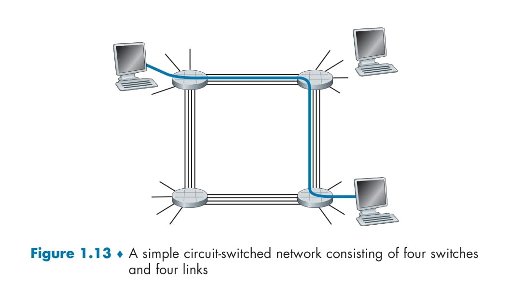
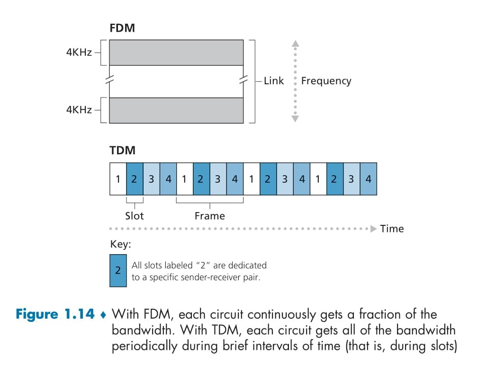

# 🌐 **Circuit Switching**

## 🖥️ **Introduction**
**Circuit switching** is one of the two fundamental methods used to transmit data through a network of links and switches, the other being **packet switching**. In circuit-switched networks, resources such as **link bandwidth** and **buffers** are **reserved** for the entire duration of a communication session. This approach provides a dedicated connection between the sender and receiver, guaranteeing a constant transmission rate.

---

## 📌 **What Is Circuit Switching?**

### 🌟 **Definition**:
**Circuit switching** establishes a dedicated communication path between two endpoints for the entire session. The resources along this path are reserved and cannot be used by other connections until the session ends.

---

## 🧩 **Key Features of Circuit Switching**

1. **Resource Reservation**:  
   - Buffers and link bandwidth are reserved for the duration of the communication session.

2. **Guaranteed Performance**:  
   - Since resources are pre-allocated, the sender can transmit data at a **constant, guaranteed rate**.

3. **Connection Setup**:  
   - A **connection (circuit)** must be established before data transmission begins.

4. **Dedicated Path**:  
   - The path between the sender and receiver remains exclusively dedicated for the session.

---

## 🖼️ **Illustration: Circuit-Switched Network**

Refer to **Figure 1.13**:
- Four circuit switches are interconnected with four links.
- Each link has **four circuits**, meaning it can support up to four simultaneous connections.
- When **Host A** communicates with **Host B**, a **dedicated circuit** is reserved across two links:
  - The second circuit on the first link.
  - The fourth circuit on the second link.
- Each circuit receives a **dedicated fraction of the link’s capacity**.

  

## 📊 **How Circuit Switching Works**

1. **Connection Establishment**:
   - Before communication begins, a **dedicated path (circuit)** is set up between the sender and receiver.
   - Each link along the path reserves a portion of its transmission capacity.

2. **Data Transmission**:
   - Data is transmitted at a constant rate along the reserved circuit.
   - The transmission is unaffected by other traffic in the network.

3. **Connection Teardown**:
   - Once the session ends, the reserved resources are released for other connections.

---

## 🧮 **Example: Circuit Allocation**

### Scenario:
- A link has a total transmission rate of **1 Mbps**.
- The link is divided into **4 circuits**.

**Result**:
- Each circuit is allocated \( \frac{1 \, \text{Mbps}}{4} = 250 \, \text{kbps} \).
- If Host A and Host B communicate, they receive **250 kbps** of dedicated bandwidth.

---

## 🔄 **Circuit Switching vs. Packet Switching**

| **Feature**                | **Circuit Switching**                          | **Packet Switching**                          |
|----------------------------|-----------------------------------------------|----------------------------------------------|
| **Resource Allocation**     | Resources are **reserved** for the session.   | Resources are **not reserved**.              |
| **Data Transmission Rate**  | Constant and guaranteed.                     | Variable and not guaranteed.                 |
| **Setup Time**              | Requires a **setup phase** before transmission.| No setup phase required.                     |
| **Congestion Handling**     | No queuing or congestion during the session.  | Packets may queue and face delays during congestion. |
| **Use Case**                | Ideal for voice calls (e.g., traditional telephony).| Ideal for data transfer (e.g., Internet traffic). |

---

## 🧩 **Advantages of Circuit Switching**

1. **Guaranteed Bandwidth**:
   - Ensures consistent performance for real-time applications like voice and video calls.

2. **No Congestion During Communication**:
   - Once the circuit is established, no additional delays or packet loss occur.

3. **Predictable Latency**:
   - Since resources are reserved, communication occurs with minimal latency.

---

## ⚠️ **Disadvantages of Circuit Switching**

1. **Inefficient Resource Usage**:
   - Resources are reserved even if no data is being transmitted, leading to potential waste.

2. **Setup Time**:
   - Establishing a connection requires additional time before data transmission can begin.

3. **Scalability Issues**:
   - Cannot efficiently handle large-scale data traffic, making it less suitable for the modern Internet.

---

## 🌟 **Real-Life Example: Traditional Telephony**

In a traditional telephone network:
- A **circuit** is established before a call begins.
- The circuit reserves a dedicated bandwidth for the entire call duration.
- Once the call ends, the circuit is released.

---

> New Section Begins

# 🌐 **Multiplexing in Circuit-Switched Networks**

## 🖥️ **Introduction**
In **circuit-switched networks**, multiple connections share a single communication link. To manage these connections, the link can be divided using **multiplexing techniques**. The two primary methods are:
- **Frequency-Division Multiplexing (FDM)**
- **Time-Division Multiplexing (TDM)**

These techniques ensure efficient utilization of the network's resources by allocating distinct portions of the link to each connection.

---

## 📌 **What Is Multiplexing?**

### 🌟 **Definition**:
**Multiplexing** is the process of combining multiple data streams or connections into a single shared communication link. This enables multiple circuits to coexist on the same physical medium.

---

## 🧩 **Key Multiplexing Techniques**

### 1. **Frequency-Division Multiplexing (FDM)**

- **How It Works**:
  - The **frequency spectrum** of a link is divided into separate **frequency bands**.
  - Each band is allocated to a specific connection for the entire session.
  
- **Example**:
  - Telephone networks typically allocate a 4 kHz bandwidth per connection.
  - FM radio uses FDM to assign specific frequency bands (e.g., 88 MHz to 108 MHz) to different stations.

- **Visualization (Figure 1.14)**:
  - Each circuit (connection) continuously occupies a specific frequency band on the link.

  

### 2. **Time-Division Multiplexing (TDM)**

- **How It Works**:
  - Time is divided into **frames**, and each frame is further divided into **time slots**.
  - A specific **time slot** in each frame is dedicated to a connection.
  - Each connection gets the entire link bandwidth during its time slot.

- **Example**:
  - If a TDM link transmits 8,000 frames per second and each slot contains 8 bits, the transmission rate per circuit is:
    \[
    \text{Rate per circuit} = \text{Frame Rate} \times \text{Bits per Slot} = 8,000 \times 8 = 64 \, \text{kbps}.
    \]

- **Visualization (Figure 1.14)**:
  - Each circuit periodically gets full bandwidth during its allocated time slots.

  

## 🧮 **Numerical Example: File Transmission Over TDM**

### Scenario:
- File size: **640,000 bits**
- TDM link:
  - **24 slots**
  - Bit rate: **1.536 Mbps**
- Circuit setup time: **500 ms**

**Steps**:
1. **Transmission Rate Per Circuit**:
   \[
   \text{Rate per circuit} = \frac{1.536 \, \text{Mbps}}{24} = 64 \, \text{kbps}.
   \]

2. **Time to Transmit File**:
   \[
   \text{Transmission time} = \frac{\text{File size}}{\text{Rate per circuit}} = \frac{640,000 \, \text{bits}}{64,000 \, \text{bps}} = 10 \, \text{seconds}.
   \]

3. **Total Time** (Including Circuit Setup):
   \[
   \text{Total time} = \text{Setup time} + \text{Transmission time} = 0.5 \, \text{seconds} + 10 \, \text{seconds} = 10.5 \, \text{seconds}.
   \]

---

## 📊 **FDM vs. TDM**

| **Feature**                | **FDM**                                     | **TDM**                                   |
|----------------------------|---------------------------------------------|------------------------------------------|
| **Division Basis**          | Frequency spectrum                         | Time slots                               |
| **Allocation**              | Continuous allocation of frequency band    | Periodic allocation of time slots        |
| **Bandwidth Usage**         | Fixed bandwidth per connection             | Full bandwidth during allocated slot     |
| **Efficiency**              | Wasted bandwidth during idle periods       | More efficient but still idle during silence in allocated slots. |

---

## 🔄 **Challenges in Circuit Switching**

1. **Resource Wastage**:
   - If a circuit is idle (e.g., during silent periods in a phone call), the allocated resources remain unused.

2. **Complexity**:
   - Establishing and maintaining circuits across multiple links requires sophisticated signaling mechanisms.

3. **Scalability**:
   - Limited capacity for handling many simultaneous connections due to fixed resource allocation.

---

## 🌟 **Key Takeaways**

1. **Multiplexing in Circuit Switching**:
   - Enables efficient use of communication links through **FDM** and **TDM**.

2. **FDM**:
   - Assigns a continuous **frequency band** to each connection.
   - Common in analog communication like FM radio and telephony.

3. **TDM**:
   - Allocates periodic **time slots** to each connection.
   - Common in digital communication systems.

4. **Efficiency Considerations**:
   - Both techniques face challenges during idle periods when allocated resources go unused.

> New Section Begins

