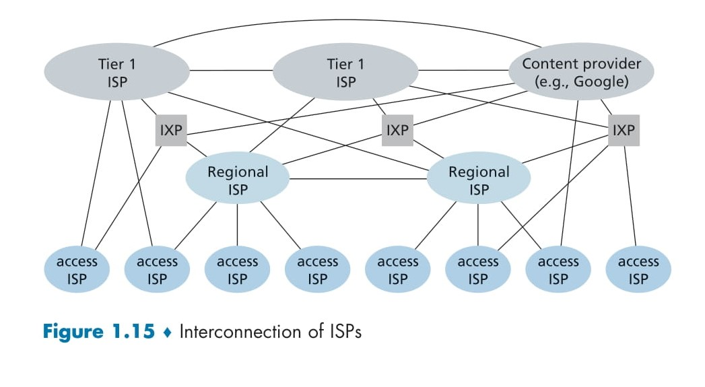

# 🌐 **A Network of Networks**

The Internet, as we know it, is not a single network but a **global network of interconnected networks**. It is designed to connect billions of end systems (such as PCs, smartphones, and servers) through a combination of ISPs (Internet Service Providers), regional networks, and global transit networks. Here's a deep dive into its intricate architecture:

---

## 📌 **Internet Layers: Key Components**
1. **Access ISPs**:
   - **Definition**: Provide Internet access to users via technologies like DSL, cable, fiber, or wireless.
   - Examples: A local telco, university networks, corporate networks.

2. **Regional ISPs**:
   - **Definition**: Serve as intermediate providers connecting access ISPs to higher-tier ISPs.

3. **Tier-1 ISPs**:
   - **Definition**: Operate global-scale networks that interconnect with one another to form the Internet's backbone.
   - Examples: AT&T, NTT, Level 3 Communications.

4. **Content Provider Networks**:
   - **Definition**: Large companies (e.g., Google) that bypass upper-tier ISPs by creating their **private networks** to control and optimize data delivery.

5. **Internet Exchange Points (IXPs)**:
   - **Definition**: Locations where multiple ISPs interconnect to exchange traffic directly without relying on upper-tier networks.

---

## 📊 **Evolution of Internet Structures**

### 🌟 **Structure 1**: A Single Global ISP
- **Design**: One central global ISP connects all access ISPs.
- **Issues**:
  - High cost for one ISP to span globally.
  - Single-point dependence.

---

### 🌟 **Structure 2**: Multiple Global ISPs
- **Design**: Competing global ISPs interconnect and offer services to access ISPs.
- **Challenge**: Requires interconnection agreements among global ISPs.

---

### 🌟 **Structure 3**: Multi-Tier Hierarchy
- **Design**: Introduces **regional ISPs** as intermediaries.
- **Hierarchy**:
  - Access ISPs connect to regional ISPs.
  - Regional ISPs connect to tier-1 ISPs.

---

### 🌟 **Structure 4**: Adding IXPs, PoPs, and Multi-Homing
1. **Points of Presence (PoPs)**:
   - **Definition**: Connection hubs for ISPs.
   - Example: Access ISPs connect via high-speed leased lines.

2. **Multi-Homing**:
   - ISPs connect to multiple providers for **redundancy and resilience**.

3. **Peering Agreements**:
   - Settlement-free connections between ISPs for cost savings.

4. **IXPs**:
   - Meeting points for traffic exchange between ISPs.

---

### 🌟 **Structure 5**: Content Provider Networks
- **Key Players**: Google, Amazon, Meta.
- **Private Networks**:
  - Data centers interconnected globally.
  - Minimize reliance on tier-1 ISPs.
  - Peer directly with access ISPs or connect via IXPs.

---

  

## 🔑 **Today’s Internet**
1. **Diverse Ecosystem**:
   - Over a dozen tier-1 ISPs.
   - Hundreds of thousands of lower-tier ISPs.

2. **Interconnections**:
   - Hierarchical relationships (access → regional → tier-1 ISPs).
   - Direct peering and multi-homing strategies.

3. **Content Delivery**:
   - Content providers bypass upper layers for cost control and performance optimization.

---

## 📖 **Key Takeaways**
1. The Internet is a **multi-layered structure**, driven by **technical needs, economics, and policy considerations**.
2. Content providers are playing an increasingly important role by creating **dedicated networks** for better service delivery.
3. IXPs, multi-homing, and peering enable **cost savings and improved performance**.
