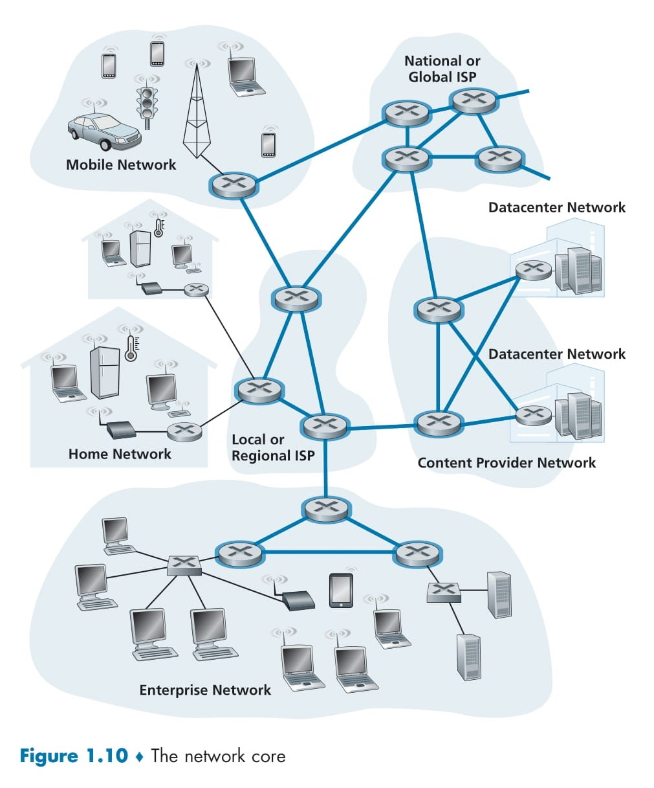

# 🌐 **The Network Core** 🚀

Let’s move from the Internet’s edge to its heart—the network core! 🌐✨ This is the central hub where packet switches and links work together to connect all the systems on the Internet. Imagine it as the Internet’s superhighway, seamlessly linking everything together. 📡💻 In Figure 1.10, the core is beautifully highlighted with bold, shaded lines to show its importance. 🚀.  

  

