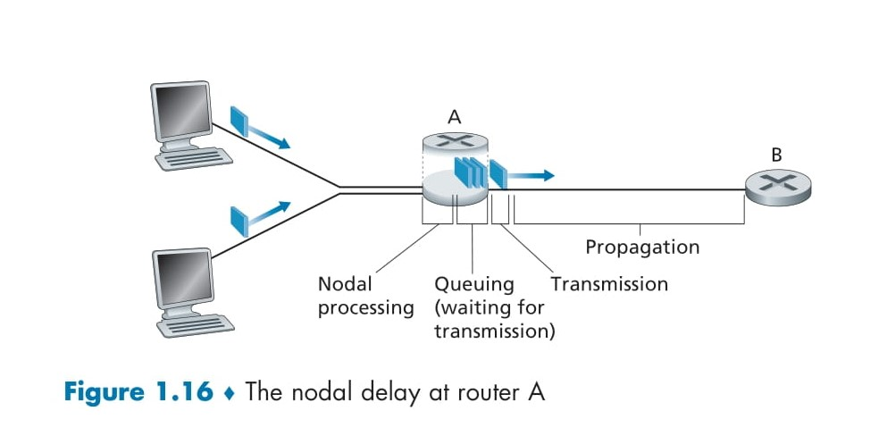
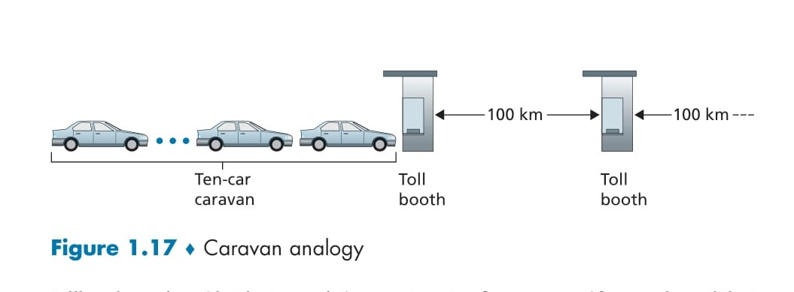

# 📚 **Types of Delay**

This guide provides a detailed explanation of **Types of Delay** in computer networks, covering every aspect to help you understand the concept thoroughly. 🚀 Let’s break it down step by step with clear examples and formulas! 😊

---

## 🔍 **What is Nodal Delay?**

In computer networks, **nodal delay** refers to the total time a packet spends at a single network **node** (such as a router) before continuing its journey toward the destination. Nodal delay consists of the following four components:  

1. 🛠️ **Processing Delay**: Time for analyzing and processing the packet.  
2. ⏳ **Queuing Delay**: Time spent waiting in the queue.  
3. 📤 **Transmission Delay**: Time to push all the bits of the packet onto the link.  
4. 🌐 **Propagation Delay**: Time for the bits to travel from one node to the next.  

Each type of delay contributes to the total **end-to-end delay** experienced by packets as they traverse the network. Let’s explore these components in detail. 👇  

---

## 🕒 **Types of Delay**

### 🛠️ **Processing Delay**  

**Definition**:  
Processing delay is the time a router takes to **examine the packet’s header**, determine the appropriate outbound link, and perform basic error-checking. This delay occurs at every node the packet visits on its way to the destination.  

**Key Details**:  
- **Header examination**: The router inspects the packet’s header to decide which link to forward it to.  
- **Error-checking**: The router verifies whether the packet contains bit-level errors caused during transmission.  
- Processing delay is typically very **small** in modern, high-speed routers, measured in **microseconds** or less.  

**Example**:  
Imagine a packet arrives at **Router A**. The router reads the header to find that the destination is **Router B** and verifies that the packet is error-free. This decision-making and error-checking take a fraction of a second, contributing to the **processing delay**.  

**Real-World Insight**:  
In high-speed networks, processing delays are optimized to handle millions of packets per second, ensuring minimal delay. However, for older or overloaded routers, this delay can become a bottleneck.  

---

### ⏳ **Queuing Delay**  

**Definition**:  
Queuing delay is the time a packet spends **waiting in the queue** before it can be transmitted onto the link.  

**Key Details**:  
- **Traffic-dependent**: Queuing delay varies depending on the number of packets already waiting in the queue.  
- If the queue is **empty** and no other packets are being transmitted, the queuing delay is **zero**.  
- If the network is congested (high traffic), queuing delay increases significantly as packets pile up in the buffer.  

**Example**:  
Imagine a road with only one lane (link) and multiple cars (packets) waiting at a traffic signal. If there are several cars ahead, your car must wait its turn. Similarly, packets wait in the queue until the link is free for transmission.  

**Real-World Insight**:  
Queuing delay becomes critical in congested networks, such as during peak internet usage hours, leading to noticeable lag in services like video streaming or gaming.  

---

### 📤 **Transmission Delay**  

**Definition**:  
Transmission delay is the time it takes to **push all bits of a packet** onto the outbound link. This delay depends on the **size of the packet** and the **speed of the link**.  

**Formula**:  
\[
\text{Transmission Delay} = \frac{\text{Packet Length (L)}}{\text{Transmission Rate (R)}}
\]  

**Key Details**:  
- \(L\): The size of the packet in **bits**.  
- \(R\): The transmission rate of the link in **bits per second (bps)**.  
- Measured in **microseconds to milliseconds**, depending on the packet size and link speed.  

**Example**:  
If a packet of size \( L = 1000 \, \text{bits} \) is transmitted over a \( R = 10 \, \text{Mbps} \) link:  
\[
\text{Transmission Delay} = \frac{1000}{10,000,000} = 0.0001 \, \text{seconds (100 microseconds)}.
\]  

**Real-World Insight**:  
On high-speed networks (e.g., fiber optic links), transmission delays are often negligible. However, in low-speed networks like **dial-up connections**, this delay can significantly impact performance.  

---

### 🌐 **Propagation Delay**  

**Definition**:  
Propagation delay is the time it takes for the **first bit of the packet** to travel from one router to the next through the physical medium (e.g., fiber optics, copper wire).  

**Formula**:  
\[
\text{Propagation Delay} = \frac{\text{Distance (d)}}{\text{Propagation Speed (s)}}
\]  

**Key Details**:  
- \(d\): The distance between the two routers in **meters**.  
- \(s\): The propagation speed, which depends on the medium (e.g., \( 2 \times 10^8 \, \text{m/s} \) in fiber optics).  
- Typically measured in **milliseconds** for long-distance networks.  

**Example**:  
For a \(300 \, \text{km}\) link with a propagation speed of \(2 \times 10^8 \, \text{m/s}\):  
\[
\text{Propagation Delay} = \frac{300,000}{200,000,000} = 1.5 \, \text{milliseconds}.
\]  

**Real-World Insight**:  
Propagation delay is crucial in wide-area networks (WANs), such as satellite communications, where distances are vast, and delays can add up to hundreds of milliseconds.  

  

---

## 🤔 **Transmission vs. Propagation Delay**

| **Aspect**            | **Transmission Delay**                | **Propagation Delay**                |  
|------------------------|---------------------------------------|---------------------------------------|  
| **Definition**         | Time to push all bits onto the link.  | Time for a bit to travel through the link. |  
| **Depends On**         | Packet size & link speed.             | Distance & medium speed.              |  
| **Key Example**        | Uploading a file to the internet.     | Fiber optic signal traveling long distances. |  

**Analogy**:  
Think of a caravan of cars on a highway:  
- **Transmission delay** is the time required to load all cars onto the highway. 🚗🚕  
- **Propagation delay** is the time it takes for a car to reach the next city. 🛣️  

  

---

## 📊 **Key Formula for Total Delay**

The total delay at a node is the sum of all four components:  

\[
\text{Total Nodal Delay (d}_{\text{nodal}}\text{)} = d_{\text{proc}} + d_{\text{queue}} + d_{\text{trans}} + d_{\text{prop}}
\]  

**Key Insights**:  
- Each component contributes differently depending on the **network conditions**.  
- For local networks (e.g., LANs), queuing and processing delays are usually dominant.  
- For long-distance networks, propagation delay becomes a significant factor.  

---

## 🌟 **Conclusion**

Understanding the **Types of Delay** is vital for designing and optimizing efficient networks. 🚀 Each delay component plays a role in determining how quickly and reliably data can travel through the network. By addressing bottlenecks like queuing delays or propagation delays, network engineers can improve performance and ensure smooth data transmission. 🌐✨  
