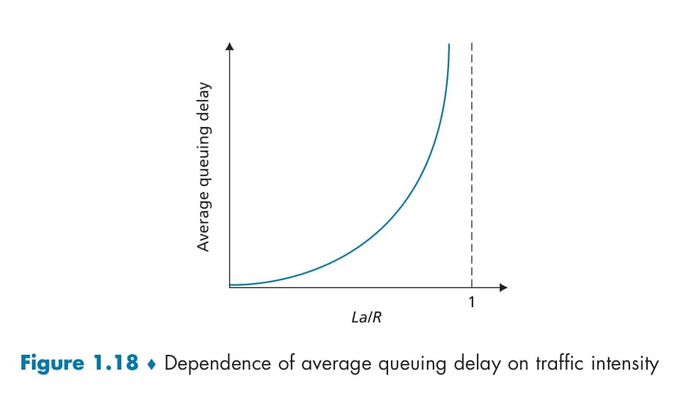

# 📚 **Queuing Delay and Packet Loss**
This README provides a **comprehensive explanation** of **queuing delay** and **packet loss**, one of the most fascinating and dynamic aspects of computer networks. Queuing delays are influenced by several factors, and understanding these delays is key to designing efficient and high-performing networks. 🚀✨

## 📑 **Table of Contents**
- [� **Queuing Delay and Packet Loss**](#-queuing-delay-and-packet-loss)
  - [📑 **Table of Contents**](#-table-of-contents)
  - [🔍 **Introduction to Queuing Delay**](#-introduction-to-queuing-delay)
  - [🕒 **What Factors Influence Queuing Delay?**](#-what-factors-influence-queuing-delay)
    - [1. 📥 **Arrival Rate of Packets ((a))**](#1--arrival-rate-of-packets-a)
    - [2. 🚀 **Transmission Rate of the Link ((R))**](#2--transmission-rate-of-the-link-r)
    - [3. 📊 **Traffic Intensity ((\\frac{La}{R}))**](#3--traffic-intensity-fraclar)
    - [4. 🔄 **Arrival Patterns**](#4--arrival-patterns)
  - [📊 **Traffic Intensity and Queuing Delay**](#-traffic-intensity-and-queuing-delay)
    - [1. 🌟 **Low Traffic Intensity ((La/R \\approx 0))**](#1--low-traffic-intensity-lar-approx-0)
    - [2. ⚖️ **Moderate Traffic Intensity ((La/R \< 1))**](#2-️-moderate-traffic-intensity-lar--1)
    - [3. 🚦 **High Traffic Intensity ((La/R \\rightarrow 1))**](#3--high-traffic-intensity-lar-rightarrow-1)
    - [4. ❌ **Traffic Intensity ((La/R \> 1))**](#4--traffic-intensity-lar--1)
  - [🛣️ **Real-World Analogy: Highways and Traffic Congestion**](#️-real-world-analogy-highways-and-traffic-congestion)
  - [🔬 **Periodic vs. Random Traffic Patterns**](#-periodic-vs-random-traffic-patterns)
    - [1. **Periodic Arrivals**](#1-periodic-arrivals)
    - [2. **Random Arrivals**](#2-random-arrivals)
  - [🛠️ **Key Observations from Figure 1.18**](#️-key-observations-from-figure-118)
  - [📚 **Formula Recap: Queuing Delay and Traffic Intensity**](#-formula-recap-queuing-delay-and-traffic-intensity)
    - [1. **Traffic Intensity ((La/R))**](#1-traffic-intensity-lar)
    - [2. **Queuing Delay ((d\_{\\text{queue}}))**](#2-queuing-delay-d_textqueue)
- [🔍 **Packet Loss**](#-packet-loss)
    - [🛠️ **What is Packet Loss?**](#️-what-is-packet-loss)
    - [📥 **Why Does Packet Loss Happen?**](#-why-does-packet-loss-happen)
    - [📊 **Impact of Packet Loss**](#-impact-of-packet-loss)
  - [🌐 **2. End-to-End Delay**](#-2-end-to-end-delay)
    - [🛠️ **What is End-to-End Delay?**](#️-what-is-end-to-end-delay)
    - [🧮 **Formula for End-to-End Delay**](#-formula-for-end-to-end-delay)
    - [🔍 **Key Insights**](#-key-insights)
  - [🚦 **3. Traceroute: Measuring Network Paths and Delays**](#-3-traceroute-measuring-network-paths-and-delays)
    - [🛠️ **What is Traceroute?**](#️-what-is-traceroute)
    - [📥 **How Does Traceroute Work?**](#-how-does-traceroute-work)
    - [📊 **Key Outputs of Traceroute**](#-key-outputs-of-traceroute)
    - [📚 **Example Output**](#-example-output)
  - [⚠️ **4. Observations and Insights**](#️-4-observations-and-insights)
  - [📦 **5. Additional Delays in Networks**](#-5-additional-delays-in-networks)
    - [🛠️ **End-System Delays**](#️-end-system-delays)
  - [🌟 **Conclusion**](#-conclusion)

---

## 🔍 **Introduction to Queuing Delay**

When a packet reaches a **node** (e.g., a router), it often has to wait in a **queue** before being transmitted onto the next link. This waiting time is known as the **queuing delay (\(d_{\text{queue}}\))**. Unlike other delays such as **processing delay (\(d_{\text{proc}}\))**, **transmission delay (\(d_{\text{trans}}\))**, and **propagation delay (\(d_{\text{prop}}\))**, queuing delay is highly **variable** and depends on the traffic conditions.

Here’s why queuing delay is important to understand:
- 🛠️ It directly affects **network performance** and user experience.
- ⏳ It fluctuates based on **traffic intensity** and **arrival patterns**.
- 🔀 It plays a crucial role in network congestion management.

---

## 🕒 **What Factors Influence Queuing Delay?**

Queuing delay is affected by several **key factors**, each contributing to its dynamic nature:

### 1. 📥 **Arrival Rate of Packets (\(a\))**
   - The rate at which packets arrive at the queue (\(a\)) significantly determines the delay.  
   - When packets arrive faster than they can be processed, the queue grows longer.

### 2. 🚀 **Transmission Rate of the Link (\(R\))**
   - This is the speed at which bits are transmitted out of the queue.  
   - Higher transmission rates reduce the likelihood of long queues.

### 3. 📊 **Traffic Intensity (\(\frac{La}{R}\))**
   - **Definition**: Traffic intensity is the ratio of the **arrival rate of bits (\(La\))** to the **link transmission rate (\(R\))**.  
   - **Key Insight**: 
     - If \(\frac{La}{R} > 1\), the queue grows indefinitely, causing infinite queuing delay.  
     - If \(\frac{La}{R} \leq 1\), the system remains stable with finite delays.

### 4. 🔄 **Arrival Patterns**
   - **Periodic Arrivals**: Packets arrive at regular intervals, reducing randomness and often minimizing delay.  
   - **Burst Arrivals**: Packets arrive in bursts, creating sudden spikes in queuing delay.

---

  

## 📊 **Traffic Intensity and Queuing Delay**

The relationship between **traffic intensity** (\(\frac{La}{R}\)) and **average queuing delay** is visualized in **Figure 1.18**. Let’s analyze it:

### 1. 🌟 **Low Traffic Intensity (\(La/R \approx 0\))**
   - At low traffic intensity, packets are sparse, and the queue is often empty.  
   - Queuing delay is minimal as packets rarely need to wait.

### 2. ⚖️ **Moderate Traffic Intensity (\(La/R < 1\))**
   - As traffic intensity increases, queuing delay becomes noticeable.  
   - Occasionally, packets arrive when the queue is already occupied, causing slight delays.

### 3. 🚦 **High Traffic Intensity (\(La/R \rightarrow 1\))**
   - Queuing delay increases **exponentially** as traffic intensity approaches 1.  
   - Even small increases in traffic intensity lead to disproportionately large delays.

### 4. ❌ **Traffic Intensity (\(La/R > 1\))**
   - If the traffic intensity exceeds 1, packets arrive faster than they can be transmitted.  
   - The queue grows infinitely, causing **packet loss** and **network collapse**.

---

## 🛣️ **Real-World Analogy: Highways and Traffic Congestion**

To better understand queuing delay, consider a **highway with a tollbooth**:
- When traffic (packets) is light, cars can move freely without delay. 🚗  
- As traffic increases, cars must wait at the tollbooth, creating a queue. ⏳  
- At extreme congestion levels (high traffic intensity), even slight increases in traffic cause massive delays, similar to a heavily congested road.

---

## 🔬 **Periodic vs. Random Traffic Patterns**

### 1. **Periodic Arrivals**
   - If packets arrive precisely at intervals of \(L/R\) seconds, the queue remains empty, and there’s no queuing delay.  
   - However, bursts of packets (e.g., \(N\) packets every \(N(L/R)\) seconds) create delays for subsequent packets:
     - The **nth** packet in the burst experiences a queuing delay of \((n-1)L/R\).

### 2. **Random Arrivals**
   - In real-world networks, packet arrivals are random, with no consistent pattern.  
   - Traffic intensity (\(\frac{La}{R}\)) helps estimate average queuing delay but doesn’t fully capture all statistical variations.

---

## 🛠️ **Key Observations from Figure 1.18**

1. **Exponential Growth of Delay**:  
   - As traffic intensity approaches 1, queuing delay increases rapidly.  
   - Small increases in intensity lead to large increases in delay.

2. **System Design Guidelines**:  
   - Always design networks to ensure **traffic intensity remains below 1**.  
   - This avoids excessive queuing delay and prevents packet loss.

---

## 📚 **Formula Recap: Queuing Delay and Traffic Intensity**

### 1. **Traffic Intensity (\(La/R\))**
   - **Definition**: Ratio of arrival rate (\(La\)) to transmission rate (\(R\)).  
   - **Key Rule**: Keep \(\frac{La}{R} \leq 1\).

### 2. **Queuing Delay (\(d_{\text{queue}}\))**
   - Averages depend on traffic intensity, arrival patterns, and queue size.

>  New Section Begins

# 🔍 **Packet Loss**

### 🛠️ **What is Packet Loss?**
Packet loss occurs when a packet arrives at a router but finds the **queue full**. With no space to store the incoming packet, the router **drops** it, resulting in **packet loss**.

### 📥 **Why Does Packet Loss Happen?**
1. **Finite Queue Capacity**:  
   - Routers have **limited buffer space** for queuing packets.  
   - When the queue reaches capacity, any additional packets are dropped.  

2. **High Traffic Intensity (\(La/R > 1\))**:  
   - If the arrival rate (\(La\)) exceeds the transmission rate (\(R\)), the queue overflows.

3. **Network Congestion**:  
   - During peak traffic, multiple routers may experience high queue utilization, increasing packet loss probability.

### 📊 **Impact of Packet Loss**
1. **End-System Perspective**:  
   - A lost packet looks like it was sent into the network but never arrived at its destination.  
   - As the **traffic intensity (\(La/R\))** increases, the fraction of lost packets also increases.  

2. **Performance Metrics**:  
   - Packet loss is a key metric in evaluating network performance.  
   - High packet loss can cause retransmissions, increasing delays and degrading the user experience.

---

## 🌐 **2. End-to-End Delay**

### 🛠️ **What is End-to-End Delay?**
End-to-end delay (\(d_{\text{end-to-end}}\)) refers to the total time taken for a packet to travel from the **source host** to the **destination host**. It accumulates the delays experienced at all intermediate routers along the path.

### 🧮 **Formula for End-to-End Delay**
\[
d_{\text{end-to-end}} = N (d_{\text{proc}} + d_{\text{trans}} + d_{\text{prop}})
\]  
Where:
- \(N\): Number of nodes (routers) along the path.  
- \(d_{\text{proc}}\): Processing delay at each node.  
- \(d_{\text{trans}}\): Transmission delay (\(L/R\), where \(L\) is packet size and \(R\) is transmission rate).  
- \(d_{\text{prop}}\): Propagation delay on each link.  

### 🔍 **Key Insights**
1. **Uncongested Networks**:  
   - If queuing delays (\(d_{\text{queue}}\)) are negligible, end-to-end delay is dominated by processing, transmission, and propagation delays.  

2. **Congested Networks**:  
   - Queuing delay significantly adds to the total delay.  
   - The impact grows as traffic intensity approaches 1.

---

## 🚦 **3. Traceroute: Measuring Network Paths and Delays**

### 🛠️ **What is Traceroute?**
Traceroute is a tool used to **measure the route** packets take from a source to a destination and to analyze **round-trip delays** at each hop (intermediate router).

### 📥 **How Does Traceroute Work?**
1. The source sends **special packets** to the destination.  
2. Each packet has a **unique identifier** (e.g., 1 through \(N\)).  
3. When a router receives a packet:  
   - It **returns a message** to the source, including its name and address.  
4. The source measures the **round-trip time** for each packet.

### 📊 **Key Outputs of Traceroute**
- **Router Information**: Name and IP address of each intermediate router.  
- **Round-Trip Delays**: Time taken for packets to travel to and from each router.  
- **Dropped Packets**: Marked with an asterisk (*) when packets are lost.

### 📚 **Example Output**
Here’s a sample output of Traceroute from the source at UMass to a host in Paris:  

| Router # | Name                         | IP Address       | RTT1 (ms) | RTT2 (ms) | RTT3 (ms) |
|----------|------------------------------|------------------|-----------|-----------|-----------|
| 1        | gw-vlan-2451.cs.umass.edu   | 128.119.245.1    | 1.899     | 3.266     | 3.280     |
| 2        | j-cs-gw-int-10-240.cs.umass.edu | 10.119.240.254 | 1.296     | 1.276     | 1.245     |
| 3        | n5-rt-1-1-xe-2-1-0.gw.umass.edu | 128.119.3.33   | 2.237     | 2.217     | 2.187     |
| 4        | core1-rt-et-5-2-0.gw.umass.edu | 128.119.0.9    | 0.351     | 0.392     | 0.380     |
| 5        | border1-rt-et-5-0-0.gw.umass.edu | 192.80.83.102 | 0.345     | 0.345     | 0.344     |
| 6        | nox300gw1-umass-re.nox.org  | 192.5.89.101     | 3.260     | 0.416     | 3.127     |
| 7        | nox300gw1-umass-re.nox.org  | 192.5.89.101     | 3.165     | 7.326     | 7.311     |
| 8        | 198.71.45.237               | 198.71.45.237    | 77.826    | 77.246    | 77.744    |
| 9        | renater-lb1-gw.mx1.par.fr.geant.net | 62.40.124.70 | 79.357    | 77.729    | 79.152    |
| 10       | 193.51.180.109              | 193.51.180.109   | 78.379    | 79.936    | 80.042    |
| 11       | 193.51.180.109              | 193.51.180.109   | 80.640    | *         | *         |
| 12       | 195.221.127.182             | 195.221.127.182  | 78.408    | *         | *         |
| 13       | 195.221.127.182             | 195.221.127.182  | 80.686    | 80.796    | 78.434    |
| 14       | r-upmc1.reseau.jussieu.fr   | 134.157.254.10   | 78.399    | *         | 81.353    |

---

## ⚠️ **4. Observations and Insights**

1. **Variable Delays**:  
   - The round-trip delay to a router depends on queuing delays, which vary with time.  
   - Example: Delays to Router 12 are smaller than delays to Router 11, highlighting variations in network conditions.

2. **Propagation Delays**:  
   - Large increases in delay (e.g., from Router 7 to Router 8) often indicate long-distance links, such as transatlantic fiber-optic cables.  

3. **Congestion Indicators**:  
   - Frequent asterisks (*) in the output suggest packet loss or network congestion.  

---

## 📦 **5. Additional Delays in Networks**

### 🛠️ **End-System Delays**
These delays occur at the source or destination systems:
1. **Shared Medium Delays**:  
   - In scenarios like WiFi, end systems may purposefully delay packet transmission to share the medium fairly.

2. **Packetization Delay**:  
   - In applications like **VoIP (Voice over IP)**, the sender must fill a packet with data (e.g., digitized speech) before transmission.  
   - This delay impacts the **quality of service** (e.g., call clarity).

---

## 🌟 **Conclusion**

Understanding **packet loss**, **end-to-end delay**, and tools like **Traceroute** is essential for analyzing and improving network performance. By managing traffic intensity, queue capacity, and congestion, networks can ensure smoother data transmission and higher reliability. 🚀✨  
