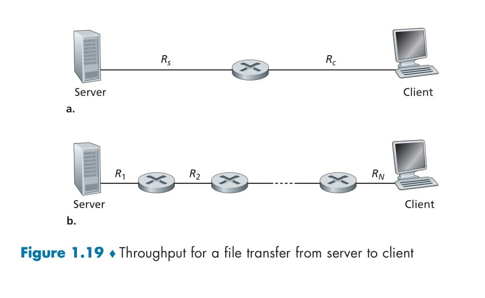
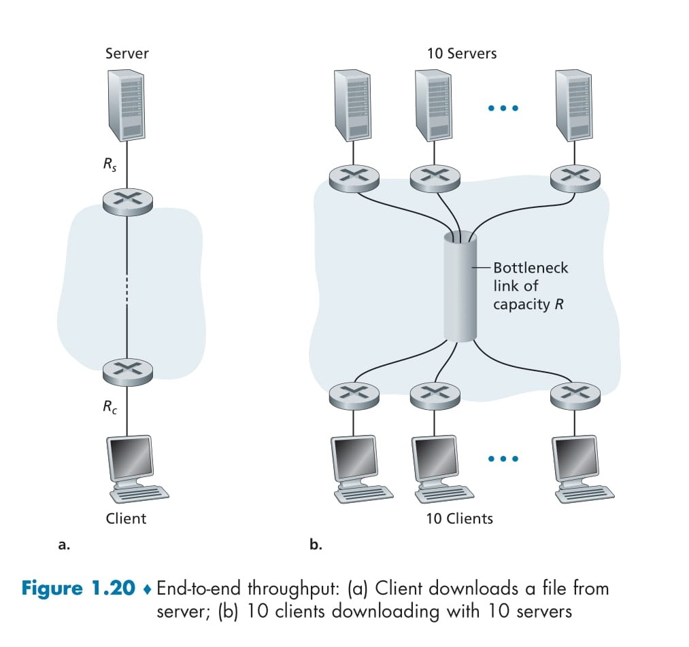

# 📚 **Throughput in Computer Networks**

In addition to **delay** and **packet loss**, **throughput** is a critical performance measure in computer networks. It represents how effectively data is transmitted across a network and impacts both real-time applications (e.g., video streaming) and bulk transfers (e.g., file downloads). This README explores the concept of throughput with clear explanations and examples. 🚀✨

---

## 🔍 **1. What is Throughput?**

Throughput refers to the **rate (in bits/second)** at which data is successfully delivered from a source (e.g., a server) to a destination (e.g., a client). It can be categorized as:  
1. **Instantaneous Throughput**: The rate at any given moment.  
2. **Average Throughput**: The total data transferred divided by the total time taken.  

### 🧮 **Formula for Average Throughput**
If a file of size \(F\) (in bits) is transferred in \(T\) seconds, the average throughput is:  
\[
\text{Throughput} = \frac{F}{T} \, \text{bits/sec}.
\]

---

## 🌐 **2. Real-World Applications of Throughput**

1. **Real-Time Applications**:  
   - Applications like **Internet telephony** and **video streaming** require **consistent throughput** above a certain threshold.  
   - Example: A video call might need a minimum of **256 kbps** to maintain quality.

2. **File Transfers**:  
   - For non-real-time applications (e.g., downloading a large file), the goal is to maximize throughput for faster transfer.

---

## 📊 **3. Understanding Throughput with Examples**

### Example 1: Two-Link Network  
Consider a simple network with two links:  
- **Server** connected to a router with a link of rate \(R_s\).  
- **Router** connected to a **client** with a link of rate \(R_c\).

#### 🔧 Key Concepts:
- The **bottleneck link** determines the throughput of the entire system.  
- Bottleneck Link: The link with the **lowest transmission rate**.

#### 🧮 **Throughput Calculation**
\[
\text{Throughput} = \text{min}\{R_s, R_c\}.
\]

#### 🌟 **Example Calculation**
- File size (\(F\)) = 32 million bits  
- Server link rate (\(R_s\)) = 2 Mbps  
- Client link rate (\(R_c\)) = 1 Mbps  

Throughput:  
\[
\text{Throughput} = \text{min}\{2 \, \text{Mbps}, 1 \, \text{Mbps}\} = 1 \, \text{Mbps}.
\]

Time to transfer the file:  
\[
T = \frac{F}{\text{Throughput}} = \frac{32 \, \text{million bits}}{1 \, \text{Mbps}} = 32 \, \text{seconds}.
\]

---

### Example 2: Multi-Link Network  
Now, consider a network with \(N\) links between the **server** and the **client**, where the transmission rates are \(R_1, R_2, \dots, R_N\).  

#### 🔧 Key Concepts:
- The bottleneck link still determines the throughput.  
- Bottleneck Link: The link with the **minimum transmission rate** in the network.

#### 🧮 **Throughput Calculation**
\[
\text{Throughput} = \text{min}\{R_1, R_2, \dots, R_N\}.
\]

---

### Example 3: Over-Provisioned Core Networks  
Modern Internet networks often have **high-speed links** in their core, meaning:  
- Core links have very high transmission rates (\(R_{\text{core}}\)).  
- The bottleneck link is typically the **access link** between the end system and the network (e.g., \(R_s\) or \(R_c\)).

#### 🔧 Key Insight:
For such networks, throughput is:  
\[
\text{Throughput} = \text{min}\{R_s, R_c\}.
\]

  

## 🚦 **4. Bottleneck Links and Their Impact**

1. **Definition of Bottleneck Link**:  
   The link in the network with the **lowest transmission rate**, limiting the throughput of the entire system.

2. **Example of Bottleneck Behavior**:  
   - If \(R_s > R_c\), the router will queue bits because it cannot forward them as fast as they arrive.  
   - This creates a **backlog** at the router, potentially leading to delays and packet loss.

3. **Impact on Transfer Time**:  
   - The time to transfer a file depends on the bottleneck link’s rate.  
   - Formula for transfer time:
   \[
   T = \frac{F}{\text{Throughput}} = \frac{F}{\text{min}\{R_s, R_c\}}.
   \]

---

## 🌟 **5. Key Observations**

1. **Throughput in Simple Networks**:  
   - For a two-link network, throughput depends on the **minimum rate** between the server-router link (\(R_s\)) and the router-client link (\(R_c\)).  

2. **Throughput in Multi-Link Networks**:  
   - For \(N\)-link networks, the bottleneck link (\(\text{min}\{R_1, R_2, \dots, R_N\}\)) determines the throughput.

3. **Modern Internet**:  
   - In today’s over-provisioned networks, the **access links** (e.g., \(R_s\) and \(R_c\)) are typically the bottleneck, not the core links.

---

## 📦 **6. Practical Example: MP3 File Transfer**

Let’s revisit the MP3 file transfer example:  
- File size (\(F\)) = 32 million bits  
- Server link rate (\(R_s\)) = 2 Mbps  
- Client link rate (\(R_c\)) = 1 Mbps  

**Throughput**:  
\[
\text{Throughput} = \text{min}\{2 \, \text{Mbps}, 1 \, \text{Mbps}\} = 1 \, \text{Mbps}.
\]

**Time to Transfer**:  
\[
T = \frac{F}{\text{Throughput}} = \frac{32 \, \text{million bits}}{1 \, \text{Mbps}} = 32 \, \text{seconds}.
\]

---

## 🌐 **7. Core vs. Access Networks**

### Core Network Characteristics:  
1. **High-Speed Links**: The Internet core is over-provisioned with links capable of handling high traffic.  
2. **Minimal Congestion**: Core links rarely form bottlenecks in modern networks.

### Access Network Characteristics:  
1. **Limited Speeds**: Access links (e.g., home broadband or mobile networks) often have lower transmission rates.  
2. **Frequent Bottlenecks**: Access links usually constrain the throughput between end systems.

> **New Section Begins Here**

Here’s a detailed and professional README on the topic of **Throughput in Multi-Client and Multi-Server Scenarios**, based on the information provided in **Figure 1.20**. This README maintains a **beautiful layout with emojis** and comprehensive explanations.

---

# 📚 **Throughput in Multi-Client and Multi-Server Scenarios**

Throughput in computer networks can vary based on **link capacities**, **access rates**, and **intervening traffic**. In this README, we explore scenarios involving multiple clients, servers, and shared network links, as illustrated in **Figure 1.20**. 🚀✨

---

## 🔍 **1. Throughput in Single-Client vs. Multi-Client Scenarios**

### 🖥️ **Single-Client Scenario (Figure 1.20a)**

In a single-client scenario:
- **Access Links**: The server is connected to the network with an access link of rate \(R_s\), and the client with \(R_c\).  
- **Core Links**: Assume the core network links are much faster than \(R_s\) and \(R_c\).  

#### 🧮 **Throughput Formula**:
The throughput in this case is determined by the **minimum of the server and client access link rates**:
\[
\text{Throughput} = \text{min}(R_s, R_c).
\]

#### 🌟 **Example**:
- \(R_s = 2 \, \text{Mbps}\) (server’s access link rate).  
- \(R_c = 1 \, \text{Mbps}\) (client’s access link rate).  

\[
\text{Throughput} = \text{min}(2 \, \text{Mbps}, 1 \, \text{Mbps}) = 1 \, \text{Mbps}.
\]

In this case, the **bottleneck** is the client’s access link (\(R_c\)).  

---

### 👥 **Multi-Client Scenario (Figure 1.20b)**

In a multi-client scenario:
- **10 Servers** and **10 Clients** are connected to the network.  
- A **shared core link** of rate \(R\) is traversed by all the downloads.  

---

## 📊 **2. Impact of Shared Links on Throughput** [Bottleneck](../bottleneck.md)

### 🔧 **Key Concept: Bottleneck Link**
- A **bottleneck link** limits the throughput of all traffic flowing through it.  
- Even if the core links are fast, a shared bottleneck link can reduce the throughput of individual flows.

---

### 🌐 **Scenario: Shared Core Link**

#### Case 1: **High Core Link Rate (\(R\))**
If the shared link \(R\) has a rate much higher than \(R_s\) and \(R_c\):
\[
\text{Throughput for each download} = \text{min}(R_s, R_c).
\]

#### Case 2: **Moderate Core Link Rate (\(R\))**
If the shared link \(R\) has a rate similar to \(R_s\) and \(R_c\):
1. The core link \(R\) becomes the bottleneck.  
2. The throughput for each download is determined by the **rate of the shared link divided equally among all flows**.

  

## 🧮 **3. Example Calculation: Multi-Client Throughput**

### Given:
- \(R_s = 2 \, \text{Mbps}\) (server access link rate).  
- \(R_c = 1 \, \text{Mbps}\) (client access link rate).  
- \(R = 5 \, \text{Mbps}\) (shared core link rate).  
- **10 simultaneous downloads**.

### Throughput Calculation:
- Each download receives an equal share of the shared core link rate:  
\[
\text{Throughput per download} = \frac{R}{10}.
\]

Substitute the values:
\[
\text{Throughput per download} = \frac{5 \, \text{Mbps}}{10} = 0.5 \, \text{Mbps}.
\]

Thus, the throughput for each download is **500 kbps**, and the shared core link becomes the bottleneck.

---

## 🌟 **4. Key Observations**

1. **Throughput in Single-Client Scenarios**:  
   - Determined by the slower access link between the server and the client (\(\text{min}(R_s, R_c)\)).  

2. **Throughput in Multi-Client Scenarios**:  
   - Dependent on the capacity of shared links and the number of simultaneous flows.  
   - Shared links divide their capacity equally among flows, making them bottlenecks in high-traffic scenarios.

3. **Intervening Traffic**:  
   - A link with a high transmission rate can still become a bottleneck if many data flows traverse it.  
   - This is common in shared core networks.

---

## 🔧 **5. Practical Insights**

1. **Impact of Bottlenecks**:  
   - In shared networks, the bottleneck can shift from access links to core links based on traffic intensity.  

2. **Network Design Considerations**:  
   - High-capacity shared links are essential for supporting multiple simultaneous downloads.  
   - Load balancing and traffic engineering can reduce the impact of bottlenecks.

3. **Throughput Calculation**:  
   - For a single flow:  
   \[
   \text{Throughput} = \text{min}(R_s, R_c).
   \]
   - For multiple flows sharing a link:  
   \[
   \text{Throughput per flow} = \frac{\text{Link Capacity}}{\text{Number of Flows}}.
   \]

