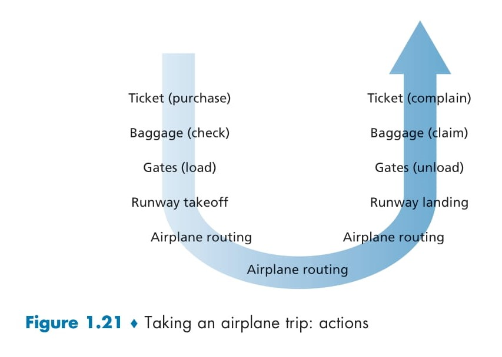
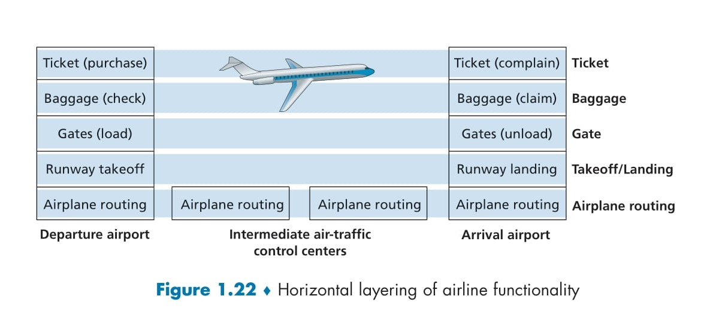

# ✈️ **Protocol Layers and Their Service Models** 🚀

## 📌 Introduction
The Internet is a highly complex system with numerous components, including **applications, protocols, end systems, packet switches, and link-level media**. To simplify this complexity, a **layered architecture** is used to structure networking functions, making them easier to manage and troubleshoot.

---

## 🏛 Layered Architecture in Networking
A **layered architecture** breaks down the functionality of a network into separate levels, with each level responsible for a specific task. This modular design helps in **efficient troubleshooting, flexibility, and standardization**.

### 🎭 Real-World Analogy: The Airline System ✈️
A great way to understand layered networking is by comparing it to **taking an airplane trip**. Just like networking, the airline system involves multiple steps, processes, and personnel working together to ensure a smooth experience.

### 🛫 Actions in an Airplane Trip
| **Step** | **Action** | **Networking Equivalent** |
|---------|-----------|----------------------|
| 🎫 **Ticket (purchase)** | Buying a ticket to travel | Establishing a connection |
| 🧳 **Baggage (check)** | Checking in your luggage | Data preparation |
| 🚪 **Gates (load)** | Boarding the airplane | Data encapsulation |
| 🏃 **Runway takeoff** | Plane takes off | Data transmission |
| 🌍 **Airplane routing** | Plane follows a route | Routing packets over the network |
| 🛬 **Runway landing** | Plane lands at the destination | Data reception |
| 🚪 **Gates (unload)** | Deplaning at the gate | Data extraction |
| 🧳 **Baggage (claim)** | Collecting your luggage | Data retrieval |
| 😡 **Ticket (complain)** | Complaining if issues arise | Error handling |

This analogy helps illustrate how **network protocols function** in a systematic, structured manner, ensuring that data reaches its destination just like a traveler reaches theirs.

  

  **Figure 1.21**: Taking an airplane trip: actions

### ✈️ **Horizontal Layering Breakdown**
| **Layer** | **Functionality** | **Description** |
|-----------|----------------|----------------|
| 🎫 **Ticketing Layer** | Ticket purchase & complaints | Ensures passengers are registered for flights and can report issues. |
| 🧳 **Baggage Layer** | Baggage check & claim | Handles checked luggage from origin to destination. |
| 🚪 **Gate Layer** | Loading & unloading passengers | Manages passenger boarding and deplaning. |
| 🏃 **Takeoff/Landing Layer** | Runway handling | Ensures smooth departure and arrival on runways. |
| ✈️ **Airplane Routing Layer** | Flight path coordination | Manages in-flight routing between airports. |

  

  **Figure e 1.22**: Horizontal layering of airline functionality

# `New Section Starts here`

