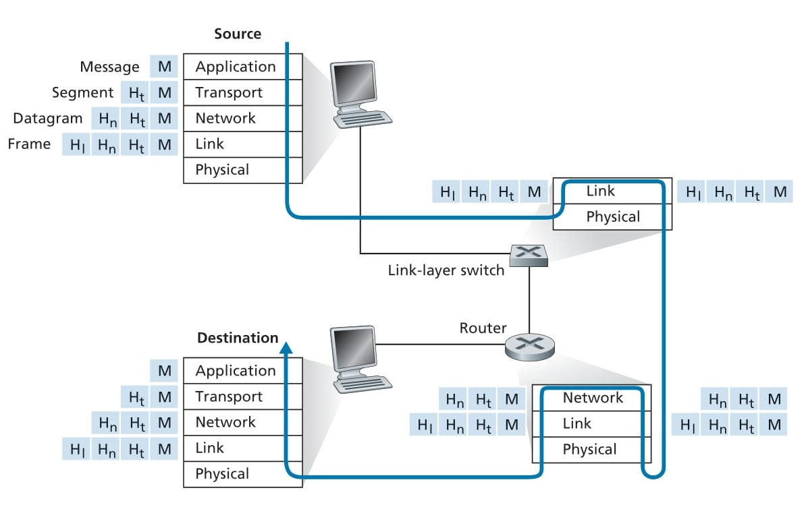

# **Protocol Layers and Their Service Models** 🚀

## 📌 Introduction
The Internet is a highly complex system with numerous components, including **applications, protocols, end systems, packet switches, and link-level media**. To simplify this complexity, a **layered architecture** is used to structure networking functions, making them easier to manage and troubleshoot.

---

## 🏛 Layered Architecture in Networking
A **layered architecture** breaks down the functionality of a network into separate levels, with each level responsible for a specific task. This modular design helps in **efficient troubleshooting, flexibility, and standardization**.

### 🎭 Real-World Analogy: The Airline System ✈️
A great way to understand layered networking is by comparing it to **taking an airplane trip**. Just like networking, the airline system involves multiple steps, processes, and personnel working together to ensure a smooth experience.

### 🛫 Actions in an Airplane Trip
| **Step** | **Action** | **Networking Equivalent** |
|---------|-----------|----------------------|
| 🎫 **Ticket (purchase)** | Buying a ticket to travel | Establishing a connection |
| 🧳 **Baggage (check)** | Checking in your luggage | Data preparation |
| 🚪 **Gates (load)** | Boarding the airplane | Data encapsulation |
| 🏃 **Runway takeoff** | Plane takes off | Data transmission |
| 🌍 **Airplane routing** | Plane follows a route | Routing packets over the network |
| 🛬 **Runway landing** | Plane lands at the destination | Data reception |
| 🚪 **Gates (unload)** | Deplaning at the gate | Data extraction |
| 🧳 **Baggage (claim)** | Collecting your luggage | Data retrieval |
| 😡 **Ticket (complain)** | Complaining if issues arise | Error handling |

This analogy helps illustrate how **network protocols function** in a systematic, structured manner, ensuring that data reaches its destination just like a traveler reaches theirs.

  

  **Figure 1.21**: Taking an airplane trip: actions

### ✈️ **Horizontal Layering Breakdown**
| **Layer** | **Functionality** | **Description** |
|-----------|----------------|----------------|
| 🎫 **Ticketing Layer** | Ticket purchase & complaints | Ensures passengers are registered for flights and can report issues. |
| 🧳 **Baggage Layer** | Baggage check & claim | Handles checked luggage from origin to destination. |
| 🚪 **Gate Layer** | Loading & unloading passengers | Manages passenger boarding and deplaning. |
| 🏃 **Takeoff/Landing Layer** | Runway handling | Ensures smooth departure and arrival on runways. |
| ✈️ **Airplane Routing Layer** | Flight path coordination | Manages in-flight routing between airports. |

  

  **Figure e 1.22**: Horizontal layering of airline functionality

# `New Section Protocol Layering`

# 🌐 **Protocol Layering** 🚀

## 📌 Introduction
Networking protocols are structured using **protocol layering**, which provides a modular approach to designing and organizing network communication. In this method, network protocols, along with the hardware and software implementing them, are categorized into layers. Each layer offers specific services to the layer above it, ensuring **efficient data transmission and organization**.

---

## 🏛 What is Protocol Layering? 
Protocol layering is a method used to design **network architectures** by dividing the communication process into multiple layers. This approach follows a structured service model where:

1️⃣ Each layer **performs specific actions** related to communication. 
2️⃣ Each layer **depends on the services** of the layer directly below it.

For example, a **higher-layer protocol** might require reliable message delivery from one point to another. If the lower layer provides only unreliable delivery, then the higher layer will add functionality like **error detection and retransmission**.

---

## 🖥️ Implementation of Protocol Layers
A **protocol layer** can be implemented in software, hardware, or a combination of both:
- **Application & Transport Layers** → Typically implemented in **software** (e.g., HTTP, SMTP, TCP, UDP).
- **Network Layer** → A combination of **hardware and software** (e.g., routers using IP protocol).
- **Link & Physical Layers** → Mostly implemented in **hardware**, often in **network interface cards (NICs)** (e.g., Ethernet, WiFi cards).

Just as **airline functionality is distributed among airports and control centers**, **protocol layers are distributed among end systems, switches, and routers** in a network. Each **network component** operates a portion of the protocol relevant to its function.

---

  

  **Figure Figure 1.23**: The Internet protocol stack

## 🔗 The Five-Layer Internet Protocol Stack
The **Internet protocol stack** consists of **five key layers**, as illustrated in Figure 1.23:

| **Layer** | **Functionality** | **Example Protocols** |
|------------|------------------|-------------------|
| 🏛 **Application Layer** | Provides services directly to end-users | HTTP, SMTP, FTP |
| 🚀 **Transport Layer** | Handles end-to-end communication | TCP, UDP |
| 🌍 **Network Layer** | Routes packets across networks | IP (IPv4, IPv6) |
| 🔗 **Link Layer** | Handles data transfer over physical connections | Ethernet, WiFi, ARP |
| ⚡ **Physical Layer** | Manages physical data transmission | Fiber, Copper, Radio waves |

Each layer provides services to the layer **above** it while depending on the services of the layer **below** it. For example, the **transport layer (TCP/UDP)** relies on the **network layer (IP)** to deliver packets across different networks.

# `New Section Application Layer`

# 🌍 **Application Layer** 🚀

The **Application Layer** is the topmost layer of the **Internet protocol stack**. It is responsible for **network applications and their corresponding application-layer protocols**. This layer provides the **interface for end-users and applications** to communicate over the network.The **Application Layer** houses network applications and the **protocols** that enable communication between devices. These protocols define **how messages are structured, sent, and processed** between applications on different end systems.

### 💡 Key Functions of the Application Layer:
- **Enables network communication for user applications** (e.g., web browsing, email, file transfer).
- **Provides protocols for specific tasks**, such as requesting webpages, sending emails, or transferring files.
- **Handles name resolution** (e.g., converting human-readable domain names to IP addresses).
- **Ensures proper data formatting, encoding, and encryption for secure communication.**

---

## 🌐 Key Protocols in the Application Layer
| **Protocol** | **Purpose** | **Functionality** |
|-------------|------------|------------------|
| 🌍 **HTTP (Hypertext Transfer Protocol)** | Web browsing | Requests and transfers web documents (e.g., HTML, CSS, images). |
| 📩 **SMTP (Simple Mail Transfer Protocol)** | Email services | Transfers email messages between mail servers. |
| 📁 **FTP (File Transfer Protocol)** | File sharing | Transfers files between end systems. |
| 🔎 **DNS (Domain Name System)** | Name resolution | Converts human-friendly domain names (e.g., www.ietf.org) into IP addresses. |

These protocols enable communication between applications running on different devices across the Internet. 

---

## 🖥️ How Does the Application Layer Work?
An **Application-Layer Protocol** operates **across multiple end systems**. It enables communication between applications running on different devices, following these steps:

1️⃣ **A user application (like a web browser) initiates a request** using an application-layer protocol (e.g., HTTP).  
2️⃣ **A message is generated** containing necessary information for communication.   
3️⃣ **The message is transmitted** across the network using lower-layer protocols.   
4️⃣ **The receiving application interprets and processes the message**, enabling a response or action.   

At the **Application Layer**, we refer to the **data exchanged** as a **message**. These messages encapsulate application-specific information that is **interpreted and processed** at the destination system.

# `New Section Transport Layer`

# 🚀 **Transport Layer**

## 🏛 What is the Transport Layer? 
The **Transport Layer** is responsible for **delivering data** from one **application endpoint to another** across the Internet. It acts as a **bridge** between the **Application Layer** and the **lower network layers**, ensuring that messages from applications are delivered efficiently and reliably. The **Transport Layer** is the second-highest layer in the Internet protocol stack. It ensures that **application-layer messages** are properly **transmitted and received** between end systems, regardless of the underlying network conditions.

### 💡 Key Functions of the Transport Layer:
- **Transfers application-layer messages** between source and destination endpoints.
- **Provides reliability and flow control** (in the case of TCP) to prevent network congestion.
- **Segments long messages** into smaller packets and reassembles them at the destination.
- **Offers different levels of service** depending on the protocol used (TCP vs. UDP).

---

## 🌐 Transport Layer Protocols
The Internet primarily uses two **Transport Layer protocols**:

| **Protocol** | **Type** | **Functionality** |
|-------------|---------|------------------|
| ⚡ **TCP (Transmission Control Protocol)** | Connection-oriented | Provides reliable, ordered, and error-checked delivery of data. |
| 🌍 **UDP (User Datagram Protocol)** | Connectionless | Provides fast but unreliable, unordered delivery of data. |

Each protocol serves different types of applications based on their communication needs.

---

## 📡 TCP (Transmission Control Protocol)
TCP is a **connection-oriented** protocol that ensures **reliable** data transmission. It is used for applications that require:
✅ **Guaranteed message delivery** – Ensures that data reaches its destination correctly.  
✅ **Flow control** – Matches sender/receiver speeds to prevent data loss.  
✅ **Congestion control** – Prevents overwhelming the network by adjusting transmission rates.  
✅ **Data segmentation and reassembly** – Breaks large messages into smaller packets and reassembles them upon arrival.  

TCP is commonly used in applications like:
- 🌍 **Web browsing (HTTP, HTTPS)**
- 📩 **Email (SMTP, IMAP, POP3)**
- 🎮 **Online gaming (when reliability is needed)**

---

## ⚡ UDP (User Datagram Protocol)
UDP is a **connectionless** protocol designed for applications that require **speed over reliability**. It provides:
❌ **No guaranteed delivery** – Packets may be lost in transit.  
❌ **No flow control** – Data is sent at the application’s speed, regardless of network congestion.  
❌ **No congestion control** – Does not adjust transmission rates in response to network conditions.  

UDP is commonly used in:
- 📺 **Streaming (YouTube, Netflix, VoIP, Video Calls)**
- 🎮 **Real-time gaming (fast but lossy connections)**
- 📡 **DNS lookups (quick, one-time queries)**

---

## 🔗 Transport Layer Data Unit: Segments
In the Transport Layer, the unit of data transmission is called a **segment**. A segment carries **application-layer messages**, along with **headers** containing important metadata such as **source/destination ports, sequence numbers, and error-checking fields**.

# `New Section Network Layer`

# 🌐 **Network Layer** 🚀

The **Network Layer** is responsible for **delivering data packets** from one host to another across the Internet. It acts as the **backbone** of network communication, ensuring that data is efficiently routed and delivered between source and destination devices 
The **Network Layer** is the third layer in the Internet protocol stack. It plays a crucial role in **addressing, routing, and forwarding** data to ensure successful communication between devices located in different networks.

### 💡 Key Functions of the Network Layer:
- **Transfers packets (datagrams) between hosts.**
- **Uses logical addressing (IP addresses) to identify source and destination devices.**
- **Determines the best routes for packets using routing protocols.**
- **Handles packet fragmentation and reassembly when necessary.**

---

## 🌍 Core Components of the Network Layer
The Network Layer consists of two main components:

1️⃣ **The IP Protocol (Internet Protocol)**  
2️⃣ **Routing Protocols**  

Let's explore each of these in detail.

---

## 📡 The IP Protocol (Internet Protocol)
The **IP protocol** is the **heart of the Network Layer**. It defines the **structure of datagrams** (network-layer packets) and specifies how devices handle and forward these packets.

✅ **IP is the universal protocol that all Internet-enabled devices must use.**  
✅ **IP defines the structure of datagram headers**, including source/destination addresses.  
✅ **IP enables end-to-end communication between hosts across different networks.**  
✅ **IP provides best-effort delivery**, meaning it does not guarantee packet arrival but relies on higher layers for error checking.  

### 📌 IP Addressing
Each device connected to the Internet is assigned a **unique IP address** that identifies it within the network. There are two major versions of IP:
- **IPv4 (32-bit addresses, widely used)**
- **IPv6 (128-bit addresses, designed for future scalability)**

---

## 🔗 Routing Protocols
The **Network Layer** also includes **routing protocols**, which determine the **best path** for delivering datagrams from the source to the destination.

| **Routing Protocol Type** | **Examples** | **Functionality** |
|-----------------|--------------------|------------------|
| 📡 **Interior Gateway Protocols (IGPs)** | OSPF, RIP, EIGRP | Used within a single organization’s network. |
| 🌍 **Exterior Gateway Protocols (EGPs)** | BGP | Used to route data between different organizations (Autonomous Systems). |

### 📌 Role of Routing Protocols
- **Routing protocols help routers decide the most efficient paths for data transmission.**
- **They enable dynamic path selection, ensuring optimal data flow.**
- **Routers use these protocols to communicate and exchange network topology information.**

---

## 📦 Network Layer Data Unit: Datagrams
At the **Network Layer**, the unit of data transmission is called a **datagram**. A datagram contains:
✅ **A header** (which includes source/destination IP addresses).  
✅ **A payload** (which contains the actual data being transmitted).  
✅ **Control information** (used for routing and delivery).

# `New Section Link Layer`

# 🔗 **Link Layer** 🚀
The **Link Layer** facilitates communication between devices on the same physical or logical link. While the **Network Layer** determines the end-to-end route of a **datagram**, the **Link Layer** ensures that the datagram is delivered from **one node to the next** along this route.

### 💡 Key Functions of the Link Layer:
- **Transfers data between directly connected nodes (hosts or routers).**
- **Encapsulates network-layer datagrams into link-layer frames.**
- **Handles error detection, retransmission, and flow control (depending on the protocol).**
- **Uses different protocols for different types of network links.**

---

## 📡 How the Link Layer Works
When a **datagram** reaches a network node (such as a router or host), the **Network Layer** hands it over to the **Link Layer** for **local delivery**. The Link Layer then:

1️⃣ **Encapsulates the datagram into a frame** that is compatible with the specific link-layer protocol in use.  
2️⃣ **Transmits the frame** over the physical link to the next node (router or host).  
3️⃣ **At the receiving node, the Link Layer extracts the datagram** from the frame and passes it up to the **Network Layer**.  

This process is repeated at every hop along the route until the datagram reaches its final destination.

---

## 🌍 Key Link Layer Protocols
Different types of **link-layer protocols** are used depending on the network link:

| **Protocol** | **Purpose** | **Example Use Case** |
|-------------|------------|------------------|
| 📶 **WiFi (802.11)** | Wireless communication | Home and enterprise wireless networks |
| 🔗 **Ethernet (802.3)** | Wired LAN communication | Office and data center networking |
| 🌍 **PPP (Point-to-Point Protocol)** | Direct connection between two nodes | DSL and dial-up connections |
| 📡 **DOCSIS (Data Over Cable Service Interface Specification)** | Broadband over cable | Cable internet connections |

A **datagram** often needs to traverse multiple links using **different link-layer protocols**. For example:
- A datagram may travel over **WiFi** from a laptop to a router.
- It may then be transmitted over **Ethernet** to an ISP.
- Finally, it may be carried over **DOCSIS** via a cable network to reach a server.

Each link-layer protocol provides **different services** based on its technology.

---

## 📦 Link Layer Data Unit: Frames
At the **Link Layer**, the unit of data transmission is called a **frame**. A frame contains:
✅ **A header** (which includes addressing information like MAC addresses).  
✅ **A payload** (which contains the network-layer datagram).  
✅ **Error-checking information** (used for data integrity and reliability).  

# `New Section Physical Layer`

# ⚡ **Physical Layer** 🚀
The **Physical Layer** is the **lowest layer** in the Internet protocol stack. It is responsible for **transmitting raw bits** from one network device to another over a communication medium. Unlike higher layers that deal with structured data (such as frames or packets), the **Physical Layer** focuses on the fundamental task of moving individual bits across a physical connection. The **Physical Layer** ensures that **bits are transmitted as electrical signals, optical pulses, or radio waves** over a medium such as copper wires, fiber optics, or wireless channels. It provides the foundation for all network communication by defining how data is physically sent and received.

### 💡 Key Functions of the Physical Layer:
- **Transfers individual bits** across a communication link.
- **Defines transmission medium characteristics** (copper, fiber, radio waves, etc.).
- **Handles bit encoding and modulation** for efficient transmission.
- **Specifies data rates and synchronization mechanisms.**
- **Manages physical network topology and hardware interfaces.**

---

## 📡 Physical Layer Technologies
Different communication mediums require different **Physical Layer protocols** to ensure reliable bit transmission. 

| **Technology** | **Transmission Medium** | **Usage** |
|--------------|------------------|------------------|
| 🔌 **Twisted-Pair Copper Wire** | Electrical signals | Ethernet LAN connections |
| 📡 **Coaxial Cable** | Electrical signals | Cable networks (DOCSIS) |
| 🔦 **Fiber Optics** | Light pulses | High-speed backbone networks |
| 📶 **Wireless (WiFi, Cellular)** | Radio waves | Mobile and WiFi networks |

Each medium requires a specific method to convert **bits into signals** that can be transmitted efficiently over that medium.

---

## 📦 How the Physical Layer Works
When data is passed down from the **Link Layer**, the Physical Layer performs the following steps:

1️⃣ **Bit Encoding & Modulation:** The data is converted into signals (electrical, optical, or radio) for transmission.  
2️⃣ **Signal Transmission:** The encoded signals travel through the transmission medium to the next network device.  
3️⃣ **Reception & Decoding:** The receiving device converts the incoming signals back into bits.  
4️⃣ **Bit Synchronization:** Ensures that both sender and receiver maintain proper timing during data transmission.  

# `New Section Data Encapsulation`

# 📦 **Data Encapsulation** 🚀

Encapsulation occurs when data is passed **from an upper-layer protocol to a lower-layer protocol** in the network stack. Each layer **wraps the received data** by adding a **header** (and sometimes a trailer) containing information needed for processing at that layer.
Figure 1.24 illustrates how data moves **down the protocol stack** in a sending system, through intermediary network devices, and then **up the protocol stack** in the receiving system.

  

  **Figure 1.24**: Hosts, routers, and link-layer switches; each contains a
different set of layers, reflecting their differences in functionality-

### 💡 Key Steps in Data Encapsulation:
1️⃣ The **Application Layer** creates the original **message (M)**.  
2️⃣ The **Transport Layer** encapsulates the message into a **segment** by adding a transport-layer **header (Ht)**.  
3️⃣ The **Network Layer** encapsulates the segment into a **datagram** by adding a network-layer **header (Hn)**.  
4️⃣ The **Link Layer** encapsulates the datagram into a **frame** by adding a link-layer **header (Hl)**.  
5️⃣ The **Physical Layer** transmits the raw bits over the network medium.  

At the **receiving end**, the encapsulation process is reversed:
- The **Link Layer** extracts the **datagram** from the frame.
- The **Network Layer** extracts the **segment** from the datagram.
- The **Transport Layer** extracts the **original message** from the segment and delivers it to the **Application Layer**.

---

## 📡 Headers at Each Layer
Each layer's **header information** helps with specific networking functions:

| **Layer** | **Header** | **Purpose** |
|----------|----------|-------------|
| 🌍 **Application Layer** | M | The original message from the user application. |
| 🚀 **Transport Layer** | Ht | Adds information for **error-checking, sequencing, and delivery** (e.g., TCP/UDP headers). |
| 🌐 **Network Layer** | Hn | Adds **IP source/destination addresses** to route the data. |
| 🔗 **Link Layer** | Hl | Adds **MAC addresses** to ensure proper transmission within a network. |
| ⚡ **Physical Layer** | Bits | Converts data into **electrical, optical, or radio signals** for transmission. |

Each **header field** ensures that the data is successfully delivered to the next stage in the network journey.

---

## 📦 A Real-World Analogy: Sending a Memo
A useful analogy to encapsulation is **sending an interoffice memo via postal mail**:

1️⃣ **Memo Creation:** Alice writes a memo (similar to an application-layer message).  
2️⃣ **Interoffice Envelope:** She places it inside an interoffice envelope, addressed to Bob (similar to a transport-layer segment).  
3️⃣ **Postal Envelope:** The office mailroom places this envelope inside a larger **postal envelope** with destination addresses (similar to a network-layer datagram).  
4️⃣ **Mailing Process:** The envelope is handed to the postal service for delivery (similar to the link layer forwarding data).  
5️⃣ **Delivery & Unpacking:** The receiving mailroom removes the postal envelope, extracts the interoffice memo, and delivers it to Bob (similar to de-encapsulation in networking).  

This analogy illustrates how **each layer encapsulates and transports data**, ensuring it reaches the final recipient correctly.

---

## 🔗 Fragmentation & Reassembly
In some cases, **large messages must be divided into smaller packets** for transmission:
- **The Transport Layer** may break a large message into **multiple segments**.
- **The Network Layer** may further divide a segment into **multiple datagrams**.
- At the receiving end, these **fragments are reassembled** before being passed to higher layers.

