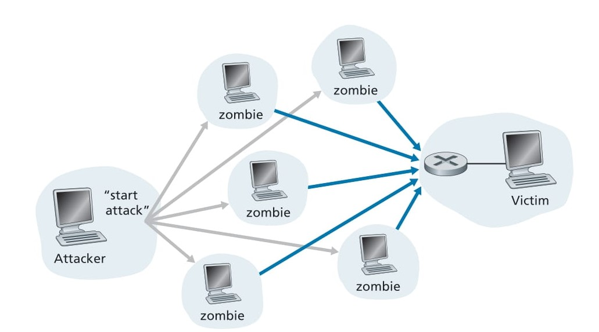

# 🔒 **Networks Under Attack** 🚀

## 📌 Introduction

The Internet has become **mission critical** for institutions, businesses, universities, and government agencies. Individuals also depend on it for **professional, social, and personal activities**. With billions of **connected devices**, from wearables to home automation systems, the **Internet plays a central role** in our daily lives.

However, amidst this utility and innovation, there exists a **dark side**—a world where **malicious actors** attempt to disrupt networks, steal sensitive data, and compromise privacy. This is where **network security** comes into play.

---

## 🏛 What is Network Security?

**Network Security** involves:

- **Understanding cyber threats and vulnerabilities**.
- **Implementing defensive measures to protect networks**.
- **Designing secure architectures to prevent future attacks**.

As future **computer networking professionals**, we must develop expertise in **securing networks against cyber threats** and **building resilient Internet infrastructures**.

---

## 🔥 Why is Network Security Important?

Given the **increasing frequency and sophistication of cyberattacks**, network security has become a **critical area** in computer networking. It ensures:
✅ **Protection of personal and corporate data** from hackers.\
✅ **Safe and uninterrupted access** to essential online services.\
✅ **Preservation of privacy** by preventing unauthorized access.\
✅ **Mitigation of cyber threats** before they cause significant damage.

---

## ⚠️ What Can Go Wrong?

Understanding **network vulnerabilities** helps us better **anticipate and mitigate** cyber threats. Some key security risks include:

### 🛑 **Types of Network Attacks**

| **Attack Type**                                         | **Description**                                                             | **Impact**                                             |
| ------------------------------------------------------- | --------------------------------------------------------------------------- | ------------------------------------------------------ |
| 🦠 **Malware (Viruses, Worms, Trojans)**                | Malicious software that infects devices and spreads                         | Data corruption, system failures, and financial losses |
| 🎭 **Phishing**                                         | Fraudulent emails/websites trick users into revealing sensitive information | Identity theft, financial fraud, data breaches         |
| ⚔️ **Denial of Service (DoS) & Distributed DoS (DDoS)** | Overloading a network service to make it unavailable                        | Website/service downtime, business disruption          |
| 🕵️ **Man-in-the-Middle (MitM) Attacks**                | Attackers intercept communication between users                             | Data theft, session hijacking, eavesdropping           |
| 🔓 **Unauthorized Access & Data Breaches**              | Gaining access to systems without permission                                | Loss of confidential data, financial impact            |
| 🎭 **Spoofing (IP/MAC Address Spoofing)**               | Faking an identity to gain access to networks                               | Network disruption, unauthorized resource use          |

These are just a few of the many possible **cyber threats** that networks face today.

---

## 🛡️ How Can We Defend Against These Attacks?

While cyber threats continue to evolve, **network security professionals** employ various **defense mechanisms** to safeguard networks.

### 🔑 **Key Defense Strategies**

✅ **Firewalls** – Monitor and control incoming/outgoing traffic to prevent unauthorized access.\
✅ **Encryption** – Protect data by converting it into an unreadable format, ensuring privacy.\
✅ **Intrusion Detection Systems (IDS)** – Detect and respond to potential threats in real time.\
✅ **Access Control & Authentication** – Implement user verification techniques like **MFA (Multi-Factor Authentication)**.\
✅ **Regular Software Updates** – Keep systems and applications patched to eliminate vulnerabilities.\
✅ **Cybersecurity Awareness & Training** – Educate users on recognizing and avoiding cyber threats.

# `New Section Bad Guys Infect Your Devices`

# 🦠 **How the Bad Guys Infect Your Devices** 🚀

## 📌 Introduction

We connect devices to the Internet to access valuable data and services, including **social media, streaming, video calls, online gaming, and web browsing**. However, while these benefits enrich our digital lives, the **Internet also carries malicious threats**, commonly known as **malware**.

Malware is a **broad category of malicious software** designed to **infect, damage, or control** computers and networks. Once a device is infected, malware can **steal sensitive data on user activity, delete files, or even turn devices into botnets for cyberattacks**.

---

## 🔥 How Malware Infects Devices

Malware can infiltrate your system through various means:

- **Phishing Emails** – Malicious attachments or links trick users into installing malware.
- **Malicious Websites** – Visiting infected sites can automatically download malware onto your device.
- **Drive-by Downloads** – Some websites install malware without any user interaction.
- **Compromised Software & Applications** – Installing pirated or unverified software may introduce malware.
- **USB & External Devices** – Infected USB drives can transfer malware to a clean system.

Once inside, malware operates in **stealth mode**, performing **harmful actions** without the user’s awareness.

---

## 🛑 What Can Malware Do?

Once installed on a device, malware can execute a range of malicious actions, such as:

| **Malware Action**               | **Description**                                                          |
| -------------------------------- | ------------------------------------------------------------------------ |
| 🗑 **File Deletion**             | Deletes critical user/system files, rendering systems inoperable.        |
| 🕵️ **Spyware**                  | Tracks user activity, logging passwords, keystrokes, and sensitive data. |
| 🏴‍☠️ **Ransomware**             | Encrypts user files and demands payment for decryption.                  |
| 📩 **Spam Distribution**         | Uses infected hosts to send massive spam emails.                         |
| ⚔️ **Denial-of-Service Attacks** | Overloads network services, making them unavailable.                     |
| 🖥 **Botnet Enrollment**         | Turns devices into bots controlled remotely for cyberattacks.            |

Some of the most damaging malware strains are **self-replicating**, meaning they spread across devices automatically.

---

## 🔄 How Self-Replicating Malware Spreads

Many forms of malware can **spread exponentially** once they infect a single system. This happens in a **chain reaction**:
1️⃣ **An initial device is infected** through phishing, downloads, or software vulnerabilities.\
2️⃣ **The malware begins spreading** to other connected devices over the Internet.\
3️⃣ **Each newly infected device** continues spreading malware to more systems.\
4️⃣ **The infection grows exponentially**, forming massive networks of compromised machines.

### 🕷 **Botnets: A Network of Infected Devices**

A **botnet** is a network of compromised devices that **cybercriminals control remotely**. These botnets can be used for:

- **Spamming & Phishing Attacks** 📩
- **Distributed Denial-of-Service (DDoS) Attacks** 🌐
- **Data Theft & Espionage** 🕵️
- **Cryptocurrency Mining** ⛏

---

## 🛡️ How to Protect Yourself from Malware

### ✅ **Best Practices for Avoiding Malware Infections**

- **🔒 Use Antivirus & Anti-Malware Software** – Keep security software updated.
- **📩 Be Cautious with Emails & Links** – Avoid opening unexpected attachments or clicking on suspicious links.
- **🌍 Use Secure Websites** – Only download files and software from reputable sources.
- **🔄 Regularly Update Software** – Apply security patches to fix vulnerabilities.
- **⚠️ Enable Firewalls** – Protect against unauthorized network access.
- **🚫 Avoid Pirated Software** – They often contain hidden malware.

# `New Section Denial-of-Service`

# 🔥 **Denial-of-Service (DoS) Attacks** 🚀

## 📌 Introduction
As the Internet has become essential for individuals, businesses, and institutions, **attackers continuously exploit vulnerabilities** in network infrastructure to disrupt services. One of the most severe threats is a **Denial-of-Service (DoS) attack**, which aims to **render a network, host, or service unusable** for legitimate users.
---

## 🏛 What is a Denial-of-Service (DoS) Attack?
A **Denial-of-Service (DoS) attack** is a malicious attempt to **overwhelm a target system, network, or service** so that it can no longer respond to legitimate requests. **Web servers, email servers, DNS servers, and entire networks** are frequent targets of DoS attacks.

**Key consequences of DoS attacks:**

✅ **Service Disruptions** – Users cannot access critical applications and services.  
✅ **Financial Losses** – Businesses lose revenue due to prolonged downtime.  
✅ **Reputational Damage** – Organizations suffer credibility loss if frequently attacked.  
✅ **Security Risks** – DoS attacks may be used as a diversion for more dangerous intrusions.  

---

## ⚔️ Types of DoS Attacks
Most DoS attacks fall into one of the following **three categories**:

| **Attack Type** | **Description** | **Impact** |
|--------------|------------------|------------------|
| 🔓 **Vulnerability Attack** | Exploits weaknesses in a system by sending well-crafted packets to crash an application or OS. | Service failure, system crashes, or data loss. |
| 🌊 **Bandwidth Flooding** | Overwhelms the target’s access link by sending a massive volume of traffic. | Prevents legitimate users from accessing the service. |
| 🔗 **Connection Flooding** | Attacker opens numerous half-open or full TCP connections to exhaust system resources. | Prevents new legitimate connections from being established. |

Each of these attacks can **cripple** an online service, but **DDoS attacks** pose an even greater threat.

---

## 📡 Distributed Denial-of-Service (DDoS) Attacks
### 🕷 **How DDoS Attacks Work**
Unlike traditional **single-source DoS attacks**, a **Distributed Denial-of-Service (DDoS) attack** involves **multiple compromised machines (zombies or botnets)** attacking a single target. These zombie machines are controlled by an attacker and **generate overwhelming amounts of traffic simultaneously**, making it difficult to block the attack.

### 📌 **Why DDoS Attacks Are More Dangerous**
✅ **Difficult to Detect** – Since traffic originates from multiple sources, identifying malicious traffic is complex.  
✅ **Harder to Block** – Blocking a single attacking IP does not stop the attack, as multiple machines are involved.  
✅ **Massive Impact** – DDoS attacks can **cripple large organizations, financial institutions, and government agencies**.  

### 📊 **Example of a DDoS Attack**
If a **server has an access rate of R bps**, a DoS attacker must send traffic at **approximately R bps** to be effective. However, if **R is very large**, a single attacker may not generate enough traffic. **This is where DDoS attacks become effective**—by coordinating thousands of infected machines, attackers can **aggregate their bandwidth** to overwhelm the target system.

  

  **Figure 1.25**: A distributed denial-of-service attack

---

## 🛡️ How to Defend Against DoS & DDoS Attacks
### ✅ **Best Practices for Preventing DoS Attacks**
- **📊 Traffic Monitoring & Anomaly Detection** – Identify unusual spikes in network traffic.
- **🛑 Firewalls & Rate Limiting** – Limit the number of connections per second from a single IP.
- **🕵️ Intrusion Detection Systems (IDS)** – Identify and block suspicious activity before damage occurs.
- **🔗 Content Delivery Networks (CDNs)** – Use distributed infrastructure to absorb high-traffic attacks.
- **🌍 Anycast Network Routing** – Distribute attack traffic across multiple servers to reduce impact.
- **🚫 Blackhole Routing** – Filter and discard malicious traffic before it reaches critical systems.

# `New Section Starts here`

