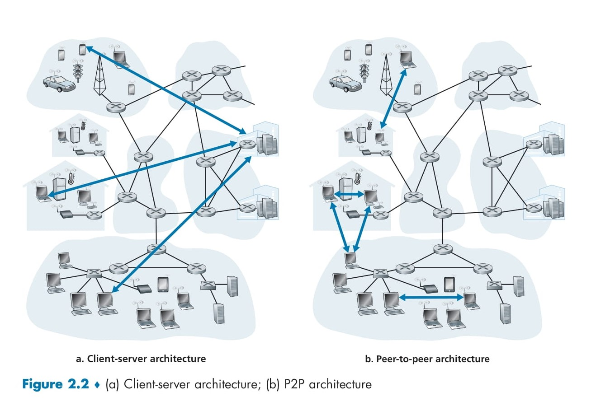

# 📡 **Network Application Architectures**

Before diving into software coding, it is essential to have a well-defined architectural plan for your application. This ensures efficiency, scalability, and maintainability. Application architecture differs from network architecture, such as the five-layer Internet architecture, as it is designed specifically by the application developer to dictate how the application is structured across various end systems.

## 🏛 Understanding Network vs. Application Architecture

- **Network Architecture**: Fixed structure providing specific services to applications.
- **Application Architecture**: Designed by developers to define communication structures between different components.

When choosing an application architecture, developers typically rely on one of two predominant paradigms: 🔍🔗📡

1. **Client-Server Architecture**
2. **Peer-to-Peer (P2P) Architecture**

---

## 🖥️ **Client-Server Architecture**

The **client-server model** is a centralized approach where:

- An **always-on server** responds to requests from multiple clients.
- Clients **do not communicate directly** with each other.
- The server has a **fixed IP address**, making it easily accessible.
- Examples include **Web, FTP, Telnet, and Email services**.

### 🔹 Characteristics of Client-Server Architecture

✅ **Centralized Control** – A single entity manages and processes requests.

✅ **Well-Defined Addressing** – Clients connect to a known server IP.

✅ **Efficient for Large-Scale Services** – Used in search engines, social media platforms, and e-commerce.

### 📌 Challenges in Client-Server Architecture

- **Scalability Issues** – A single server may struggle to handle large traffic loads.
- **Infrastructure Costs** – Requires investment in data centers and bandwidth.

### 🌎 Data Centers & Virtual Servers

To overcome scalability limitations, major services operate in **data centers**. For example:

- **Google** operates **19 data centers worldwide** for services like **Search, YouTube, and Gmail**.
- Other companies like **Amazon, Facebook, and Alibaba** use distributed server farms for high availability and redundancy.

---

## 🔄 **Peer-to-Peer (P2P) Architecture**

Unlike the client-server model, **P2P applications** minimize or eliminate dedicated servers. Instead:

- Peers (intermittently connected hosts) **directly communicate** with each other.
- Most peers are **user-owned** devices (PCs, laptops, etc.).
- **File-sharing applications**, such as **BitTorrent**, are prime examples of P2P.

### 🔹 Characteristics of P2P Architecture

✅ **Self-Scalability** – Each peer **both consumes and provides resources**, ensuring greater system efficiency.

✅ **Cost-Effective** – No need for dedicated infrastructure like client-server models.
✅ **Decentralization** – Reduces reliance on a single point of failure.

### 📌 Challenges in P2P Architecture

- **Security Risks** – Decentralization makes enforcing security protocols challenging.
- **Performance Concerns** – Network congestion and reliability issues can arise due to dynamic peer availability.
- **Data Integrity** – Ensuring trustworthy file transfers without centralized validation is difficult.

---

  

## 🏆 Client-Server vs. P2P: Which One to Choose?

| Feature         | Client-Server 🖥️               | Peer-to-Peer 🔄                      |
| --------------- | ------------------------------- | ------------------------------------ |
| **Scalability** | Limited                         | High (Self-Scaling)                  |
| **Cost**        | High (Servers & Maintenance)    | Low (User-Provided Resources)        |
| **Security**    | More Secure                     | Less Secure                          |
| **Reliability** | High                            | Varies (Depends on Peers)            |
| **Use Cases**   | Web Services, E-commerce, Email | File Sharing, Decentralized Networks |

---

## 🚀 Conclusion

Choosing between **Client-Server and P2P architectures** depends on the application’s specific needs. Client-server architectures offer **centralized control, reliability, and security**, making them ideal for large-scale web services. P2P architectures, on the other hand, provide **cost-effectiveness, self-scalability, and decentralization**, making them suitable for file sharing and distributed computing.
