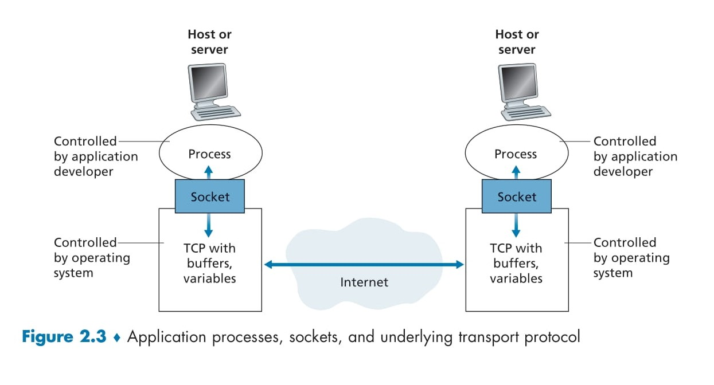

# 📡 **The Interface Between the Process and the Computer Network**

Most network applications consist of **pairs of communicating processes** that exchange messages over a network. Every message sent between these processes must pass through the underlying network. This communication is facilitated using a **software interface called a socket**. 🖥️🔗

## 🏛 Understanding Sockets in Network Communication

A **socket** serves as an intermediary between the application layer and the transport layer within a host. It is essentially an **Application Programming Interface (API)** that allows network applications to send and receive messages.

### 🔹 Process and Socket Analogy

A **process** can be compared to a **house**, while a **socket** acts as its **door**:

- When a process wants to **send a message**, it sends it through its **socket** (door).
- The message travels through the **transport infrastructure** (network) to the receiving process’s **socket**.
- The receiving process then **acts on the message** as per its programming. 📩🏠

### 📌 Socket in the Layered Network Model

In the **five-layer Internet model**, the **socket** acts as the interface between:

- The **application layer** (where the network application operates). 🎛️
- The **transport layer** (which handles the transmission of messages). 📡

📌 The **application developer** controls everything on the **application-layer** side of the socket but has **limited control** over the transport-layer side. The only options available to the developer are:

1. **Choice of transport protocol** (TCP, UDP, etc.).
2. **Configuring transport-layer parameters** (buffer size, maximum segment sizes, etc.).

Once a transport protocol is selected, the application utilizes the transport-layer **services provided by that protocol**. 🎯

---

## 🔄 Socket Programming in Python

To understand how network applications communicate through sockets, let's examine basic **socket programming** using Python. We'll implement both **server-side** and **client-side** socket programs.

### 🚀 Server Code (Listening for Connections)

```python
import socket

server_socket = socket.socket(socket.AF_INET, socket.SOCK_STREAM)
server_socket.bind(('0.0.0.0', 9090))  # Bind server to port 9090
server_socket.listen(1)  # Listen for incoming connections
print("Server is waiting for a connection...")

conn, addr = server_socket.accept()
print(f"Connected to {addr}")

message = conn.recv(1024).decode()  # Receive message from client
print(f"Client says: {message}")

conn.send("Hello from server!".encode())  # Respond to client
conn.close()
server_socket.close()
```

### 🔹 Explanation of Server Code

✅ **Creates a socket** that listens for incoming client connections.&#x20;

✅ **Binds the socket** to an IP address and port.&#x20;

✅ **Accepts a client connection** and receives a message.&#x20;

✅ **Sends a response** back to the client.&#x20;

✅ **Closes the connection** after the message exchange.&#x20;

---

### 🚀 Client Code (Initiates Communication)

```python
import socket

client_socket = socket.socket(socket.AF_INET, socket.SOCK_STREAM)
client_socket.connect(('127.0.0.1', 9090))  # Connect to the server

client_socket.send("Hello, Server!".encode())  # Send a message to the server
response = client_socket.recv(1024).decode()  # Receive the server's response
print(f"Server says: {response}")

client_socket.close()
```

### 🔹 Explanation of Client Code

✅ **Creates a socket** and connects to the server.&#x20;

✅ **Sends a message** to the server.&#x20;

✅ **Receives a response** from the server.&#x20;

✅ **Closes the connection** after communication.&#x20;

---

<div align="center">
  
</div>

## 🎯 Conclusion

Understanding **sockets and their role** in network communication is crucial for building network applications. 🔄💡

- **Sockets provide an interface** between the **application layer** and the **transport layer**. 🖥️
- **Developers control the application-side** but have limited influence over the transport side. ⚙️
- Using **Python socket programming**, we can create **client-server applications** that effectively communicate over a network. 
