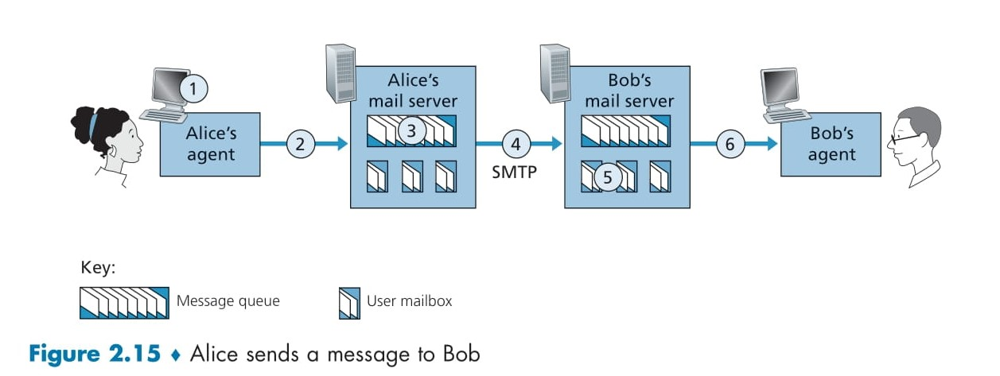

# **SMTP: The Backbone of Internet E-Mail** 📧🚀

## Overview 📚  
SMTP (Simple Mail Transfer Protocol), defined in RFC 5321, is the core protocol that moves e-mail messages from the sender's mail server to the recipient's mail server. Originating in the early days of the Internet (the original SMTP RFC dates back to 1982), it remains fundamental despite its legacy characteristics. Although it was designed when transmission capacity was limited, SMTP still reliably handles e-mail delivery today—even though its restriction to 7-bit ASCII for the message body requires additional encoding for multimedia data.

---

## How SMTP Works: A Step-by-Step Journey ✉️➡️📥

<div align="center">
  
</div>

### 1. Composing and Sending the Message  
When **Alice** wants to send an e-mail to **Bob**, she starts by composing her message using her e-mail client (or user agent), such as Gmail, Outlook, or any other e-mail application. This user-friendly interface allows her to add text, attachments, hyperlinks, or even embed images. Once she finishes writing, she instructs her client to send the message.

- **User Agent Role:**  
  Alice's e-mail client takes the composed message and forwards it to her mail server. Think of the user agent as your personal digital post office, making it easy to manage, read, and send messages.  
  **Emoji Insight:**  
  Imagine your e-mail client as a friendly assistant who prepares and hands over your letter to the postal service! 📬😊

### 2. The Mail Server and Outgoing Queue  
Alice's mail server receives the message and places it into an outgoing message queue. This server is responsible for temporarily storing the message until it can be delivered to Bob's mail server. If there are any issues, such as Bob's server being unreachable, Alice's server will periodically attempt to deliver the message until it succeeds or eventually notifies her of a delivery failure.

- **Mail Server Role:**  
  The mail server is like a sorting facility that organizes and routes your e-mail messages correctly.  
  **Emoji Insight:**  
  Think of it as a central hub that efficiently manages and directs your mail through the network! 📮🔄

### 3. Establishing a Connection via SMTP  
Once the message is queued, the SMTP client side on Alice's mail server initiates a TCP connection to Bob's mail server. This connection is used to transfer the message reliably using TCP's error-checking features.

- **Direct Connection:**  
  SMTP typically uses a direct TCP connection between the sending and receiving servers, regardless of geographical distance. For example, if Alice's server is in Hong Kong and Bob's in St. Louis, the two connect directly.
- **Emoji Insight:**  
  Picture this as two post offices opening a secure, direct line of communication to exchange letters without intermediaries! 🔗✉️

### 4. The SMTP Dialogue: Command and Response  
Once connected, the two servers engage in a dialogue following the SMTP protocol. Here’s a simplified example of how the conversation might go between the SMTP client (C) at `crepes.fr` and the SMTP server (S) at `hamburger.edu`:

- **Initial Greeting:**  
  - **S:** `220 hamburger.edu`  
  - **C:** `HELO crepes.fr`  
  - **S:** `250 Hello crepes.fr, pleased to meet you`  
  This exchange confirms the connection and establishes basic communication.

- **Specifying the Sender and Recipient:**  
  - **C:** `MAIL FROM: <alice@crepes.fr>`  
  - **S:** `250 alice@crepes.fr ... Sender ok`  
  - **C:** `RCPT TO: <bob@hamburger.edu>`  
  - **S:** `250 bob@hamburger.edu ... Recipient ok`  
  The sender and recipient e-mail addresses are validated during this stage.

- **Transferring the Message Data:**  
  - **C:** `DATA`  
  - **S:** `354 Enter mail, end with “.” on a line by itself`  
  - **C:**  
    ```
    Do you like ketchup?
    How about pickles?
    .
    ```  
  - **S:** `250 Message accepted for delivery`  
  Here, the message body is transmitted. The end of the message is signaled by a single period (`.`) on a line by itself.

- **Closing the Connection:**  
  - **C:** `QUIT`  
  - **S:** `221 hamburger.edu closing connection`  
  The connection is gracefully terminated after the message is successfully handed off.

**Emoji Insight:**  
Think of this dialogue as a courteous exchange between postal workers confirming addresses, accepting letters, and then closing up shop until the next delivery. 📞✉️🤝

### 5. Handling Multiple Messages and Persistent Connections  
SMTP supports persistent connections. If Alice's server has several messages to send to Bob's server, it can send them all over the same TCP connection, starting each new message with `MAIL FROM:` and ending with a single period to mark completion. The connection is only closed after all messages have been delivered, optimizing resource use and network efficiency.

**Emoji Insight:**  
It’s like having a long-running conversation where you exchange multiple letters in one go instead of making a separate phone call for each letter! 📞💬

---

## Limitations and Legacy Characteristics ⚙️  
Although SMTP has been remarkably robust and widely used, it has some legacy features that reflect its age:
- **7-bit ASCII Restriction:**  
  SMTP restricts mail message bodies to 7-bit ASCII. This means that any multimedia data (like images, audio, or video) must be encoded (e.g., using Base64) before sending and decoded after receipt, adding overhead.
- **Adaptation to Modern Needs:**  
  While this restriction was acceptable in the early days of the Internet, it poses challenges in today’s multimedia-rich environment where users expect to send large, diverse attachments without hassle.

**Emoji Insight:**  
Imagine trying to fit a modern high-definition movie into an old, narrow-format film reel—extra work is needed to adapt the content to the older system! 🎞️🔄

---

## How to Experiment with SMTP Using Telnet 🔧  
For hands-on learning, you can use Telnet to communicate directly with an SMTP server. By connecting to a server on port 25 using a command like `telnet serverName 25`, you can manually issue SMTP commands such as `HELO`, `MAIL FROM:`, `RCPT TO:`, `DATA`, and `QUIT` to see how the protocol operates in real time.

**Emoji Insight:**  
It’s like getting behind the scenes at a post office to watch how every piece of mail is handled—an excellent way to learn the inner workings of SMTP! 🛠️📡

---