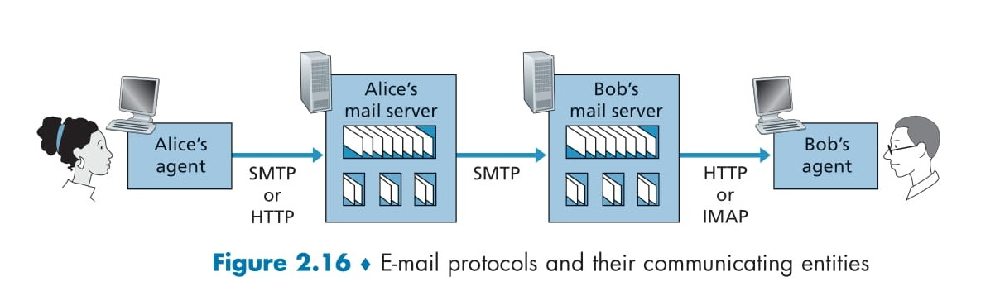

# **Message Formats and Access Protocols** 📧💻

## Overview 📚  
Electronic mail (e-mail) has evolved alongside the Internet from its early days into a rich communication medium. E-mail messages are composed of header lines and a message body, and they travel through a sophisticated system involving mail servers and access protocols. This document explains the structure of e-mail messages and how users retrieve their messages using protocols like HTTP and IMAP.

---

  

## 1. Mail Message Formats ✉️📝

When you write a traditional letter, you include details such as the recipient’s address, your return address, and the date. In e-mail, a similar concept exists: each e-mail message begins with a header section that contains peripheral information, followed by the body of the message.

### a. Header Lines  
- **Structure:**  
  The header is composed of multiple lines, each in a “keyword: value” format. For example:  
  - `From: alice@crepes.fr`  
  - `To: bob@hamburger.edu`  
  - `Subject: Searching for the meaning of life.`  
- **Separation:**  
  The header lines are separated from the message body by a blank line (a CRLF sequence).  
- **Standards:**  
  These headers are defined by RFC 5322, which specifies both the format and the meaning of each header field.  
- **Mandatory vs. Optional:**  
  Certain header fields, such as `From:` and `To:`, are required, while others like `Subject:` are optional.

**Emoji Insight:**  
Think of the header as the envelope of a letter, containing all the essential information about where it’s going and who sent it! 📬✨

### b. The Message Body  
- **Content:**  
  After the header, a blank line is placed, followed by the message body. The body contains the actual text of the message, which can be plain ASCII text, HTML, or include attachments.
- **Distinction from SMTP Commands:**  
  It’s important to note that these header lines are part of the e-mail message itself, not to be confused with the SMTP commands (like HELO, MAIL FROM, RCPT TO) used during the message transfer process.

**Emoji Insight:**  
Imagine the message body as the main content of your letter—the part that carries your thoughts, ideas, or news to the recipient! 💌📝

---

## 2. Mail Access Protocols 📤📥

After an e-mail is delivered to the recipient’s mail server, the next challenge is retrieving and managing that message. Since SMTP is a push protocol (it sends messages from one server to another), it isn’t used for pulling messages from a mail server. Instead, there are two common methods:

### a. HTTP-Based Access  
- **Usage:**  
  Many modern e-mail services (like Gmail on the web or smartphone apps) allow users to access their e-mail via a web interface.
- **How It Works:**  
  The e-mail client (or user agent) makes HTTP requests to the mail server, which provides an interface to view and manage messages.
- **Advantages:**  
  - It allows for easy access from any device with a browser.
  - The mail server must support both SMTP (for receiving messages) and HTTP (for accessing them).

**Emoji Insight:**  
Think of it as visiting an online post office where you can view, organize, and manage all your letters from a single website! 🌐📬

### b. IMAP (Internet Mail Access Protocol)  
- **Definition:**  
  IMAP, defined in RFC 3501, is the standard protocol used by many desktop e-mail clients like Microsoft Outlook.
- **Functionality:**  
  - IMAP lets you access your mailbox stored on a remote mail server.
  - It allows you to perform various operations such as reading, deleting, and organizing messages into folders.
- **Advantages:**  
  - It supports real-time management of messages, so changes you make (like moving an e-mail to a folder) are reflected on the server.
  - It is designed for users who need a powerful interface for managing large amounts of e-mail.

**Emoji Insight:**  
Imagine having a personal assistant who organizes your mailbox, letting you sort your letters into different piles, mark important ones, and keep everything tidy, all from your computer! 🗂️💼

---

## 3. The Journey of an E-Mail: From Sender to Recipient 🌍➡️📧

1. **Composition:**  
   - Alice writes an e-mail using her user agent (e.g., Gmail, Outlook) and fills in header details like From, To, and Subject.
2. **Sending:**  
   - The message, with its headers and body, is sent to Alice’s mail server via SMTP.
3. **Relaying:**  
   - Alice’s mail server uses SMTP to relay the message to Bob’s mail server. This process can include retry mechanisms if Bob’s server is temporarily unreachable.
4. **Storage:**  
   - Bob’s mail server deposits the message in his mailbox.
5. **Retrieval:**  
   - Bob accesses his messages using a user agent. He can retrieve his mail either via an HTTP interface (webmail) or using IMAP on a mail client.
6. **Management:**  
   - With IMAP or HTTP, Bob can manage his messages by moving them to folders, marking them as read, or deleting them as needed.

**Emoji Insight:**  
Picture this as the modern version of postal mail: Alice writes a letter, drops it off at the post office (her mail server), which then routes it through the postal system to Bob’s local post office (his mail server). Finally, Bob retrieves his letter using his preferred method, whether online or via a desktop app! 📮💌

---

