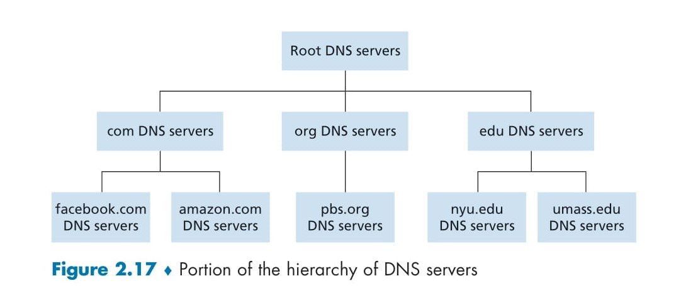
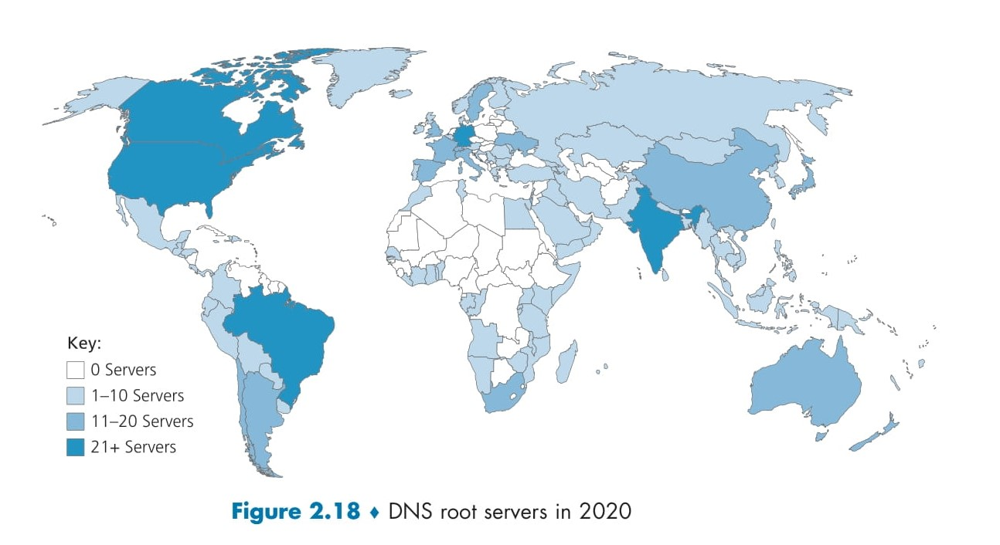
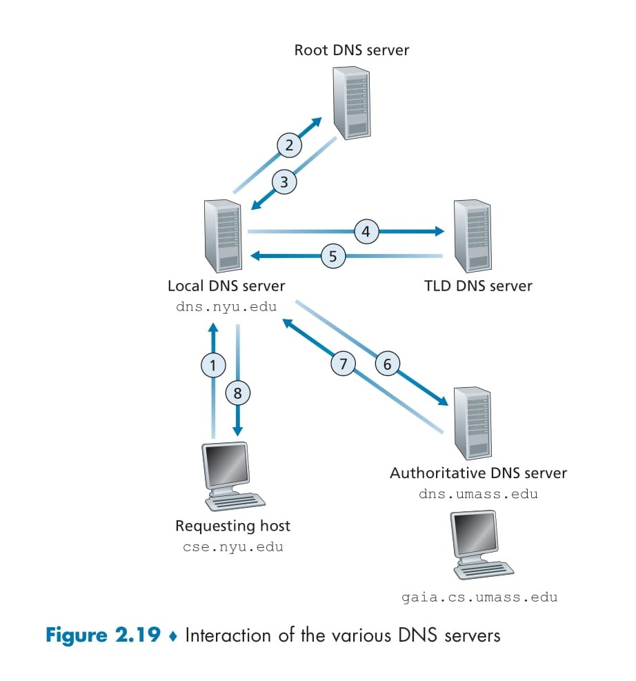
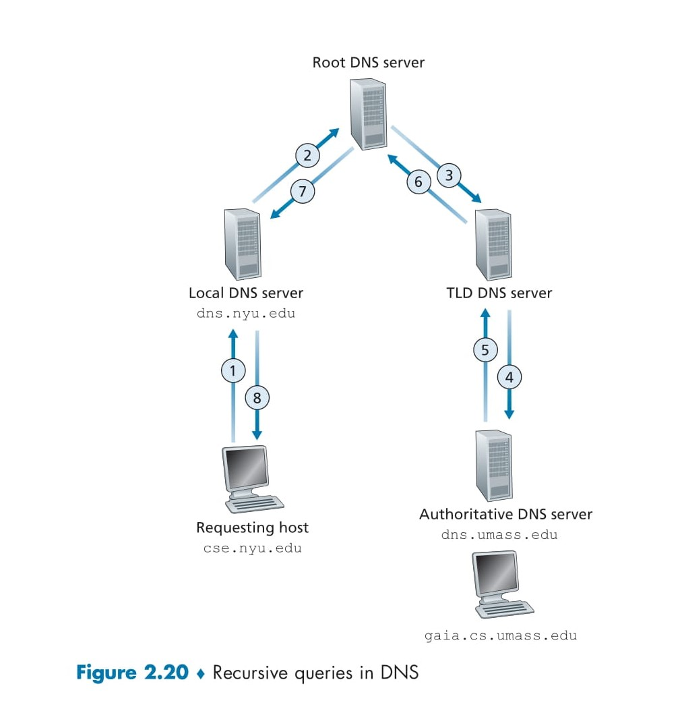

# **Understanding DNS: The Internet’s Directory Service** 📖✨

Welcome to this guide on **Domain Name System (DNS)**! Think of DNS as the internet's phonebook, translating human-friendly names into computer-friendly addresses. Just like we identify people by names, social security numbers, or driver’s licenses, the internet identifies devices using **hostnames** and **IP addresses**. Let’s break it down with clarity and a sprinkle of fun! 🚀

## What is a Hostname? 🏷️

A **hostname** (e.g., `www.google.com`) is a human-readable label assigned to a device or server on the internet. It’s designed to be easy for us to remember and type. Hostnames can include:

- Letters (a-z, A-Z)
- Numbers (0-9)
- Hyphens (-)
- Dots (.) to separate parts of the name

However, hostnames don’t tell computers *where* a device is located on the internet. Routers, which direct internet traffic, struggle to process these alphabetic names directly. This is where IP addresses and DNS come into play! 🌐

## What is an IP Address? 🔢

An **IP address** (e.g., `121.7.106.83`) is a unique numerical identifier for every device connected to the internet. In the IPv4 system, it consists of **four numbers** (each ranging from 0 to 255), separated by dots. Think of it as a digital postal address! 📍

### Key Features of IP Addresses:

- **Unique**: No two devices share the same public IP address at the same time.
- **Hierarchical**: As you read from left to right, the numbers provide increasingly specific location details, much like a postal address narrows down from country to house number.
- **Computer-Friendly**: Routers use IP addresses to locate and communicate with devices efficiently.

For example:

- IP Address: `121.7.106.83`
  - `121`: Broad network region
  - `7`: Subnetwork
  - `106`: More specific network segment
  - `83`: Specific device

---

# **How Does DNS Work**? 🔄

When you type a website URL (e.g., `www.someschool.edu`) into your browser, DNS performs a series of steps to resolve the hostname into an IP address. Here’s the process, step by step:

1. **Extract the Hostname** 🖱️\
   The browser identifies the hostname from the URL (e.g., `www.someschool.edu` from `www.someschool.edu/index.html`).

2. **DNS Client Initiates Query** 💻\
   Your device (computer or phone) runs a DNS client, which sends a request to resolve the hostname into an IP address.

3. **Query Sent to DNS Server** 📡\
   The DNS client sends a query to a DNS server, asking, “What is the IP address for `www.someschool.edu`?”

4. **Receive the IP Address** ✅\
   The DNS server responds with the corresponding IP address (e.g., `121.7.106.83`).

5. **Connect to the Website** 🌍\
   The browser uses the IP address to connect to the website’s server, loading the page for you to view.

**Note**: This process is lightning-fast, especially if the IP address is cached locally (e.g., in your device or a nearby DNS server), reducing lookup time. ⚡

---

## Additional DNS Services 🛠️

DNS does more than just resolve hostnames to IP addresses. It provides several advanced services to enhance internet functionality:

### 1. Host Aliasing (Simplifying Names) 📛

- Some servers have long, complex **canonical hostnames** (e.g., `relay1.west-coast.enterprise.com`).
- DNS allows the use of shorter, memorable **alias names** (e.g., `enterprise.com` or `www.enterprise.com`).
- When queried, DNS resolves the alias to the canonical hostname and its IP address, making navigation easier.

### 2. Mail Server Aliasing (Email Support) 📧

- Email addresses like `bob@yahoo.com` are simple, but the actual mail server might have a complex name (e.g., `relay1.west-coast.yahoo.com`).
- DNS uses **MX records** to map email domains (e.g., `yahoo.com`) to the correct mail server’s hostname and IP address.
- This allows web and mail servers to share the same alias (e.g., `enterprise.com`), streamlining access.

### 3. Load Distribution (Balancing Traffic) ⚖️

- Popular websites (e.g., `cnn.com`) use multiple servers with different IP addresses to handle high traffic.
- DNS associates a single hostname with multiple IP addresses and rotates their order in responses.
- This distributes user requests across servers, preventing any single server from becoming overloaded.
- Load distribution is also used for email servers and content delivery networks (e.g., Akamai).

---

## Key Features of DNS 🔑

DNS is a powerful, distributed system with several notable characteristics:

- **Distributed Database** 🌍\
  DNS operates across a global network of servers, ensuring reliability and scalability. No single server holds all the data, making DNS robust and fault-tolerant.

- **UDP and Port 53** 📡\
  DNS queries typically use the **UDP protocol** on **port 53**, enabling fast and lightweight communication.

- **Caching for Speed** ⚡\
  DNS responses can be cached locally (e.g., on your device or a nearby server), reducing lookup times for frequently visited websites.

- **Standards** 📜\
  DNS is defined in **RFC 1034** and **RFC 1035**, which outline its architecture and protocols.

---

# **How DNS Works: A Simple Overview** 🛠️

DNS acts like a translator, converting hostnames into IP addresses so your apps (like browsers or email clients) can connect to the right servers. Here’s how it happens:

1. **Application Calls DNS** 📱\
   When you enter a hostname (e.g., `www.google.com`) in a browser or email app, the app triggers the DNS client. On UNIX systems, this is often done using the `gethostbyname()` function.

2. **DNS Query is Sent** 📡\
   Your device’s DNS client sends a query message over the network using the **UDP protocol** on **port 53**. This message asks, “What’s the IP address for this hostname?”

3. **DNS Reply is Received** ✅\
   Within milliseconds to seconds, the DNS server responds with the IP address (e.g., `142.250.190.14`). The app uses this address to connect to the website or server.

**For Apps, DNS is a Black Box** 🖤\
From an app’s perspective, DNS is a simple service: give it a hostname, get an IP address. But behind the scenes, it’s a complex system involving a global network of DNS servers and an application-layer protocol.

---

## Why Not a Centralized DNS? 🤔

You might wonder: why not have one giant DNS server that stores all hostnames and IP addresses? While simple in theory, this wouldn’t work for several reasons:

1. **Single Point of Failure** ⚠️\
   If the central server crashes, the entire internet would stop working!

2. **Overwhelming Traffic** 📈\
   A single server couldn’t handle the billions of DNS queries (from web browsing, emails, etc.) generated worldwide.

3. **Geographic Delays** 🌍\
   A server in one location (e.g., New York) would cause delays for users far away (e.g., Australia), slowing down the internet.

4. **Maintenance Nightmare** 🛠️\
   Keeping a single server updated with records for every internet host would be a massive, constantly changing task.

**Why DNS is Distributed** 🌐\
To overcome these challenges, DNS is designed as a **distributed database**. Instead of one server, it relies on a global network of DNS servers that work together. This makes DNS:

- **Fast**: Queries are handled by nearby servers.
- **Reliable**: No single point of failure.
- **Scalable**: It can handle the internet’s growth.

---

# **DNS: A Distributed, Hierarchical Database** 🌐📚

The **Domain Name System (DNS)** is a globally distributed and hierarchically organized system designed to handle the vast scale of the internet. Instead of relying on a single server to store all hostname-to-IP mappings, DNS distributes this responsibility across a network of servers arranged in a tree-like structure. This section explains how DNS servers are organized, how they work together, and the query resolution process, with insights from Figures 2.17, 2.18, and 2.19. 🚀

---

  

## DNS Server Hierarchy (Figure 2.17) 🌳

DNS servers are structured in a hierarchical, tree-like model, as illustrated in **Figure 2.17**. The hierarchy consists of three main levels:

1. **Root DNS Servers** (Top Level) 🌍\\

   - The highest level in the DNS hierarchy.
   - Responsible for providing IP addresses of **Top-Level Domain (TLD)** servers.
   - Example: For a query involving `.com` or `.edu`, the root server directs to the appropriate TLD server.

2. **Top-Level Domain (TLD) Servers** (Middle Level) 🏷️\\

   - Manage top-level domains like `.com`, `.org`, `.edu`, `.net`, and country-specific domains (e.g., `.uk`, `.jp`).
   - Provide IP addresses of **Authoritative DNS Servers** for specific domains.
   - Example: The `.com` TLD server can provide the IP address of the authoritative server for `amazon.com`.

3. **Authoritative DNS Servers** (Bottom Level) 🖥️\\

   - Owned by organizations, these servers store the actual hostname-to-IP mappings.
   - Example: The authoritative server for `amazon.com` holds the IP address for `www.amazon.com`.

**Figure 2.17 Explanation** 📊\\

- Depicts a tree structure with:
  - **Root DNS Servers** at the top.
  - Branches for TLDs like `.com`, `.org`, and `.edu`.
  - Sub-branches for specific domains (e.g., `facebook.com`, `pbs.org`, `nyu.edu`).
- Shows how DNS queries are resolved step-by-step through the hierarchy.

---

  

## Root DNS Servers: Global Distribution (Figure 2.18) 🗺️

Root DNS servers are spread worldwide to ensure reliability and efficiency, as shown in **Figure 2.18**.

- **Key Details**:

  - There are **13 logical root servers**, but they have over **1000 instances** globally.
  - Managed by **12 organizations** under the coordination of **IANA (Internet Assigned Numbers Authority)**.
  - Their role is to provide IP addresses for TLD servers.

- **Figure 2.18 Explanation** 🌐\\

  - A world map highlighting root server locations:
    - **0 Servers**: White (no servers, e.g., some regions in Africa).
    - **1-10 Servers**: Light blue (sparse coverage, e.g., parts of Africa).
    - **11-20 Servers**: Medium blue (moderate coverage, e.g., Europe, China).
    - **21+ Servers**: Dark blue (dense coverage, e.g., USA, Brazil, India).
  - More servers are placed in high-traffic regions like North America and Europe to handle query volume efficiently.

---

  

## How DNS Resolves Queries (Figure 2.19) 🔍

DNS query resolution involves multiple servers working together to translate a hostname (e.g., `gaia.cs.umass.edu`) into an IP address. **Figure 2.19** illustrates this process.

### Key Servers Involved:

1. **Local DNS Server** 🏠\\

   - Not part of the official hierarchy but critical for query resolution.
   - Operated by your **Internet Service Provider (ISP)** or organization, located close to your device.
   - Acts as the first point of contact for DNS queries.

2. **Root DNS Server** 🌍\\

   - Provides IP addresses of TLD servers.

3. **TLD DNS Server** 🏷️\\

   - Responsible for TLDs (e.g., `.edu`) and provides IP addresses of authoritative servers.

4. **Authoritative DNS Server** 🖥️\\

   - Holds the final hostname-to-IP mapping.

### Example: Resolving `gaia.cs.umass.edu`

**Figure 2.19** outlines the steps for resolving the IP address of `gaia.cs.umass.edu`:

- **Requesting Host**: `cse.nyu.edu` (your computer sending the query).
- **Local DNS Server**: `dns.nyu.edu` (NYU’s local server).
- **TLD DNS Server**: Server for `.edu`.
- **Authoritative DNS Server**: `dns.umass.edu` (UMass’s server).
- **Target Host**: `gaia.cs.umass.edu` (the host whose IP is needed).

**Steps**:

1. **Step 1**: `cse.nyu.edu` sends a query to `dns.nyu.edu`: “What’s the IP address of `gaia.cs.umass.edu`?”.
2. **Step 2**: `dns.nyu.edu` contacts a **root DNS server**.
3. **Step 3**: The root server sees the `.edu` TLD and returns IP addresses of `.edu` TLD servers.
4. **Step 4**: `dns.nyu.edu` queries the `.edu` TLD server.
5. **Step 5**: The TLD server identifies `umass.edu` and returns the IP address of `dns.umass.edu` (UMass’s authoritative server).
6. **Step 6**: `dns.nyu.edu` queries `dns.umass.edu`.
7. **Step 7**: `dns.umass.edu` responds with the IP address of `gaia.cs.umass.edu`.
8. **Step 8**: `dns.nyu.edu` forwards the IP address to `cse.nyu.edu`.

**Total Messages**: 8 (4 queries, 4 replies).

### Recursive vs. Iterative Queries 🔄

- **Recursive Query**: The local DNS server (`dns.nyu.edu`) handles the entire process and delivers the final IP address to the requesting host (Steps 1 and 8).
- **Iterative Query**: The local DNS server queries the root, TLD, and authoritative servers individually, with each server responding directly (Steps 2–7).

---

## Complex Case: Additional Hierarchy 📚

In some cases, an extra layer of DNS servers is involved:

- Example: If UMass has department-specific DNS servers, like `dns.cs.umass.edu` for the Computer Science department.
- Process:
  - `dns.umass.edu` acts as an intermediate server and provides the IP address of `dns.cs.umass.edu`.
  - `dns.nyu.edu` then queries `dns.cs.umass.edu` for the final IP address.
- **Total Messages**: 10 (5 queries, 5 replies).

---

## Summary ✨

- **Hierarchy**: DNS servers are organized in a tree-like structure (Root → TLD → Authoritative).
- **Local DNS Server**: Your nearby server that initiates and forwards queries.
- **Query Process**: Starts at the root, moves to TLD, then authoritative servers, delivering the IP address (8 messages in the standard case).
- **Figures**:
  - **2.17**: Shows the DNS hierarchy (Root, TLD, Authoritative).
  - **2.18**: Maps root server locations globally.
  - **2.19**: Details the query resolution process (8 messages).
- **Distributed Design**: DNS’s distributed and hierarchical nature ensures it can scale, remain reliable, and avoid single points of failure.

---

# **DNS: Recursive Queries and Caching Explained** 🔄💾

The **Domain Name System (DNS)** uses two types of queries—**recursive** and **iterative**—to resolve hostnames into IP addresses. While iterative queries were covered previously (Figure 2.19), this section dives into **recursive queries** as illustrated in **Figure 2.20**, followed by an explanation of **DNS caching**, a critical feature for performance and efficiency. Let’s explore these concepts step-by-step with clarity and simplicity! 🚀

---

  

## Recursive Queries in DNS (Figure 2.20) 🔍

In a **recursive query**, each DNS server takes full responsibility for resolving the query and forwards it to the next server in the chain, rather than just providing partial information. **Figure 2.20** demonstrates this process for resolving the IP address of `gaia.cs.umass.edu`.

### Servers Involved:

- **Requesting Host**: `cse.nyu.edu` (the computer initiating the query).
- **Local DNS Server**: `dns.nyu.edu` (NYU’s local server).
- **Root DNS Server**: Provides IP addresses of TLD servers.
- **TLD DNS Server**: Handles `.edu` domain queries.
- **Authoritative DNS Server**: `dns.umass.edu` (UMass’s server).
- **Target Host**: `gaia.cs.umass.edu` (the host whose IP address is needed).

### Steps (Figure 2.20):

1. **Step 1**: `cse.nyu.edu` sends a recursive query to `dns.nyu.edu`: “What’s the IP address of `gaia.cs.umass.edu`?”

   - This is recursive, meaning `dns.nyu.edu` must find the complete answer.

2. **Step 2**: `dns.nyu.edu` sends a recursive query to a **root DNS server**: “What’s the IP address of `gaia.cs.umass.edu`?”

3. **Step 3**: The root server responds with the IP addresses of `.edu` **TLD servers** and sends this back to `dns.nyu.edu`.

4. **Step 4**: `dns.nyu.edu` sends a recursive query to the `.edu` TLD server: “What’s the IP address of `gaia.cs.umass.edu`?”

5. **Step 5**: The TLD server identifies `umass.edu` and responds with the IP address of the authoritative server, `dns.umass.edu`.

6. **Step 6**: The TLD server sends a recursive query to `dns.umass.edu`: “What’s the IP address of `gaia.cs.umass.edu`?”

7. **Step 7**: `dns.umass.edu` responds with the IP address of `gaia.cs.umass.edu`, which is sent back to `dns.nyu.edu` via the TLD server.

8. **Step 8**: `dns.nyu.edu` delivers the final IP address to `cse.nyu.edu`.

**Total Messages**: 8 (4 queries, 4 replies), all recursive in this scenario.

### Recursive vs. Iterative Queries:

- **Recursive Queries** (Figure 2.20): Each server fully resolves the query by forwarding it to the next server, taking on the responsibility of getting the final answer.
- **Iterative Queries** (Figure 2.19): Each server provides only its part of the answer (e.g., the next server’s IP address), and the local DNS server continues querying.
- **Common Practice**: Queries from the requesting host to the local DNS server are typically recursive, while queries between DNS servers (root, TLD, authoritative) are often iterative. Figure 2.20 shows a fully recursive scenario for illustration.

---

## DNS Caching: Boosting Efficiency 💾

**DNS caching** is a technique that reduces query time and network traffic by storing DNS responses for future use. This ensures that repeated queries can be answered quickly without contacting multiple servers.

### How Caching Works:

- When a DNS server receives a response (e.g., a hostname-to-IP mapping), it stores it in its **cache** (temporary memory).
- If another query for the same hostname arrives, the server retrieves the answer from the cache instead of querying root, TLD, or authoritative servers again.

### Example:

- **First Query**: A host, `apricot.nyu.edu`, asks `dns.nyu.edu`: “What’s the IP address of `cnn.com`?”

  - `dns.nyu.edu` queries the root, TLD, and authoritative servers, receives the IP address, and caches it.

- **Second Query**: Later, another host, `kiwi.nyu.edu`, asks `dns.nyu.edu` the same question.

  - `dns.nyu.edu` retrieves the cached IP address and responds immediately, skipping the root, TLD, and authoritative servers.

### Additional Benefits:

- **Caching TLD Server Addresses**: Local DNS servers can cache IP addresses of TLD servers, allowing them to bypass root servers for future queries.
- **Faster Responses**: Caching significantly reduces query resolution time, improving user experience.
- **Reduced Traffic**: Fewer queries reach root and TLD servers, lowering the load on the DNS infrastructure.

### Time Limit:

- Cached data isn’t permanent. DNS servers delete cached entries after a **fixed time** (typically 2 days) to account for potential changes in hostname-to-IP mappings.

---