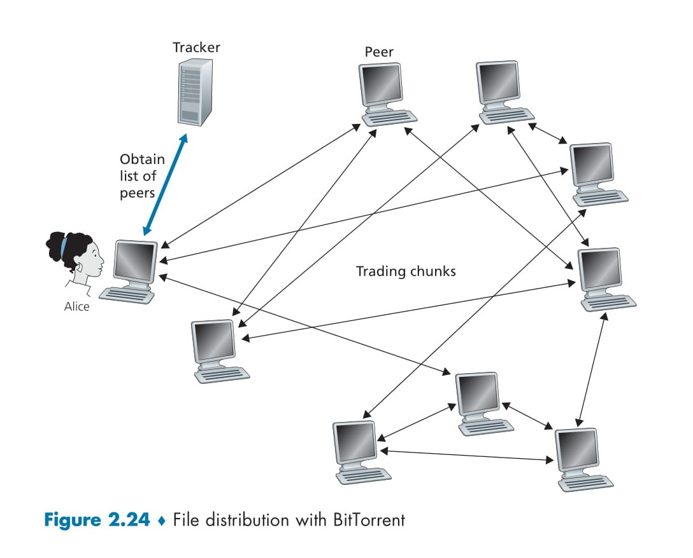

# **Peer-to-Peer File Distribution** 🎉

This section explains how files 📁 are shared over the internet 🌐, comparing two methods: **Client-Server** 🖥️ and **Peer-to-Peer (P2P)** 🤝. We’ll break down the process, the diagram (Figure 2.22), and the differences in a simple way with emojis! 😊

## Client-Server Architecture for File Distribution 🖥️📤

In the **Client-Server** model, a big server 🖥️ holds a file (*F* 📁) and sends it to many users 📱💻 over the internet 🌐.

  

### Key Elements in the Diagram (Figure 2.22) 📊
- **Server** 🖥️: Has the file *F* 📁 and an upload speed of *u_s* 🚀.
- **Users (Peers)** 👥: Shown as *u_1, u_2, ..., u_N* (total *N* users). Each user has:
  - An upload speed (*u_i* 📤).
  - A download speed (*d_i* 📥).
- **Internet** 🌐: Connects the server and users.
- **File Size** 📏: *F* (in bits).

### How It Works 🔄
- The server 🖥️ sends the entire file *F* 📁 to each of the *N* users 👥.
- Total data uploaded by the server: *N × F* bits 📦.
- Server upload time: *NF/u_s* ⏱️ (depends on its upload speed *u_s*).
- The slowest user 🐢 (with the lowest download speed *d_min = min(d_1, d_2, ..., d_N)*) takes *F/d_min* time to download 📥.

### Distribution Time Formula ⏰
The time for Client-Server (*D_cs*) is the maximum of the server’s upload time and the slowest user’s download time:

\[
D_{cs} = \max\left(\frac{NF}{u_s}, \frac{F}{d_{min}}\right) ⏳
\]

### Limitation 🚫
- As the number of users (*N*) grows 📈, the server’s workload increases linearly (*NF/u_s* dominates). For example, if *N* jumps from 1,000 to 1,000,000, the time increases by 1,000 times! 😱 This method struggles with lots of users.

## Peer-to-Peer (P2P) Architecture for File Distribution 🤝📲

In the **P2P** model, users 👥 help each other by sharing file parts 📦 after downloading them. A popular example is **BitTorrent** 🌟.

### Key Elements in the Diagram (Figure 2.22) 📊
- Same as Client-Server: A server 🖥️ with file *F* 📁, users (*u_1, u_2, ..., u_N*), upload speeds (*u_i* 📤), and download speeds (*d_i* 📥).
- Difference: Users share file parts with each other 🤝 after getting them from the server or other peers.

### How It Works 🔄
- The server 🖥️ starts by sending parts of the file 📁 to some users.
- Once a user gets a piece 📦, they can upload it to others using their upload speed (*u_i* 📤).
- This teamwork 🤝 reduces the server’s load because peers help distribute the file.
- Total upload capacity of the system: *u_total = u_s + u_1 + u_2 + ... + u_N* 🚀.

### Distribution Time Formula ⏰
The time for P2P (*D_P2P*) depends on three things:
- Server’s initial upload time: *F/u_s* ⏱️.
- Slowest user’s download time: *F/d_min* 🐢.
- Time to distribute *NF* bits using total upload capacity: *NF/(u_s + u_1 + u_2 + ... + u_N)* 🌐.

\[
D_{P2P} = \max\left(\frac{F}{u_s}, \frac{F}{d_{min}}, \frac{NF}{u_s + \sum_{i=1}^{N} u_i}\right) ⏳
\]

### Advantage ✅
- As *N* increases 📈, the total upload capacity grows because more peers help 🤝. This makes P2P scalable, and the time doesn’t increase much, even with tons of users! 🎉

## Comparison of Client-Server vs. P2P ⚖️

- **Client-Server** 🖥️: The server works alone 😓. As *N* grows, the time increases linearly (*NF/u_s*), making it slow for large groups.
- **P2P** 🤝: Peers help each other 🌟, using their combined upload power. The time stays low and manageable, even with millions of users!

### Example 🌟
- File size (*F*) = 1 GB 📁, server upload speed (*u_s*) = 1 MB/s 🚀, *N* = 100 users 👥.
- **Client-Server**: Server uploads 100 GB (100 × 1 GB), taking 100,000 seconds (~27 hours) ⏰.
- **P2P**: If each user has an upload speed of 1 MB/s, total capacity = 1 + 100 = 101 MB/s. Distributing 100 GB takes ~1,000 seconds (~16-17 minutes) 🎉—way faster! ⚡

## Real-World Application 🌍
P2P is used in apps like **BitTorrent** 🌟, where users download 📥 and upload 📤 file chunks at the same time, making big file sharing super fast and efficient! 🚀

---

# **BitTorrent File Distribution**:

This section dives into **BitTorrent**, a popular Peer-to-Peer (P2P) protocol for efficient file distribution 📁. We’ll explore how BitTorrent works, break down the diagram (Figure 2.24), and highlight its key mechanisms using clear explanations and emojis! 🎉

## What is BitTorrent? 🤔

BitTorrent is a P2P protocol that allows users (called peers 👥) to share files by distributing small pieces (chunks 📦) among themselves. Unlike a Client-Server model, where a single server handles all the load, BitTorrent leverages the collective power of peers to make file sharing faster and more efficient 🚀.

### Core Concept 🔑

- A file 📁 is split into equal-sized chunks (typically 256 KB each).
- Peers download 📥 and upload 📤 these chunks to each other.
- Once a peer has the entire file, they can either leave the torrent (selfish 😏) or stay to help others (altruistic 🤗).

  

## Diagram Breakdown (Figure 2.24) 📊

The diagram illustrates how BitTorrent operates:

- **Tracker** 🖥️: A central node that keeps track of all peers in the torrent.
- **Alice** 👩: A new peer joining the torrent.
- **Peers** 👥: Other users already in the torrent, sharing chunks.
- **Obtain List of Peers** 📋: The tracker provides Alice with a list of peers.
- **Trading Chunks** 🔄: Peers exchange file chunks with each other.

## How BitTorrent Works: Step-by-Step 🛠️

Let’s break down BitTorrent’s operation into clear steps:

### 1. Role of the Tracker 📋

- Every torrent has a **tracker** 🖥️, a node that maintains a list of all peers 👥 participating in the torrent.
- When a new peer (e.g., Alice 👩) joins, she registers with the tracker.
- The tracker randomly selects a subset of peers (e.g., 50) and sends their IP addresses to Alice 📋.
- Alice then tries to establish TCP connections with these peers. The ones she successfully connects to become her **neighboring peers** 🤝.

**Example**: Alice joins a torrent. The tracker says, “Here’s a list of 50 peers!” 📋 Alice connects to 10 of them, making them her neighboring peers.

### 2. Exchanging Chunks 🔄

- Each peer has a subset of the file’s chunks 📦. When Alice joins, she has no chunks.
- Alice asks her neighboring peers (via TCP connections) for a list of the chunks they have 📜.
- If she has 5 neighbors, she gets 5 lists of chunks.
- Alice then requests the chunks she doesn’t have from her neighbors 📥.

### 3. Rarest First Strategy 🧠

- To decide which chunks to request first, Alice uses the **rarest first** strategy.
- She identifies the chunks she doesn’t have and checks which ones are the rarest (i.e., have the fewest copies among her neighbors).
- Alice requests these rare chunks first 📦. This helps balance the distribution of chunks across the torrent, ensuring no chunk becomes a bottleneck.

**Example**: A file has 10 chunks (1 to 10). Alice’s neighbors have:

- Peer 1: Chunks 1, 2, 3
- Peer 2: Chunks 1, 2, 4
- Peer 3: Chunks 1, 3, 5 Chunk 1 is common (all have it), but chunks 4 and 5 are rare (only one peer each). Alice requests chunk 4 or 5 first 🥇.

### 4. Trading Algorithm: Tit-for-Tat 🤝

- BitTorrent uses a **tit-for-tat** trading algorithm to decide which peers Alice should send chunks to 📤.
- Alice measures the download speed 📥 from each neighbor and identifies the top 4 peers who are sending her chunks the fastest ⚡.
- She prioritizes these 4 peers by sending them chunks in return (these peers are **unchoked** ✅).
- Every 10 seconds, Alice recalculates the speeds and updates her top 4 list 🔄.

### 5. Optimistic Unchoking 🎲

- Every 30 seconds, Alice randomly selects one additional peer (not in her top 4) and sends them chunks 📤. This peer is **optimistically unchoked** 🌟.
- This gives new or slower peers a chance to join the trading game.
- If the randomly chosen peer (e.g., Bob) performs well, he might become one of Alice’s top 4, creating a mutually beneficial relationship 🤝.

**Example**: Alice has 5 neighbors. She sends chunks to her top 4 fastest peers. Every 30 seconds, she picks a random 5th peer (Bob) and sends him chunks, hoping he’ll become a good trading partner 🎯.

### 6. Choking Mechanism 🚫

- Peers not in Alice’s top 4 or the optimistic unchoke slot are **choked** 🚫, meaning they don’t receive chunks from her.
- This ensures Alice focuses her upload bandwidth on the most beneficial peers 📤.

## Why BitTorrent Works So Well 🌟

BitTorrent’s efficiency comes from its smart mechanisms:

- **Tit-for-Tat** 🤝: Encourages fairness by rewarding peers who upload more. Selfish peers (who only download) get choked 🚫.
- **Rarest First** 🧠: Ensures chunks are evenly distributed, preventing any single chunk from becoming unavailable.
- **Optimistic Unchoking** 🎲: Allows new peers to join the torrent and start trading, keeping the system inclusive.

## Real-World Example 🌍

Imagine you’re downloading a 1 GB movie using BitTorrent 🎬:

- You contact the tracker and get a list of peers 📋.
- You start with no chunks and request pieces from your neighbors 📥.
- As soon as you get a chunk, you upload it to others 📤, and they send you more chunks in return.
- Fast peers get priority (tit-for-tat 🤝), while every 30 seconds, you give a chance to a random peer (optimistic unchoking 🎲).

## Benefits and Challenges 💡

### Benefits ✅

- **Speed** ⚡: BitTorrent is fast because peers collaborate, sharing the load.
- **Scalability** 📈: Works well even with thousands of peers.
- **Efficiency** 🛠️: The tracker only coordinates; peers handle the heavy lifting.

### Challenges ⚠️

- **Selfish Peers** 😏: Some users might only download without uploading. Tit-for-tat helps mitigate this.
- **Tracker Dependency** 🖥️: If the tracker fails, new peers can’t join easily.
