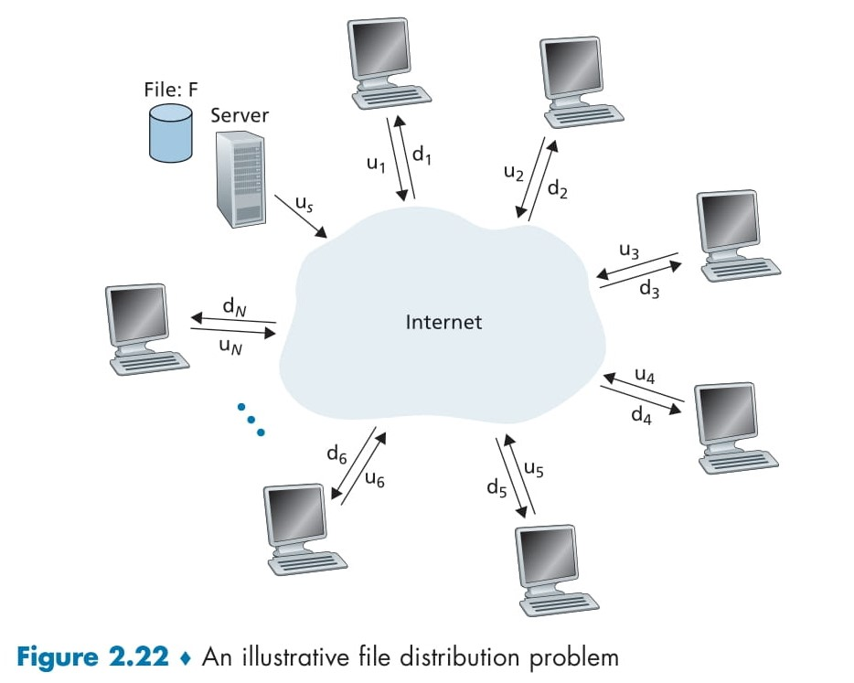

# **Peer-to-Peer File Distribution** 🎉

This section explains how files 📁 are shared over the internet 🌐, comparing two methods: **Client-Server** 🖥️ and **Peer-to-Peer (P2P)** 🤝. We’ll break down the process, the diagram (Figure 2.22), and the differences in a simple way with emojis! 😊

## Client-Server Architecture for File Distribution 🖥️📤

In the **Client-Server** model, a big server 🖥️ holds a file (*F* 📁) and sends it to many users 📱💻 over the internet 🌐.

  

### Key Elements in the Diagram (Figure 2.22) 📊
- **Server** 🖥️: Has the file *F* 📁 and an upload speed of *u_s* 🚀.
- **Users (Peers)** 👥: Shown as *u_1, u_2, ..., u_N* (total *N* users). Each user has:
  - An upload speed (*u_i* 📤).
  - A download speed (*d_i* 📥).
- **Internet** 🌐: Connects the server and users.
- **File Size** 📏: *F* (in bits).

### How It Works 🔄
- The server 🖥️ sends the entire file *F* 📁 to each of the *N* users 👥.
- Total data uploaded by the server: *N × F* bits 📦.
- Server upload time: *NF/u_s* ⏱️ (depends on its upload speed *u_s*).
- The slowest user 🐢 (with the lowest download speed *d_min = min(d_1, d_2, ..., d_N)*) takes *F/d_min* time to download 📥.

### Distribution Time Formula ⏰
The time for Client-Server (*D_cs*) is the maximum of the server’s upload time and the slowest user’s download time:

\[
D_{cs} = \max\left(\frac{NF}{u_s}, \frac{F}{d_{min}}\right) ⏳
\]

### Limitation 🚫
- As the number of users (*N*) grows 📈, the server’s workload increases linearly (*NF/u_s* dominates). For example, if *N* jumps from 1,000 to 1,000,000, the time increases by 1,000 times! 😱 This method struggles with lots of users.

## Peer-to-Peer (P2P) Architecture for File Distribution 🤝📲

In the **P2P** model, users 👥 help each other by sharing file parts 📦 after downloading them. A popular example is **BitTorrent** 🌟.

### Key Elements in the Diagram (Figure 2.22) 📊
- Same as Client-Server: A server 🖥️ with file *F* 📁, users (*u_1, u_2, ..., u_N*), upload speeds (*u_i* 📤), and download speeds (*d_i* 📥).
- Difference: Users share file parts with each other 🤝 after getting them from the server or other peers.

### How It Works 🔄
- The server 🖥️ starts by sending parts of the file 📁 to some users.
- Once a user gets a piece 📦, they can upload it to others using their upload speed (*u_i* 📤).
- This teamwork 🤝 reduces the server’s load because peers help distribute the file.
- Total upload capacity of the system: *u_total = u_s + u_1 + u_2 + ... + u_N* 🚀.

### Distribution Time Formula ⏰
The time for P2P (*D_P2P*) depends on three things:
- Server’s initial upload time: *F/u_s* ⏱️.
- Slowest user’s download time: *F/d_min* 🐢.
- Time to distribute *NF* bits using total upload capacity: *NF/(u_s + u_1 + u_2 + ... + u_N)* 🌐.

\[
D_{P2P} = \max\left(\frac{F}{u_s}, \frac{F}{d_{min}}, \frac{NF}{u_s + \sum_{i=1}^{N} u_i}\right) ⏳
\]

### Advantage ✅
- As *N* increases 📈, the total upload capacity grows because more peers help 🤝. This makes P2P scalable, and the time doesn’t increase much, even with tons of users! 🎉

## Comparison of Client-Server vs. P2P ⚖️

- **Client-Server** 🖥️: The server works alone 😓. As *N* grows, the time increases linearly (*NF/u_s*), making it slow for large groups.
- **P2P** 🤝: Peers help each other 🌟, using their combined upload power. The time stays low and manageable, even with millions of users!

### Example 🌟
- File size (*F*) = 1 GB 📁, server upload speed (*u_s*) = 1 MB/s 🚀, *N* = 100 users 👥.
- **Client-Server**: Server uploads 100 GB (100 × 1 GB), taking 100,000 seconds (~27 hours) ⏰.
- **P2P**: If each user has an upload speed of 1 MB/s, total capacity = 1 + 100 = 101 MB/s. Distributing 100 GB takes ~1,000 seconds (~16-17 minutes) 🎉—way faster! ⚡

## Real-World Application 🌍
P2P is used in apps like **BitTorrent** 🌟, where users download 📥 and upload 📤 file chunks at the same time, making big file sharing super fast and efficient! 🚀