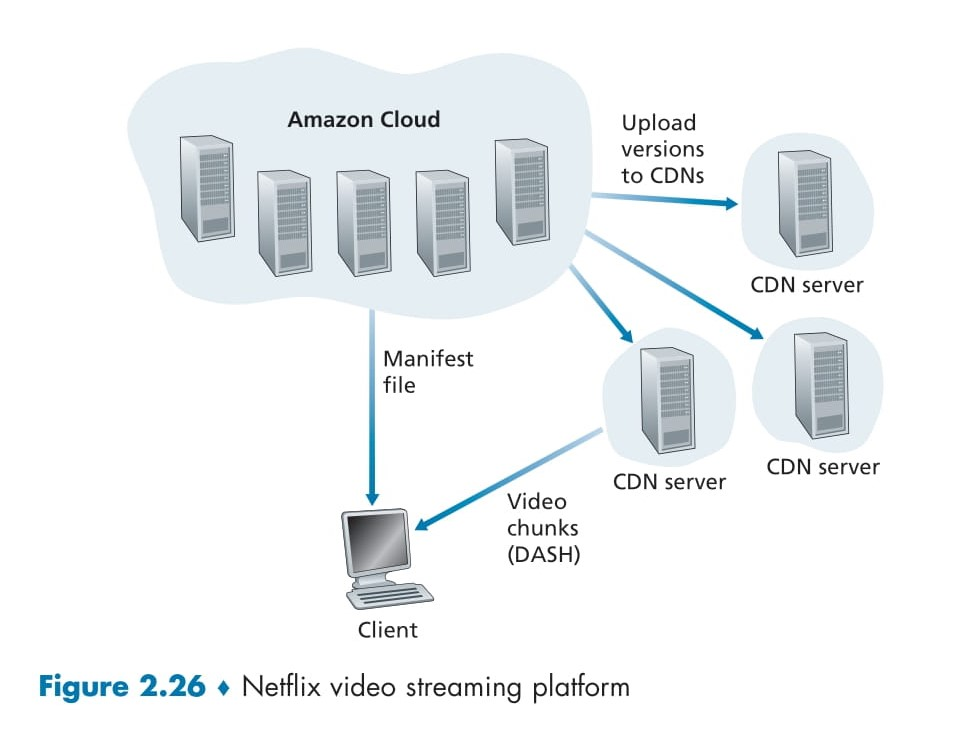

# **Content Distribution Networks** (CDNs) 🖥️

A **Content Distribution Network (CDN)** is a system that helps deliver content (like videos, images, or web pages) to users quickly and efficiently over the internet. Big companies like YouTube and Netflix use CDNs to stream videos to millions of people worldwide without delays. Let’s break it down step by step! 🚀

---

## Why Do We Need CDNs? 🤔

Imagine a company like Netflix wants to stream videos to users all over the world. One way to do this is to store all videos in a single big data center and send them to users from there. But this has **three big problems**:

- **Distance Causes Delays** 🐢: If the user is far from the data center, the video data has to travel through many networks. If any network is slow, the video will freeze or buffer, which is annoying!
- **Wastes Network Bandwidth** 📉: If a popular video is sent to many users over the same network, it wastes bandwidth. The company also has to pay more to its internet provider for sending the same data repeatedly.
- **Single Point of Failure** ⚠️: If the data center or its network goes down, no one can watch videos because everything depends on that one location.

CDNs solve these problems by spreading servers around the world and storing copies of videos closer to users. 🌍

---

## What Is a CDN? 🖥️

A CDN is a network of servers placed in many locations around the world. These servers store copies of content (like videos) and deliver them to users from the closest location. This makes things faster and more reliable! Here’s how CDNs help:

- **Faster Delivery** ⚡: By using a server close to the user, videos load quickly.
- **Saves Bandwidth** 💾: Videos are sent from nearby servers, so the same data isn’t sent over long distances repeatedly.
- **No Single Point of Failure** 🛡️: If one server goes down, other servers can still deliver the content.

---

  

## How Does a CDN Work? The Process Explained 📋

Let’s look at the diagram (Figure 2.25) to understand how a CDN works. In this example, a company called **NetCinema** uses a CDN called **KingCDN** to deliver videos to users. Here’s the step-by-step process when a user wants to watch a video:

### Step 1: User Visits the Website 🖱️
- The user goes to NetCinema’s website (`www.netcinema.com`) on their computer.
- They click on a video link, like `http://video.netcinema.com/6Y7B23V`, to watch a video.

### Step 2: User’s Computer Sends a DNS Query 📡
- When the user clicks the video link, their computer needs the **IP address** of the server where the video is stored.
- The computer sends a **DNS query** (a request) to its **Local DNS Server** (LDNS) asking for the IP address of `video.netcinema.com`.

### Step 3: Local DNS Server Contacts NetCinema’s DNS Server 🔄
- The Local DNS Server forwards the query to **NetCinema’s authoritative DNS server**.
- This server sees the word “video” in the domain (`video.netcinema.com`) and knows this request should go to the CDN (KingCDN).
- Instead of giving an IP address, NetCinema’s DNS server gives a new hostname in KingCDN’s domain, like `a1105.kingcdn.com`.

### Step 4: KingCDN’s DNS System Chooses a Server 🧠
- The Local DNS Server now sends a new query for `a1105.kingcdn.com` to **KingCDN’s DNS system**.
- KingCDN’s system decides which of its servers is best for the user (usually the closest one to the user’s location).
- KingCDN’s DNS system sends the **IP address** of that server back to the Local DNS Server.

### Step 5: Local DNS Server Tells the User the IP Address 📩
- The Local DNS Server forwards the IP address of the KingCDN server to the user’s computer.

### Step 6: User Connects to the Server and Gets the Video 🎥
- The user’s computer uses the IP address to connect directly to the KingCDN server.
- It sends an **HTTP GET request** to ask for the video.
- If the video uses **DASH** (a streaming technology), the server first sends a list of video versions (like different qualities), and the user’s device picks the best one to stream.

---

## Diagram Breakdown (Figure 2.25) 📊

Here’s what the diagram shows:

- **User’s Computer** 🖥️: Where the user starts by clicking the video link.
- **Local DNS Server** 🔗: The first server that helps find the right address.
- **NetCinema Authoritative DNS Server** 🌐: NetCinema’s server that redirects the request to KingCDN.
- **KingCDN Authoritative Server** 🖇️: KingCDN’s system that picks the best server for the user.
- **KingCDN Content Distribution Server** 📦: The server that actually sends the video to the user.
- **Arrows (1 to 6)** ➡️: These show the steps of the process, from the user’s request to getting the video.

---

## How Does a CDN Choose the Best Server? 🗺️

CDNs use a **cluster selection strategy** to decide which server should deliver the video to the user. Here are two common ways they do this:

- **Geographically Closest** 📍: The CDN picks the server that’s closest to the user’s location. It uses databases to map the user’s Local DNS Server to a location and chooses the nearest server.
- **Real-Time Measurements** ⏱️: The CDN checks which server has the fastest connection to the user by sending test messages (like pings) to measure speed and delays.

---

## Benefits of Using a CDN 🌟

- **Speed** ⚡: Videos load faster because they come from a nearby server.
- **Reliability** 🛡️: If one server fails, others can still work.
- **Cost Savings** 💰: Less bandwidth is wasted, so the company saves money on network costs.
- **Better User Experience** 😊: No buffering or freezing means users enjoy watching videos without interruptions.

--- 

# **Netflix Video Streaming Platform** 🌐

  

## Overview of the Diagram 📊
The diagram (Figure 2.26) illustrates how Netflix delivers its video content using the Amazon Cloud and its private Content Distribution Network (CDN). This process involves content processing in the Amazon Cloud and subsequent distribution to users via CDN servers. Let’s explore each step in detail.

---

## How Netflix’s System Works 🖥️

Netflix is a leading provider of online movies and TV series, particularly in North America. Its video distribution system operates through two main components:
1. **Amazon Cloud**: Handles content processing and uploading.
2. **Netflix’s Private CDN**: Delivers videos to users.

### Role of the Amazon Cloud 🌥️
The Amazon Cloud hosts servers that perform critical tasks for Netflix. These tasks include:

- **Content Ingestion (Receiving Content)** 📥:
  - When Netflix receives a new movie (in the form of a studio master version), it uploads it to servers in the Amazon Cloud.
  - This is the initial step where content is introduced into the system.

- **Content Processing (Processing Content)** 🔧:
  - Servers in the Amazon Cloud create multiple versions of each movie.
  - These versions are tailored for various devices such as desktop computers, smartphones, and game consoles connected to TVs.
  - Each version is produced at multiple bit rates to support **DASH** (Dynamic Adaptive Streaming over HTTP), ensuring video quality adapts to the user’s internet speed.

- **Uploading Versions to CDN (Uploading to CDN Servers)** 📤:
  - Once all versions are prepared, they are uploaded from the Amazon Cloud to Netflix’s CDN servers.

---

## Netflix’s Private CDN 🖇️
Initially, when Netflix launched its streaming service in 2007, it relied on three third-party CDN companies (e.g., Akamai) to distribute its video content. However, Netflix has since developed its own private CDN, which it now uses exclusively. Here’s how this CDN operates:

- **Server Locations** 🌍:
  - Netflix has installed server racks in Internet Exchange Points (IXPs) and within residential ISPs.
  - As of now, Netflix has server racks in over 200 IXP locations and hundreds of ISP locations.
  - Each rack contains servers equipped with 10 Gbps Ethernet ports and over 100 terabytes of storage capacity.
  - IXP installations typically include tens of servers that store the entire Netflix video library, including multiple versions to support DASH.

- **Content Distribution Method** 📦:
  - Netflix employs **push caching** rather than **pull caching**.
  - This means videos are manually pushed to servers during off-peak hours (when network traffic is low).
  - For locations unable to store the entire library, Netflix pushes only the most popular videos, determined on a daily basis.

---

## Step-by-Step Process from the Diagram 📋

Let’s break down the diagram (Figure 2.26) to understand how a user watches a movie:

### Step 1: Content Upload to Amazon Cloud 🖱️
- The studio master version of a movie is uploaded to the Amazon Cloud.
- This marks the beginning of the content processing phase.

### Step 2: Uploading to CDN Servers from Amazon Cloud 📡
- The Amazon Cloud generates different versions of the movie (varying bit rates and formats).
- These versions are then uploaded to Netflix’s CDN servers.

### Step 3: Client (User) Requests a Movie 🔄
- When a user selects a movie to play on Netflix, their computer (client) sends a request to the Amazon Cloud.
- Netflix’s software, running in the Amazon Cloud, checks which CDN servers have a copy of the movie.

### Step 4: Selection of the Best CDN Server 🧠
- The Netflix software determines the best CDN server for the client.
  - If the client’s ISP has a Netflix server rack with the movie’s copy, that rack’s server is typically selected.
  - If not, a server at a nearby IXP is chosen.

### Step 5: Manifest File and IP Address Sent to Client 📩
- Netflix provides the client with the IP address of the selected CDN server.
- Along with this, a **manifest file** is sent, containing URLs for the different versions of the requested movie.

### Step 6: Client Requests and Streams Video Chunks 🎥
- The client connects directly to the CDN server and requests video chunks (approximately 4-second segments) using **DASH**.
- The client measures its received throughput and runs a rate-determination algorithm to decide the quality of the next chunk.
- This enables adaptive streaming, where video quality adjusts automatically.

---

## Unique Features of Netflix 🌟
- **Private CDN**: Netflix uses its own CDN, dedicated solely to video distribution, not web pages, allowing for a simplified and tailored design.
- **No DNS Redirect**: Unlike some CDNs (e.g., KingCDN), Netflix does not rely on DNS redirection. The Amazon Cloud directly provides the client with the server’s IP address.
- **Push Caching**: Videos are pushed to servers during scheduled off-peak hours rather than pulled dynamically during cache misses.

---

## Brief Overview of YouTube 📺
- YouTube is the world’s largest video-sharing platform, with hundreds of hours of video uploaded every minute.
- Google (YouTube’s owner) uses its private CDN with **pull caching** and **DNS redirection**.
- Unlike Netflix, YouTube does not use adaptive streaming (e.g., DASH); users must manually select the video version.
- Videos are streamed using HTTP byte range requests to save bandwidth.

---

## Google’s Network Infrastructure 🌐
Google supports its services (e.g., search, Gmail, YouTube) with an extensive private network and CDN infrastructure:
- **19 Mega Data Centers**: Located in North America, Europe, and Asia, each with approximately 100,000 servers, handling dynamic content like search results.
- **90 IXP Clusters**: Distributed globally, each with hundreds of servers, serving static content like YouTube videos.
- **Hundreds of Enter-Deep Clusters**: Located within access ISPs, typically with tens of servers per rack, delivering static content.

---