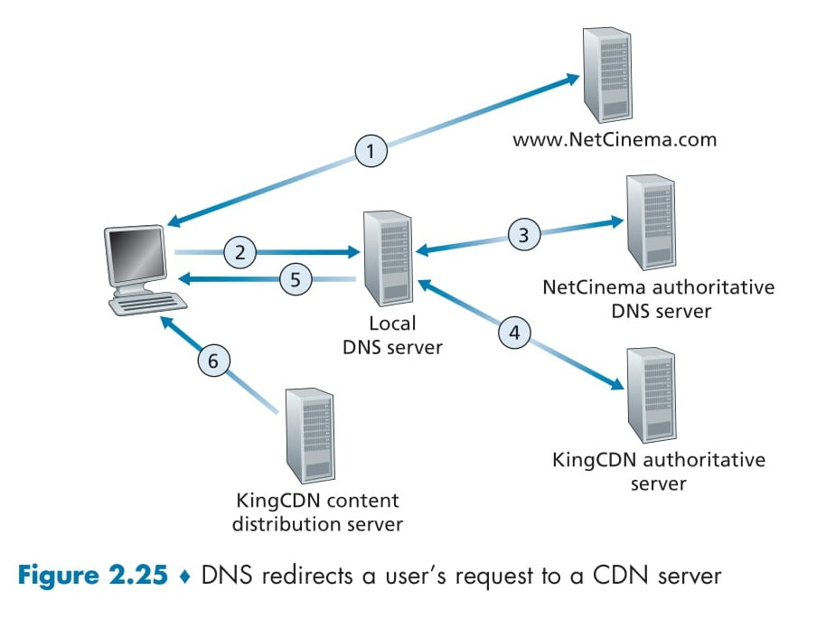

# **Content Distribution Networks** (CDNs) 🖥️

A **Content Distribution Network (CDN)** is a system that helps deliver content (like videos, images, or web pages) to users quickly and efficiently over the internet. Big companies like YouTube and Netflix use CDNs to stream videos to millions of people worldwide without delays. Let’s break it down step by step! 🚀

---

## Why Do We Need CDNs? 🤔

Imagine a company like Netflix wants to stream videos to users all over the world. One way to do this is to store all videos in a single big data center and send them to users from there. But this has **three big problems**:

- **Distance Causes Delays** 🐢: If the user is far from the data center, the video data has to travel through many networks. If any network is slow, the video will freeze or buffer, which is annoying!
- **Wastes Network Bandwidth** 📉: If a popular video is sent to many users over the same network, it wastes bandwidth. The company also has to pay more to its internet provider for sending the same data repeatedly.
- **Single Point of Failure** ⚠️: If the data center or its network goes down, no one can watch videos because everything depends on that one location.

CDNs solve these problems by spreading servers around the world and storing copies of videos closer to users. 🌍

---

## What Is a CDN? 🖥️

A CDN is a network of servers placed in many locations around the world. These servers store copies of content (like videos) and deliver them to users from the closest location. This makes things faster and more reliable! Here’s how CDNs help:

- **Faster Delivery** ⚡: By using a server close to the user, videos load quickly.
- **Saves Bandwidth** 💾: Videos are sent from nearby servers, so the same data isn’t sent over long distances repeatedly.
- **No Single Point of Failure** 🛡️: If one server goes down, other servers can still deliver the content.

---

  

## How Does a CDN Work? The Process Explained 📋

Let’s look at the diagram (Figure 2.25) to understand how a CDN works. In this example, a company called **NetCinema** uses a CDN called **KingCDN** to deliver videos to users. Here’s the step-by-step process when a user wants to watch a video:

### Step 1: User Visits the Website 🖱️
- The user goes to NetCinema’s website (`www.netcinema.com`) on their computer.
- They click on a video link, like `http://video.netcinema.com/6Y7B23V`, to watch a video.

### Step 2: User’s Computer Sends a DNS Query 📡
- When the user clicks the video link, their computer needs the **IP address** of the server where the video is stored.
- The computer sends a **DNS query** (a request) to its **Local DNS Server** (LDNS) asking for the IP address of `video.netcinema.com`.

### Step 3: Local DNS Server Contacts NetCinema’s DNS Server 🔄
- The Local DNS Server forwards the query to **NetCinema’s authoritative DNS server**.
- This server sees the word “video” in the domain (`video.netcinema.com`) and knows this request should go to the CDN (KingCDN).
- Instead of giving an IP address, NetCinema’s DNS server gives a new hostname in KingCDN’s domain, like `a1105.kingcdn.com`.

### Step 4: KingCDN’s DNS System Chooses a Server 🧠
- The Local DNS Server now sends a new query for `a1105.kingcdn.com` to **KingCDN’s DNS system**.
- KingCDN’s system decides which of its servers is best for the user (usually the closest one to the user’s location).
- KingCDN’s DNS system sends the **IP address** of that server back to the Local DNS Server.

### Step 5: Local DNS Server Tells the User the IP Address 📩
- The Local DNS Server forwards the IP address of the KingCDN server to the user’s computer.

### Step 6: User Connects to the Server and Gets the Video 🎥
- The user’s computer uses the IP address to connect directly to the KingCDN server.
- It sends an **HTTP GET request** to ask for the video.
- If the video uses **DASH** (a streaming technology), the server first sends a list of video versions (like different qualities), and the user’s device picks the best one to stream.

---

## Diagram Breakdown (Figure 2.25) 📊

Here’s what the diagram shows:

- **User’s Computer** 🖥️: Where the user starts by clicking the video link.
- **Local DNS Server** 🔗: The first server that helps find the right address.
- **NetCinema Authoritative DNS Server** 🌐: NetCinema’s server that redirects the request to KingCDN.
- **KingCDN Authoritative Server** 🖇️: KingCDN’s system that picks the best server for the user.
- **KingCDN Content Distribution Server** 📦: The server that actually sends the video to the user.
- **Arrows (1 to 6)** ➡️: These show the steps of the process, from the user’s request to getting the video.

---

## How Does a CDN Choose the Best Server? 🗺️

CDNs use a **cluster selection strategy** to decide which server should deliver the video to the user. Here are two common ways they do this:

- **Geographically Closest** 📍: The CDN picks the server that’s closest to the user’s location. It uses databases to map the user’s Local DNS Server to a location and chooses the nearest server.
- **Real-Time Measurements** ⏱️: The CDN checks which server has the fastest connection to the user by sending test messages (like pings) to measure speed and delays.

---

## Benefits of Using a CDN 🌟

- **Speed** ⚡: Videos load faster because they come from a nearby server.
- **Reliability** 🛡️: If one server fails, others can still work.
- **Cost Savings** 💰: Less bandwidth is wasted, so the company saves money on network costs.
- **Better User Experience** 😊: No buffering or freezing means users enjoy watching videos without interruptions.

--- 