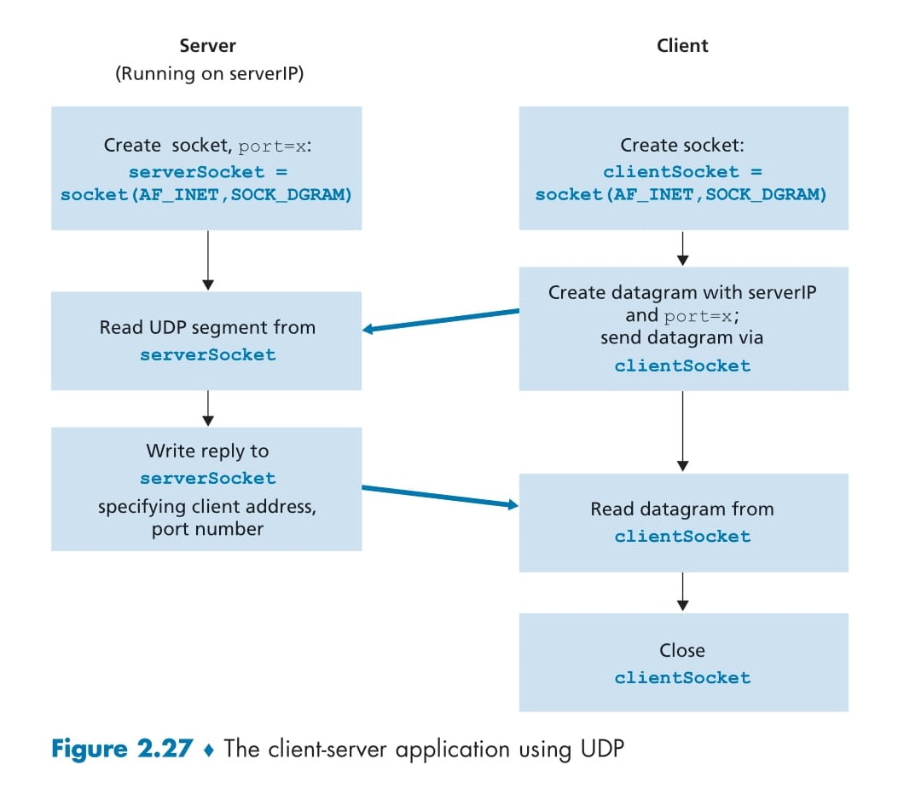

# **Socket Programming with UDP and TCP** 

---

<div align="center">
  
</div>

## 📊 Diagram Explanation: Figure 2.27 - Client-Server Application Using UDP

The diagram (Figure 2.27) illustrates the flow of a client-server application using UDP (User Datagram Protocol). UDP is a connectionless protocol, meaning there’s no handshake or connection setup like in TCP. This makes UDP faster but less reliable, as packets might be lost or arrive out of order. Let’s break down the diagram step-by-step.

### Server Side (Left Side) 🖥️

1. **Create socket, port=X: `serverSocket = socket(AF_INET, SOCK_DGRAM)`**  
   - The server creates a UDP socket and binds it to a specific port (denoted as `X` in the diagram).  
   - `serverSocket` is the variable that holds this socket, which will listen for incoming UDP packets.  
   - 📌 **Purpose:** This step prepares the server to receive datagrams (UDP packets) on the specified port.

2. **Read UDP segment from `serverSocket`**  
   - The server waits for a UDP packet (datagram) to arrive at `serverSocket` and reads the message sent by the client.  
   - Since UDP is connectionless, the server doesn’t establish a connection—it simply waits for packets.  
   - 📌 **Purpose:** This step retrieves the client’s message for processing.

3. **Write reply to `serverSocket`, specifying client address, port number**  
   - After processing the client’s message, the server sends a reply back to the client using `serverSocket`.  
   - UDP requires the server to specify the client’s address (IP and port number) to ensure the reply reaches the correct destination.  
   - 📌 **Purpose:** This step sends the processed response (e.g., uppercase message) back to the client.

### Client Side (Right Side) 📱

1. **Create socket: `clientSocket = socket(AF_INET, SOCK_DGRAM)`**  
   - The client creates a UDP socket named `clientSocket`.  
   - This socket is also of type `SOCK_DGRAM`, indicating it’s for UDP communication.  
   - The client’s port number is automatically assigned by the operating system.  
   - 📌 **Purpose:** This step prepares the client to send and receive UDP datagrams.

2. **Create datagram with `serverIP` and `port=X`, send datagram via `clientSocket`**  
   - The client creates a datagram (UDP packet) containing the server’s IP address and port number (`X`).  
   - The datagram is sent to the server using `clientSocket`.  
   - 📌 **Purpose:** This step sends the client’s message (e.g., a lowercase sentence) to the server.

3. **Read datagram from `clientSocket`**  
   - The client waits for the server’s reply and reads the incoming datagram from `clientSocket`.  
   - 📌 **Purpose:** This step retrieves the server’s response (e.g., the uppercase sentence).

4. **Close `clientSocket`**  
   - Once the communication is complete, the client closes its socket to free up resources.  
   - 📌 **Purpose:** This step terminates the client’s socket connection.

### Key Observation: No Connection Setup 🚫
- Unlike TCP, there’s no "connection setup" in UDP (e.g., no 3-way handshake). The diagram shows direct communication between client and server, which is faster but less reliable since UDP doesn’t guarantee delivery or order of packets.

---

## 🖥️ Code Explanation: Line-by-Line Breakdown of `UDPClient.py` and `UDPServer.py`

The provided Python code (`UDPClient.py` and `UDPServer.py`) implements the client-server application described in the diagram. The client sends a lowercase sentence to the server, the server converts it to uppercase, and sends it back. Let’s break down each line of the code and map it to the diagram’s steps. 🎯

### `UDPClient.py` (Client Side) 🖱️

```python
from socket import *
Server_name = 'Localhost'
server_port = 12000
client_socket = socket(AF_INET, SOCK_DGRAM)
message = input('Input lowercase sentence: ')
client_socket.sendto(message.encode(), (Server_name, server_port))
modified_message, server_address = client_socket.recvfrom(2048)
print(modified_message.decode())
client_socket.close()
```

Here’s the client-side code with a detailed explanation of each line:

```python
from socket import *
```
- **Explanation:** This line imports the `socket` module, which is essential for network communication in Python. It provides functions like `socket()`, `sendto()`, and `recvfrom()` to create sockets and handle data transfer.  
- **Diagram Mapping:** This is a prerequisite step, not directly shown in the diagram, but necessary for socket creation.

```python
serverName = 'hostname'
serverPort = 12000
```
- **Explanation:**  
  - `serverName` holds the server’s hostname (e.g., `cis.poly.edu`) or IP address (e.g., `128.138.32.126`). If a hostname is provided, DNS resolves it to an IP address automatically.  
  - `serverPort` defines the server’s port number, set to `12000`. This matches the `port=X` in the diagram.  
- **Diagram Mapping:** This sets up the server’s address and port, used in the step **"Create datagram with serverIP and port=X"**.

```python
clientSocket = socket(AF_INET, SOCK_DGRAM)
```
- **Explanation:**  
  - This creates a UDP socket named `clientSocket`.  
  - `AF_INET` indicates the IPv4 address family.  
  - `SOCK_DGRAM` specifies that this is a UDP socket (for TCP, it would be `SOCK_STREAM`).  
  - The operating system assigns a port number to this socket automatically.  
- **Diagram Mapping:** Matches the step **"Create socket: clientSocket = socket(AF_INET, SOCK_DGRAM)"**.

```python
message = input('Input lowercase sentence:')
```
- **Explanation:** This line prompts the user to enter a sentence (e.g., "hello world") with the message "Input lowercase sentence:". The input is stored in the `message` variable as a string.  
- **Diagram Mapping:** This step prepares the message to be sent, not explicitly shown in the diagram but necessary for the next step.

```python
clientSocket.sendto(message.encode(), (serverName, serverPort))
```
- **Explanation:**  
  - `message.encode()` converts the string `message` into bytes, as sockets can only send byte data.  
  - `sendto()` attaches the destination address (`serverName`, `serverPort`) to the message and sends it via `clientSocket`.  
  - UDP doesn’t require a connection, so the message is sent directly.  
- **Diagram Mapping:** Matches the step **"Create datagram with serverIP and port=X, send datagram via clientSocket"**.

```python
modifiedMessage, serverAddress = clientSocket.recvfrom(2048)
```
- **Explanation:**  
  - `recvfrom(2048)` waits for a datagram to arrive at `clientSocket` and reads up to 2048 bytes of data.  
  - `modifiedMessage` stores the server’s reply (in bytes).  
  - `serverAddress` stores the server’s address (IP and port), though the client doesn’t need this since it already knows the server’s address.  
- **Diagram Mapping:** Matches the step **"Read datagram from clientSocket"**.

```python
print(modifiedMessage.decode())
```
- **Explanation:**  
  - `modifiedMessage.decode()` converts the received bytes back into a string.  
  - The string (e.g., "HELLO WORLD") is printed to the screen.  
- **Diagram Mapping:** Not explicitly shown in the diagram, but this displays the server’s reply to the user.

```python
clientSocket.close()
```
- **Explanation:** This closes the `clientSocket`, freeing up system resources and ending the client program.  
- **Diagram Mapping:** Matches the step **"Close clientSocket"**.

### `UDPServer.py` (Server Side) 🌐

```python 
from socket import *
serverPort = 12000
serverSocket = socket(AF_INET, SOCK_DGRAM)
serverSocket.bind(('', serverPort))
print("The server is ready to receive")
while True:
    message, clientAddress = serverSocket.recvfrom(2048)
    modifiedMessage = message.decode().upper()
    serverSocket.sendto(modifiedMessage.encode(), clientAddress)
```

Here’s the server-side code with a detailed explanation of each line:

```python
from socket import *
```
- **Explanation:** Imports the `socket` module, necessary for network communication.  
- **Diagram Mapping:** A prerequisite step, not directly shown in the diagram.

```python
serverPort = 12000
```
- **Explanation:** Defines the server’s port number as `12000`, matching the `port=X` in the diagram.  
- **Diagram Mapping:** Part of the setup for **"Create socket, port=X"**.

```python
serverSocket = socket(AF_INET, SOCK_DGRAM)
```
- **Explanation:**  
  - Creates a UDP socket named `serverSocket`.  
  - `AF_INET` indicates IPv4, and `SOCK_DGRAM` specifies a UDP socket.  
- **Diagram Mapping:** Part of the step **"Create socket, port=X: serverSocket = socket(AF_INET, SOCK_DGRAM)"**, though binding happens in the next line.

```python
serverSocket.bind(('', serverPort))
```
- **Explanation:**  
  - Binds `serverSocket` to port `12000`.  
  - `''` means the server will accept packets from any IP address (e.g., localhost or external IPs).  
  - This ensures that any packet sent to port `12000` on the server’s IP will be directed to this socket.  
- **Diagram Mapping:** Completes the step **"Create socket, port=X"**.

```python
print("The server is ready to receive")
```
- **Explanation:** Prints a message to indicate that the server is ready to receive packets.  
- **Diagram Mapping:** Not shown in the diagram, but an informational step for the user.

```python
while True:
```
- **Explanation:** Starts an infinite loop so the server can continuously receive and process packets from clients.  
- **Diagram Mapping:** Implied in the diagram, as the server must keep listening for packets.

```python
    message, clientAddress = serverSocket.recvfrom(2048)
```
- **Explanation:**  
  - `recvfrom(2048)` waits for a datagram to arrive at `serverSocket` and reads up to 2048 bytes.  
  - `message` stores the client’s message (in bytes).  
  - `clientAddress` stores the client’s address (IP and port), which is needed to send a reply.  
- **Diagram Mapping:** Matches the step **"Read UDP segment from serverSocket"**.

```python
    modifiedMessage = message.decode().upper()
```
- **Explanation:**  
  - `message.decode()` converts the received bytes into a string.  
  - `upper()` converts the string to uppercase (e.g., "hello world" becomes "HELLO WORLD").  
- **Diagram Mapping:** Not explicitly shown, but this prepares the reply for the next step.

```python
    serverSocket.sendto(modifiedMessage.encode(), clientAddress)
```
- **Explanation:**  
  - `modifiedMessage.encode()` converts the uppercase string back to bytes.  
  - `sendto()` sends the reply to the client’s address (`clientAddress`) via `serverSocket`.  
- **Diagram Mapping:** Matches the step **"Write reply to serverSocket, specifying client address, port number"**.

---

## 🔄 Mapping Code to Diagram

Here’s how the code steps map to the diagram:

| **Diagram Step**                                    | **Code Line (Client)**                          | **Code Line (Server)**                          |
|-----------------------------------------------------|------------------------------------------------|------------------------------------------------|
| **Create socket (Client/Server)**                   | `clientSocket = socket(AF_INET, SOCK_DGRAM)`   | `serverSocket = socket(AF_INET, SOCK_DGRAM)`   |
| **Bind port (Server)**                              | N/A                                            | `serverSocket.bind(('', serverPort))`          |
| **Create/send datagram (Client)**                   | `clientSocket.sendto(...)`                     | N/A                                            |
| **Read UDP segment (Server)**                       | N/A                                            | `message, clientAddress = serverSocket.recvfrom(2048)` |
| **Write reply (Server)**                            | N/A                                            | `serverSocket.sendto(...)`                     |
| **Read datagram (Client)**                          | `modifiedMessage, serverAddress = clientSocket.recvfrom(2048)` | N/A                           |
| **Close socket (Client)**                           | `clientSocket.close()`                         | N/A                                            |

---

## 🌟 Key Differences Between UDP and TCP

The diagram and code highlight UDP’s characteristics. Let’s compare UDP with TCP for clarity:

| **Feature**          | **UDP**                              | **TCP**                              |
|----------------------|--------------------------------------|--------------------------------------|
| **Connection**       | Connectionless, no setup 🚫          | Connection-oriented, 3-way handshake 🤝 |
| **Reliability**      | Unreliable, packets may be lost ⚠️   | Reliable, ensures delivery ✅         |
| **Speed**            | Faster, less overhead 🚀             | Slower, more overhead 🐢            |
| **Socket Type**      | `SOCK_DGRAM`                        | `SOCK_STREAM`                       |
| **Use Case**         | Video streaming, gaming 🎮          | Web browsing, email 📧              |

📌 **Note:** The diagram doesn’t show a connection setup (unlike TCP’s 3-way handshake), which is why UDP is faster but less reliable.

---

## 🛠️ Running the Program

To test the application, follow these steps:

1. **Run the Server:**  
   - Execute `UDPServer.py` on the server machine.  
     ```bash
     python UDPServer.py
     ```
   - This starts the server, which listens on port `12000` for incoming UDP packets.

2. **Run the Client:**  
   - Execute `UDPClient.py` on the client machine (or a different terminal).  
     ```bash
     python UDPClient.py
     ```
   - The client prompts the user to input a lowercase sentence (e.g., "hello world").  
   - The client sends the sentence to the server, the server converts it to uppercase ("HELLO WORLD"), and sends it back.  
   - The client prints the uppercase sentence on the screen.

---

