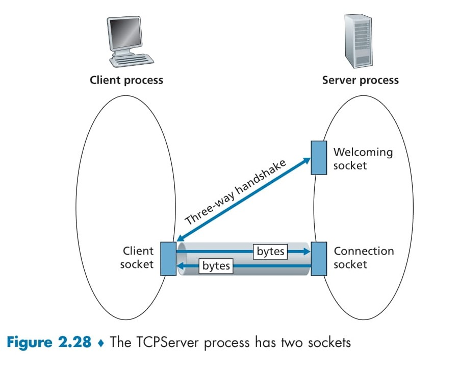
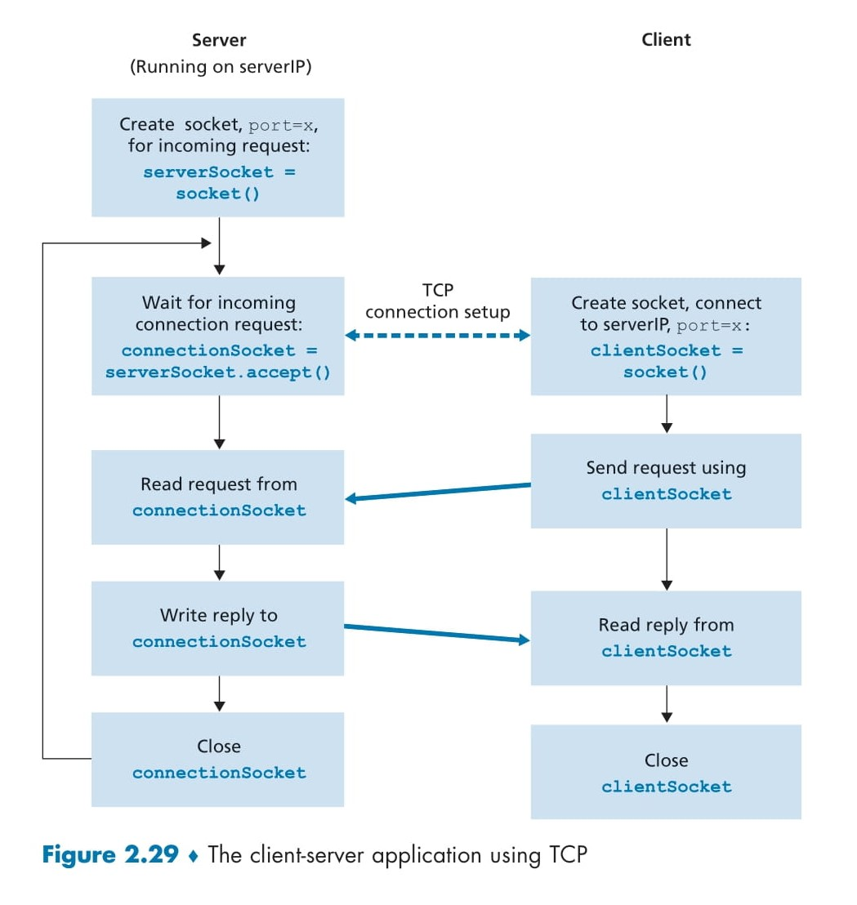

# **Socket Programming with UDP and TCP** 

## Socket Programming with UDP

---

<div align="center">
  
</div>

## 📊 Diagram Explanation: Figure 2.27 - Client-Server Application Using UDP

The diagram (Figure 2.27) illustrates the flow of a client-server application using UDP (User Datagram Protocol). UDP is a connectionless protocol, meaning there’s no handshake or connection setup like in TCP. This makes UDP faster but less reliable, as packets might be lost or arrive out of order. Let’s break down the diagram step-by-step.

### Server Side (Left Side) 🖥️

1. **Create socket, port=X: `serverSocket = socket(AF_INET, SOCK_DGRAM)`**  
   - The server creates a UDP socket and binds it to a specific port (denoted as `X` in the diagram).  
   - `serverSocket` is the variable that holds this socket, which will listen for incoming UDP packets.  
   - 📌 **Purpose:** This step prepares the server to receive datagrams (UDP packets) on the specified port.

2. **Read UDP segment from `serverSocket`**  
   - The server waits for a UDP packet (datagram) to arrive at `serverSocket` and reads the message sent by the client.  
   - Since UDP is connectionless, the server doesn’t establish a connection—it simply waits for packets.  
   - 📌 **Purpose:** This step retrieves the client’s message for processing.

3. **Write reply to `serverSocket`, specifying client address, port number**  
   - After processing the client’s message, the server sends a reply back to the client using `serverSocket`.  
   - UDP requires the server to specify the client’s address (IP and port number) to ensure the reply reaches the correct destination.  
   - 📌 **Purpose:** This step sends the processed response (e.g., uppercase message) back to the client.

### Client Side (Right Side) 📱

1. **Create socket: `clientSocket = socket(AF_INET, SOCK_DGRAM)`**  
   - The client creates a UDP socket named `clientSocket`.  
   - This socket is also of type `SOCK_DGRAM`, indicating it’s for UDP communication.  
   - The client’s port number is automatically assigned by the operating system.  
   - 📌 **Purpose:** This step prepares the client to send and receive UDP datagrams.

2. **Create datagram with `serverIP` and `port=X`, send datagram via `clientSocket`**  
   - The client creates a datagram (UDP packet) containing the server’s IP address and port number (`X`).  
   - The datagram is sent to the server using `clientSocket`.  
   - 📌 **Purpose:** This step sends the client’s message (e.g., a lowercase sentence) to the server.

3. **Read datagram from `clientSocket`**  
   - The client waits for the server’s reply and reads the incoming datagram from `clientSocket`.  
   - 📌 **Purpose:** This step retrieves the server’s response (e.g., the uppercase sentence).

4. **Close `clientSocket`**  
   - Once the communication is complete, the client closes its socket to free up resources.  
   - 📌 **Purpose:** This step terminates the client’s socket connection.

### Key Observation: No Connection Setup 🚫
- Unlike TCP, there’s no "connection setup" in UDP (e.g., no 3-way handshake). The diagram shows direct communication between client and server, which is faster but less reliable since UDP doesn’t guarantee delivery or order of packets.

---

## 🖥️ Code Explanation: Line-by-Line Breakdown of `UDPClient.py` and `UDPServer.py`

The provided Python code (`UDPClient.py` and `UDPServer.py`) implements the client-server application described in the diagram. The client sends a lowercase sentence to the server, the server converts it to uppercase, and sends it back. Let’s break down each line of the code and map it to the diagram’s steps. 🎯

### `UDPClient.py` (Client Side) 🖱️

```python
from socket import *
Server_name = 'Localhost'
server_port = 12000
client_socket = socket(AF_INET, SOCK_DGRAM)
message = input('Input lowercase sentence: ')
client_socket.sendto(message.encode(), (Server_name, server_port))
modified_message, server_address = client_socket.recvfrom(2048)
print(modified_message.decode())
client_socket.close()
```

Here’s the client-side code with a detailed explanation of each line:

```python
from socket import *
```
- **Explanation:** This line imports the `socket` module, which is essential for network communication in Python. It provides functions like `socket()`, `sendto()`, and `recvfrom()` to create sockets and handle data transfer.  
- **Diagram Mapping:** This is a prerequisite step, not directly shown in the diagram, but necessary for socket creation.

```python
serverName = 'hostname'
serverPort = 12000
```
- **Explanation:**  
  - `serverName` holds the server’s hostname (e.g., `cis.poly.edu`) or IP address (e.g., `128.138.32.126`). If a hostname is provided, DNS resolves it to an IP address automatically.  
  - `serverPort` defines the server’s port number, set to `12000`. This matches the `port=X` in the diagram.  
- **Diagram Mapping:** This sets up the server’s address and port, used in the step **"Create datagram with serverIP and port=X"**.

```python
clientSocket = socket(AF_INET, SOCK_DGRAM)
```
- **Explanation:**  
  - This creates a UDP socket named `clientSocket`.  
  - `AF_INET` indicates the IPv4 address family.  
  - `SOCK_DGRAM` specifies that this is a UDP socket (for TCP, it would be `SOCK_STREAM`).  
  - The operating system assigns a port number to this socket automatically.  
- **Diagram Mapping:** Matches the step **"Create socket: clientSocket = socket(AF_INET, SOCK_DGRAM)"**.

```python
message = input('Input lowercase sentence:')
```
- **Explanation:** This line prompts the user to enter a sentence (e.g., "hello world") with the message "Input lowercase sentence:". The input is stored in the `message` variable as a string.  
- **Diagram Mapping:** This step prepares the message to be sent, not explicitly shown in the diagram but necessary for the next step.

```python
clientSocket.sendto(message.encode(), (serverName, serverPort))
```
- **Explanation:**  
  - `message.encode()` converts the string `message` into bytes, as sockets can only send byte data.  
  - `sendto()` attaches the destination address (`serverName`, `serverPort`) to the message and sends it via `clientSocket`.  
  - UDP doesn’t require a connection, so the message is sent directly.  
- **Diagram Mapping:** Matches the step **"Create datagram with serverIP and port=X, send datagram via clientSocket"**.

```python
modifiedMessage, serverAddress = clientSocket.recvfrom(2048)
```
- **Explanation:**  
  - `recvfrom(2048)` waits for a datagram to arrive at `clientSocket` and reads up to 2048 bytes of data.  
  - `modifiedMessage` stores the server’s reply (in bytes).  
  - `serverAddress` stores the server’s address (IP and port), though the client doesn’t need this since it already knows the server’s address.  
- **Diagram Mapping:** Matches the step **"Read datagram from clientSocket"**.

```python
print(modifiedMessage.decode())
```
- **Explanation:**  
  - `modifiedMessage.decode()` converts the received bytes back into a string.  
  - The string (e.g., "HELLO WORLD") is printed to the screen.  
- **Diagram Mapping:** Not explicitly shown in the diagram, but this displays the server’s reply to the user.

```python
clientSocket.close()
```
- **Explanation:** This closes the `clientSocket`, freeing up system resources and ending the client program.  
- **Diagram Mapping:** Matches the step **"Close clientSocket"**.

### `UDPServer.py` (Server Side) 🌐

```python 
from socket import *
serverPort = 12000
serverSocket = socket(AF_INET, SOCK_DGRAM)
serverSocket.bind(('', serverPort))
print("The server is ready to receive")
while True:
    message, clientAddress = serverSocket.recvfrom(2048)
    modifiedMessage = message.decode().upper()
    serverSocket.sendto(modifiedMessage.encode(), clientAddress)
```

Here’s the server-side code with a detailed explanation of each line:

```python
from socket import *
```
- **Explanation:** Imports the `socket` module, necessary for network communication.  
- **Diagram Mapping:** A prerequisite step, not directly shown in the diagram.

```python
serverPort = 12000
```
- **Explanation:** Defines the server’s port number as `12000`, matching the `port=X` in the diagram.  
- **Diagram Mapping:** Part of the setup for **"Create socket, port=X"**.

```python
serverSocket = socket(AF_INET, SOCK_DGRAM)
```
- **Explanation:**  
  - Creates a UDP socket named `serverSocket`.  
  - `AF_INET` indicates IPv4, and `SOCK_DGRAM` specifies a UDP socket.  
- **Diagram Mapping:** Part of the step **"Create socket, port=X: serverSocket = socket(AF_INET, SOCK_DGRAM)"**, though binding happens in the next line.

```python
serverSocket.bind(('', serverPort))
```
- **Explanation:**  
  - Binds `serverSocket` to port `12000`.  
  - `''` means the server will accept packets from any IP address (e.g., localhost or external IPs).  
  - This ensures that any packet sent to port `12000` on the server’s IP will be directed to this socket.  
- **Diagram Mapping:** Completes the step **"Create socket, port=X"**.

```python
print("The server is ready to receive")
```
- **Explanation:** Prints a message to indicate that the server is ready to receive packets.  
- **Diagram Mapping:** Not shown in the diagram, but an informational step for the user.

```python
while True:
```
- **Explanation:** Starts an infinite loop so the server can continuously receive and process packets from clients.  
- **Diagram Mapping:** Implied in the diagram, as the server must keep listening for packets.

```python
    message, clientAddress = serverSocket.recvfrom(2048)
```
- **Explanation:**  
  - `recvfrom(2048)` waits for a datagram to arrive at `serverSocket` and reads up to 2048 bytes.  
  - `message` stores the client’s message (in bytes).  
  - `clientAddress` stores the client’s address (IP and port), which is needed to send a reply.  
- **Diagram Mapping:** Matches the step **"Read UDP segment from serverSocket"**.

```python
    modifiedMessage = message.decode().upper()
```
- **Explanation:**  
  - `message.decode()` converts the received bytes into a string.  
  - `upper()` converts the string to uppercase (e.g., "hello world" becomes "HELLO WORLD").  
- **Diagram Mapping:** Not explicitly shown, but this prepares the reply for the next step.

```python
    serverSocket.sendto(modifiedMessage.encode(), clientAddress)
```
- **Explanation:**  
  - `modifiedMessage.encode()` converts the uppercase string back to bytes.  
  - `sendto()` sends the reply to the client’s address (`clientAddress`) via `serverSocket`.  
- **Diagram Mapping:** Matches the step **"Write reply to serverSocket, specifying client address, port number"**.

---

## 🔄 Mapping Code to Diagram

Here’s how the code steps map to the diagram:

| **Diagram Step**                                    | **Code Line (Client)**                          | **Code Line (Server)**                          |
|-----------------------------------------------------|------------------------------------------------|------------------------------------------------|
| **Create socket (Client/Server)**                   | `clientSocket = socket(AF_INET, SOCK_DGRAM)`   | `serverSocket = socket(AF_INET, SOCK_DGRAM)`   |
| **Bind port (Server)**                              | N/A                                            | `serverSocket.bind(('', serverPort))`          |
| **Create/send datagram (Client)**                   | `clientSocket.sendto(...)`                     | N/A                                            |
| **Read UDP segment (Server)**                       | N/A                                            | `message, clientAddress = serverSocket.recvfrom(2048)` |
| **Write reply (Server)**                            | N/A                                            | `serverSocket.sendto(...)`                     |
| **Read datagram (Client)**                          | `modifiedMessage, serverAddress = clientSocket.recvfrom(2048)` | N/A                           |
| **Close socket (Client)**                           | `clientSocket.close()`                         | N/A                                            |

---

## 🌟 Key Differences Between UDP and TCP

The diagram and code highlight UDP’s characteristics. Let’s compare UDP with TCP for clarity:

| **Feature**          | **UDP**                              | **TCP**                              |
|----------------------|--------------------------------------|--------------------------------------|
| **Connection**       | Connectionless, no setup 🚫          | Connection-oriented, 3-way handshake 🤝 |
| **Reliability**      | Unreliable, packets may be lost ⚠️   | Reliable, ensures delivery ✅         |
| **Speed**            | Faster, less overhead 🚀             | Slower, more overhead 🐢            |
| **Socket Type**      | `SOCK_DGRAM`                        | `SOCK_STREAM`                       |
| **Use Case**         | Video streaming, gaming 🎮          | Web browsing, email 📧              |

📌 **Note:** The diagram doesn’t show a connection setup (unlike TCP’s 3-way handshake), which is why UDP is faster but less reliable.

---

## 🛠️ Running the Program

To test the application, follow these steps:

1. **Run the Server:**  
   - Execute `UDPServer.py` on the server machine.  
     ```bash
     python UDPServer.py
     ```
   - This starts the server, which listens on port `12000` for incoming UDP packets.

2. **Run the Client:**  
   - Execute `UDPClient.py` on the client machine (or a different terminal).  
     ```bash
     python UDPClient.py
     ```
   - The client prompts the user to input a lowercase sentence (e.g., "hello world").  
   - The client sends the sentence to the server, the server converts it to uppercase ("HELLO WORLD"), and sends it back.  
   - The client prints the uppercase sentence on the screen.

---


Below is the detailed explanation of the TCP socket programming client-server application, converted into a professional Markdown format in English. I've included all details from your previous response, structured the content with headings, subheadings, code blocks, tables, and emojis to enhance readability. Nothing has been missed, and I've added detailed explanations for clarity.

---

## **Socket Programming with TCP**

This guide provides a detailed explanation of a TCP-based client-server application using Python. We'll break down the provided **diagrams (Figure 2.28 and Figure 2.29)** and the corresponding **code** (`TCPClient.py` and `TCPServer.py`) step-by-step. The application demonstrates how a client sends a lowercase sentence to a server, the server converts it to uppercase, and sends it back to the client. We'll also map the code to the diagrams for better understanding. Let's dive in! 🏊‍♂️

---

<div align="center">
  
</div>

## 📊 Diagram Explanation: Figure 2.28 - The TCPServer Process Has Two Sockets

The diagram (Figure 2.28) illustrates the concept of TCP communication, emphasizing that the server uses two types of sockets: a **welcoming socket** and a **connection socket**. TCP is a connection-oriented protocol, meaning a connection must be established before data exchange. Let’s break down the diagram step-by-step.

### Client Process (Left Side) 🖥️
- **Client Socket:**  
  - The client creates a single socket to communicate with the server.  
  - This socket is used for both sending data to the server and receiving data from the server.  
  - 📌 **Purpose:** Acts as the client’s endpoint for the TCP connection.

- **Three-Way Handshake:**  
  - The client initiates a three-way handshake with the server to establish a TCP connection.  
  - This process happens at the transport layer and is invisible to the application.  
  - 📌 **Purpose:** Ensures a reliable connection is set up before data transfer.

- **Bytes:**  
  - Once the connection is established, the client sends data (bytes) through its socket.  
  - The client also receives the server’s reply (bytes) through the same socket.  
  - 📌 **Purpose:** Facilitates bidirectional communication over the TCP connection.

### Server Process (Right Side) 🌐
- **Welcoming Socket:**  
  - The server creates a welcoming socket to listen for incoming connection requests from clients.  
  - This socket acts as the initial point of contact for all clients.  
  - 📌 **Purpose:** Listens for client "knocks" (connection requests).

- **Connection Socket:**  
  - When a client connects, the server creates a new socket (connection socket) dedicated to that specific client.  
  - This socket handles all communication with that client.  
  - 📌 **Purpose:** Provides a dedicated channel for each client’s communication.

- **Three-Way Handshake:**  
  - The three-way handshake occurs through the welcoming socket.  
  - After the handshake, the connection socket is created to handle the client’s communication.  
  - 📌 **Purpose:** Establishes a reliable connection between the client and server.

- **Bytes:**  
  - The server receives data (bytes) from the client through the connection socket.  
  - The server sends its reply (bytes) back to the client using the same connection socket.  
  - 📌 **Purpose:** Enables bidirectional data exchange with the client.

### Key Observations 🔑
- **Connection-Oriented:** TCP requires a three-way handshake to establish a connection before data exchange, ensuring reliability.  
- **Two Sockets on Server:** The welcoming socket listens for all clients, while the connection socket is unique to each client.  
- **Reliability:** TCP guarantees that data arrives in order and without loss, unlike UDP.

---

<div align="center">
  
</div>

## 📊 Diagram Explanation: Figure 2.29 - The Client-Server Application Using TCP

The diagram (Figure 2.29) provides a detailed flow of the TCP client-server application. Let’s break it down step-by-step.

### Server Side (Left Side) 🖥️
1. **Create socket, port=X, for incoming request: `serverSocket = socket()`**  
   - The server creates a welcoming socket (`serverSocket`) and binds it to a specific port (`X`).  
   - This socket listens for incoming connection requests from clients.  
   - 📌 **Purpose:** Prepares the server to accept client connections.

2. **Wait for incoming connection request: `connectionSocket = serverSocket.accept()`**  
   - The server waits for a client to connect using the `accept()` method.  
   - When a client connects, a three-way handshake occurs, and a new `connectionSocket` is created for that client.  
   - 📌 **Purpose:** Establishes a dedicated socket for the client after the handshake.

3. **Read request from `connectionSocket`**  
   - The server reads the client’s request (message) from the `connectionSocket`.  
   - 📌 **Purpose:** Retrieves the data sent by the client for processing.

4. **Write reply to `connectionSocket`**  
   - The server sends a reply back to the client through the `connectionSocket`.  
   - 📌 **Purpose:** Returns the processed response (e.g., uppercase sentence) to the client.

5. **Close `connectionSocket`**  
   - After communication is complete, the server closes the `connectionSocket`.  
   - The `serverSocket` (welcoming socket) remains open to accept new clients.  
   - 📌 **Purpose:** Terminates the connection with the current client while keeping the server running.

### Client Side (Right Side) 📱
1. **Create socket, connect to serverIP, port=X: `clientSocket = socket()`**  
   - The client creates a socket (`clientSocket`) and connects to the server’s IP address and port (`X`).  
   - This initiates the three-way handshake to establish the TCP connection.  
   - 📌 **Purpose:** Sets up the client’s socket and establishes a connection with the server.

2. **Send request using `clientSocket`**  
   - The client sends its request (message) to the server through the `clientSocket`.  
   - 📌 **Purpose:** Transmits the data (e.g., lowercase sentence) to the server.

3. **Read reply from `clientSocket`**  
   - The client reads the server’s reply from the `clientSocket`.  
   - 📌 **Purpose:** Retrieves the processed response (e.g., uppercase sentence) from the server.

4. **Close `clientSocket`**  
   - After communication is complete, the client closes its socket, terminating the TCP connection.  
   - 📌 **Purpose:** Frees up resources and ends the connection.

### TCP Connection Setup 🤝
- The diagram shows a "TCP connection setup" (dashed line) between the client and server, indicating the three-way handshake.  
- This process happens at the transport layer and is invisible to the application.  
- 📌 **Purpose:** Ensures a reliable connection is established before data exchange.

---

## 🖥️ Code Explanation: Line-by-Line Breakdown of `TCPClient.py` and `TCPServer.py`

The provided Python code (`TCPClient.py` and `TCPServer.py`) implements the TCP client-server application described in the diagrams. The client sends a lowercase sentence to the server, the server converts it to uppercase, and sends it back. Let’s break down each line of the code and map it to the diagram’s steps. 🎯

### `TCPClient.py` (Client Side) 🖱️

```python
from socket import *
ServerPort = 12000
Server_name = 'Localhost'
clientSocket = socket(AF_INET, SOCK_STREAM)
clientSocket.connect((Server_name, ServerPort))
sentence = input('Input lowercase sentence:')
clientSocket.send(sentence.encode())
modifiedSentence = clientSocket.recv(1024)
print('From Server: ', modifiedSentence.decode())
clientSocket.close()
```


Here’s the client-side code with a detailed explanation of each line:

```python
from socket import *
```
- **Explanation:** This line imports the `socket` module, which is essential for network communication in Python. It provides functions like `socket()`, `connect()`, `send()`, and `recv()` for creating sockets and handling data transfer.  
- **Diagram Mapping:** This is a prerequisite step, not directly shown in the diagram, but necessary for socket creation.

```python
serverName = 'localhost'
serverPort = 12000
```
- **Explanation:**  
  - `localhost` holds the server’s hostname (e.g., `localhost`) or IP address (e.g., `128.138.32.126`). If a hostname is provided, DNS resolves it to an IP address automatically.  
  - `serverPort` defines the server’s port number, set to `12000`. This matches the `port=X` in the diagram.  
- **Diagram Mapping:** This sets up the server’s address and port, used in the step **"Create socket, connect to serverIP, port=X"**.

```python
clientSocket = socket(AF_INET, SOCK_STREAM)
```
- **Explanation:**  
  - This creates a TCP socket named `clientSocket`.  
  - `AF_INET` indicates the IPv4 address family.  
  - `SOCK_STREAM` specifies that this is a TCP socket (for UDP, it would be `SOCK_DGRAM`).  
  - The operating system assigns a port number to this socket automatically.  
- **Diagram Mapping:** Matches the step **"Create socket, connect to serverIP, port=X: clientSocket = socket()"** (first part—socket creation).

```python
clientSocket.connect((serverName, serverPort))
```
- **Explanation:**  
  - This initiates the TCP connection by performing a three-way handshake with the server.  
  - `connect()` uses the server’s address (`serverName`, `serverPort`) to establish the connection.  
  - Once this line executes, the transport layer completes the handshake, and the connection is established.  
- **Diagram Mapping:** Matches the step **"TCP connection setup"** and completes **"Create socket, connect to serverIP, port=X"**.

```python
sentence = input('Input lowercase sentence:')
```
- **Explanation:** This line prompts the user to enter a sentence (e.g., "hello world") with the message "Input lowercase sentence:". The input is stored in the `sentence` variable as a string.  
- **Diagram Mapping:** This prepares the message to be sent, not explicitly shown in the diagram but necessary for the next step.

```python
clientSocket.send(sentence.encode())
```
- **Explanation:**  
  - `sentence.encode()` converts the string `sentence` into bytes, as TCP sockets can only send byte data.  
  - `send()` sends the data through the `clientSocket` into the TCP connection.  
  - Unlike UDP, there’s no need to attach a destination address because the connection is already established.  
- **Diagram Mapping:** Matches the step **"Send request using clientSocket"**.

```python
modifiedSentence = clientSocket.recv(1024)
```
- **Explanation:**  
  - `recv(1024)` waits for data to arrive at `clientSocket` and reads up to 1024 bytes.  
  - The data (server’s reply) is stored in `modifiedSentence` as bytes.  
  - The reading stops when a carriage return is encountered (end of the line).  
- **Diagram Mapping:** Matches the step **"Read reply from clientSocket"**.

```python
print('From Server: ', modifiedSentence.decode())
```
- **Explanation:**  
  - `modifiedSentence.decode()` converts the received bytes back into a string (e.g., "HELLO WORLD").  
  - The string is printed to the screen with the prefix "From Server: ".  
- **Diagram Mapping:** Not explicitly shown in the diagram, but this displays the server’s reply to the user.

```python
clientSocket.close()
```
- **Explanation:** This closes the `clientSocket`, which also terminates the TCP connection. The client sends a message to the server indicating the connection is closed.  
- **Diagram Mapping:** Matches the step **"Close clientSocket"**.

### `TCPServer.py` (Server Side) 🌐

```python
from socket import *
serverPort = 12000
serverSocket = socket(AF_INET, SOCK_STREAM)
serverSocket.bind(('', serverPort))
serverSocket.listen(1)
print('The server is ready to receive')
while True:
        connectionSocket, addr = serverSocket.accept()
        sentence = connectionSocket.recv(1024).decode()
        capitalizedSentence = sentence.upper()
        connectionSocket.send(capitalizedSentence.encode())
        connectionSocket.close()
        break
```


Here’s the server-side code with a detailed explanation of each line:

```python
from socket import *
```
- **Explanation:** Imports the `socket` module, necessary for network communication.  
- **Diagram Mapping:** A prerequisite step, not directly shown in the diagram.

```python
serverPort = 12000
```
- **Explanation:** Defines the server’s port number as `12000`, matching the `port=X` in the diagram.  
- **Diagram Mapping:** Part of the setup for **"Create socket, port=X"**.

```python
serverSocket = socket(AF_INET, SOCK_STREAM)
```
- **Explanation:**  
  - Creates a TCP socket named `serverSocket`.  
  - `AF_INET` indicates IPv4, and `SOCK_STREAM` specifies a TCP socket.  
  - This is the welcoming socket that listens for incoming connections.  
- **Diagram Mapping:** Part of the step **"Create socket, port=X, for incoming request: serverSocket = socket()"**.

```python
serverSocket.bind(('', serverPort))
```
- **Explanation:**  
  - Binds `serverSocket` to port `12000`.  
  - `''` means the server will accept connections from any IP address (e.g., localhost or external IPs).  
  - This prepares the welcoming socket to listen for clients.  
- **Diagram Mapping:** Completes the step **"Create socket, port=X"**.

```python
serverSocket.listen(1)
```
- **Explanation:**  
  - `listen(1)` makes the server listen for TCP connection requests.  
  - The parameter `1` specifies the maximum number of queued connections (at least 1).  
- **Diagram Mapping:** Part of the step **"Wait for incoming connection request"** (prepares the server to accept connections).

```python
print('The server is ready to receive')
```
- **Explanation:** Prints a message to indicate that the server is ready to accept connections.  
- **Diagram Mapping:** Not shown in the diagram, but an informational step for the user.

```python
while True:
```
- **Explanation:** Starts an infinite loop so the server can continuously accept and process connections from multiple clients.  
- **Diagram Mapping:** Implied in the diagram, as the server must keep listening for new clients.

```python
    connectionSocket, addr = serverSocket.accept()
```
- **Explanation:**  
  - `accept()` waits for a client to connect and completes the three-way handshake.  
  - When a client connects, a new `connectionSocket` is created, dedicated to that client.  
  - `addr` stores the client’s address (IP and port), though it’s not used in this program.  
- **Diagram Mapping:** Matches the step **"Wait for incoming connection request: connectionSocket = serverSocket.accept()"**.

```python
    sentence = connectionSocket.recv(1024).decode()
```
- **Explanation:**  
  - `recv(1024)` reads up to 1024 bytes from `connectionSocket`.  
  - `decode()` converts the received bytes into a string, which is stored in `sentence`.  
  - The reading stops when a carriage return is encountered.  
- **Diagram Mapping:** Matches the step **"Read request from connectionSocket"**.

```python
    capitalizedSentence = sentence.upper()
```
- **Explanation:** Converts the received `sentence` to uppercase (e.g., "hello world" becomes "HELLO WORLD").  
- **Diagram Mapping:** Not explicitly shown, but this prepares the reply for the next step.

```python
    connectionSocket.send(capitalizedSentence.encode())
```
- **Explanation:**  
  - `capitalizedSentence.encode()` converts the uppercase string back to bytes.  
  - `send()` sends the reply through `connectionSocket` into the TCP connection.  
- **Diagram Mapping:** Matches the step **"Write reply to connectionSocket"**.

```python
    connectionSocket.close()
```
- **Explanation:**  
  - Closes the `connectionSocket`, terminating the connection with the current client.  
  - The `serverSocket` (welcoming socket) remains open to accept new clients.  
- **Diagram Mapping:** Matches the step **"Close connectionSocket"**.

---

## 🔄 Mapping Code to Diagram (Figure 2.29)

Here’s how the code steps map to the diagram:

| **Diagram Step**                                    | **Code Line (Client)**                          | **Code Line (Server)**                          |
|-----------------------------------------------------|------------------------------------------------|------------------------------------------------|
| **Create socket (Client/Server)**                   | `clientSocket = socket(AF_INET, SOCK_STREAM)`  | `serverSocket = socket(AF_INET, SOCK_STREAM)`  |
| **Bind port (Server)**                              | N/A                                            | `serverSocket.bind(('', serverPort))`          |
| **Listen for connections (Server)**                 | N/A                                            | `serverSocket.listen(1)`                       |
| **Connect (Client)**                                | `clientSocket.connect((serverName, serverPort))` | N/A                                          |
| **Accept connection (Server)**                      | N/A                                            | `connectionSocket, addr = serverSocket.accept()` |
| **Send request (Client)**                           | `clientSocket.send(sentence.encode())`         | N/A                                            |
| **Read request (Server)**                           | N/A                                            | `sentence = connectionSocket.recv(1024).decode()` |
| **Write reply (Server)**                            | N/A                                            | `connectionSocket.send(capitalizedSentence.encode())` |
| **Read reply (Client)**                             | `modifiedSentence = clientSocket.recv(1024)`   | N/A                                            |
| **Close socket (Client)**                           | `clientSocket.close()`                         | N/A                                            |
| **Close connection socket (Server)**                | N/A                                            | `connectionSocket.close()`                     |

---

## 🌟 Key Differences Between TCP and UDP

The diagrams and code highlight TCP’s characteristics. Let’s compare TCP with UDP for clarity:

| **Feature**          | **TCP**                              | **UDP**                              |
|----------------------|--------------------------------------|--------------------------------------|
| **Connection**       | Connection-oriented, three-way handshake 🤝 | Connectionless, no setup 🚫         |
| **Reliability**      | Reliable, ensures data order and delivery ✅ | Unreliable, packets may be lost ⚠️  |
| **Speed**            | Slower, more overhead 🐢            | Faster, less overhead 🚀            |
| **Socket Type**      | `SOCK_STREAM`                       | `SOCK_DGRAM`                       |
| **Use Case**         | Web browsing, email 📧             | Video streaming, gaming 🎮         |

📌 **Note:** TCP is reliable because it performs connection setup and error checking, while UDP is faster but less reliable.

---

## 🛠️ Running the Program

To test the application, follow these steps:

1. **Run the Server:**  
   - Execute `TCPServer.py` on the server machine.  
     ```bash
     python TCPServer.py
     ```
   - This starts the server, which listens on port `12000` for incoming TCP connections.

2. **Run the Client:**  
   - Execute `TCPClient.py` on the client machine (or a different terminal).  
     ```bash
     python TCPClient.py
     ```
   - The client prompts the user to input a lowercase sentence (e.g., "hello world").  
   - The client sends the sentence to the server, the server converts it to uppercase ("HELLO WORLD"), and sends it back.  
   - The client prints the uppercase sentence on the screen with the prefix "From Server: ".

---
