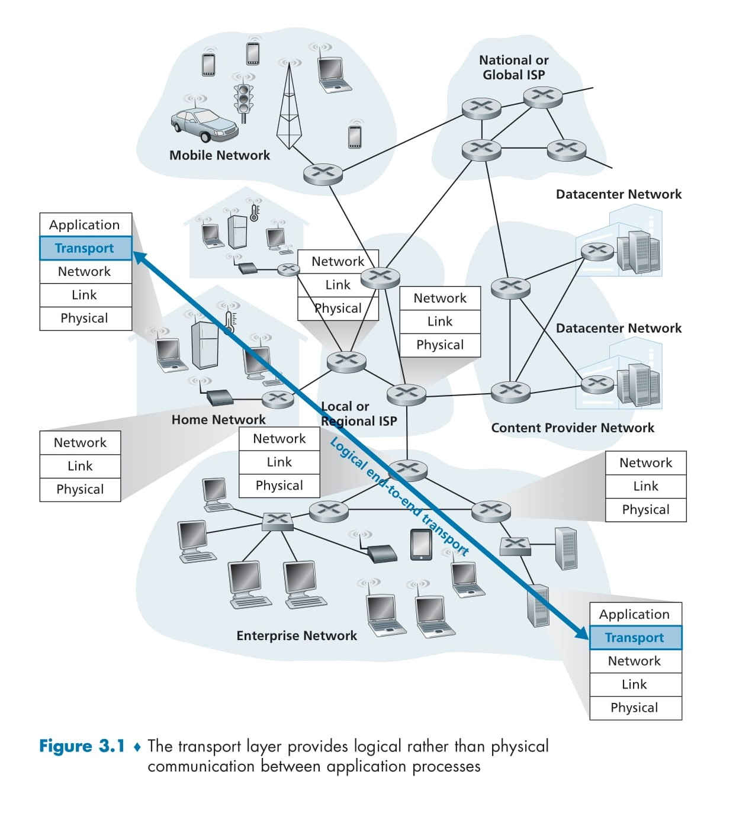

# 🌐 **What is the Transport Layer?**

## 📑 **Table of Contents**
- [🌐 **What is the Transport Layer?**](#-what-is-the-transport-layer)
  - [📑 **Table of Contents**](#-table-of-contents)
  - [🔄 **The Role of the Transport Layer**](#-the-role-of-the-transport-layer)
  - [🔌 **Transport Layer Protocols**](#-transport-layer-protocols)
  - [🔗 **Relationship Between Transport Layer and Network Layer**](#-relationship-between-transport-layer-and-network-layer)
    - [🏠 **Household Example**:](#-household-example)
    - [🗺️ **Mapping to Networking**:](#️-mapping-to-networking)
    - [🔑 **Key Points**:](#-key-points)
    - [🎯 **Role of the Transport Layer**:](#-role-of-the-transport-layer)
  - [🔄 **Different Transport Protocols, Different Services**](#-different-transport-protocols-different-services)
    - [🔄 **Similarly**:](#-similarly)
  - [⚖️ **Transport Layer Services and Network Layer Limitations**](#️-transport-layer-services-and-network-layer-limitations)
  - [📊 **Explanation of Figure 3.1**](#-explanation-of-figure-31)
- [🌟 **Two Protocols of the Transport Layer**](#-two-protocols-of-the-transport-layer)
    - [1. ⚡ **UDP (User Datagram Protocol)**:](#1--udp-user-datagram-protocol)
    - [2. 🔒 **TCP (Transmission Control Protocol)**:](#2--tcp-transmission-control-protocol)
  - [📦 **Terminology: Segment vs. Datagram**](#-terminology-segment-vs-datagram)
  - [🌐 **Internet's Network Layer: IP**](#-internets-network-layer-ip)
    - [🚚 **IP's Service Model**:](#-ips-service-model)
  - [🔀 **Services of UDP and TCP**](#-services-of-udp-and-tcp)
    - [🔧 **Common Services**:](#-common-services)
    - [⚡ **UDP's Services**:](#-udps-services)
    - [🛡️ **TCP's Additional Services**:](#️-tcps-additional-services)
  - [🧩 **TCP's Complexity**](#-tcps-complexity)

The transport layer is a layer in the network protocol stack that lies above the network layer. This layer provides **logical communication** between application processes running on different hosts (computers). Logical communication means that from the application's perspective, it feels as if the two hosts are directly connected, even if they are actually located at opposite ends of the world with many routers and links in between.

> 💬 **Example**: Imagine you're sending a message to your friend on WhatsApp. You just type the message and hit send, and it reaches your friend. You don't have to think about how the message passed through routers, which internet cable was used, or how packets were delivered. The transport layer handles all of this, making communication easy for the application (like WhatsApp).

---

## 🔄 **The Role of the Transport Layer**

The transport layer's job is to deliver messages from application processes on one host to another host. It converts these messages into **segments** and hands them to the network layer, which delivers them to the destination. To create these segments:

1. 📦 **Breaking Application Messages into Smaller Pieces**: If the message is large, the transport layer breaks it into smaller chunks.
2. 📝 **Adding a Header**: A transport-layer header is added to each chunk, containing important information (like source and destination port numbers).
3. 🔽 **Passing to the Network Layer**: These segments are given to the network layer, which encapsulates them into **datagrams** and sends them to the destination.

> 📬 **At the Destination**: When the segment reaches the destination host, the network layer extracts the segment from the datagram and passes it to the transport layer. The transport layer processes the segment and delivers the data to the receiving application.

> ⚠️ **Note**: Routers only look at the network layer fields (like IP addresses). They do not inspect the fields of the transport layer segment, meaning the transport layer data is invisible to routers.

---

## 🔌 **Transport Layer Protocols**

The Internet has two main transport layer protocols:

1. 🔒 **TCP (Transmission Control Protocol)**: This provides reliable communication, meaning messages are guaranteed to reach their destination and are delivered in sequence. It checks for errors and resends lost packets.

2. ⚡ **UDP (User Datagram Protocol)**: This is lightweight and fast but not reliable. There's no guarantee that packets won't be lost or delivered out of order. It's used for applications where speed is critical (like video streaming).

Each protocol offers different services, and applications choose TCP or UDP based on their needs.

---

## 🔗 **Relationship Between Transport Layer and Network Layer**

To understand the roles of the transport layer and network layer, let's use an example:

### 🏠 **Household Example**:

- There are two houses: one on the East Coast and one on the West Coast. Each house has 12 kids, and the kids in both houses are cousins.
- Each kid writes a letter to their cousin every week, delivered by the postal service. This means each house sends 144 letters to the other house weekly.
- In each house, one kid (Ann in the West Coast house, Bill in the East Coast house) is responsible for collecting letters from all the kids and giving them to the postal service. When letters arrive, they distribute them to the kids in their house.

### 🗺️ **Mapping to Networking**:

| Real World | Network Equivalent |
|------------|-------------------|
| **Letters** | Application messages |
| **Kids (Cousins)** | Application processes |
| **Houses** | Hosts (end systems) |
| **Ann and Bill** | Transport layer protocol |
| **Postal Service** | Network layer protocol |

### 🔑 **Key Points**:

- The postal service (network layer) is responsible for moving letters from one house to another. It doesn't deal directly with the kids.
- Ann and Bill (transport layer) collect letters from the kids (processes), give them to the postal service, and distribute incoming letters to the kids.
- From the kids' perspective, Ann and Bill are the mail service, but in reality, they are only part of the end-to-end delivery process. The postal service does the rest.

### 🎯 **Role of the Transport Layer**:

- The transport layer only operates in end systems (hosts), not in routers.
- It moves application messages to the network layer but has no control over how messages are moved within the network core (routers).
- Just as Ann and Bill don't work in intermediate post offices, the transport layer isn't involved in the routers' operations.

---

## 🔄 **Different Transport Protocols, Different Services**

Just as Ann and Bill collect and distribute letters in a specific way, transport layer protocols provide different services. If Ann and Bill go on vacation and other cousins (Susan and Harvey) take over, they might not work as efficiently. Letters might be delivered late, lost, or even chewed up by the dog!

### 🔄 **Similarly**:

- TCP and UDP offer different service models.
- TCP is reliable, like Ann and Bill, who take care of the letters properly.
- UDP is fast but unreliable, like Susan and Harvey, who work quickly but sometimes lose letters.

---

## ⚖️ **Transport Layer Services and Network Layer Limitations**

The services provided by the transport layer are often limited by the network layer's services. For example:

- If the postal service (network layer) cannot guarantee that a letter will be delivered in 3 days, then Ann and Bill (transport layer) cannot guarantee delivery time for the kids.
- Similarly, if the network layer cannot provide delay or bandwidth guarantees, the transport layer cannot provide such guarantees for application messages.

> 💡 **However**, the transport layer can provide some services even if the network layer doesn't support them. For example:
> 
> 1. 🛡️ **Reliable Data Transfer**: If the network layer is unreliable (packets can be lost or corrupted), protocols like TCP ensure reliable delivery by retransmitting lost packets and checking for errors.
> 
> 2. 🔐 **Security**: The transport layer can use encryption to secure messages, even if the network layer doesn't guarantee confidentiality.

---

  

## 📊 **Explanation of Figure 3.1**

Figure 3.1 shows that transport layer protocols exist only in end systems (hosts), not in routers. At the sending host:
- The application message is converted into a transport layer segment.
- The segment is passed to the network layer, which encapsulates it into a datagram and sends it to the destination.

At the receiving host:
- The network layer extracts the segment from the datagram and passes it to the transport layer.
- The transport layer processes the segment and delivers the data to the application.

Routers only operate on network layer data (like IP addresses) and ignore the transport layer segment.

---

# 🌟 **Two Protocols of the Transport Layer**

The Internet provides two transport-layer protocols that applications use:

### 1. ⚡ **UDP (User Datagram Protocol)**:
   - It is an **unreliable** and **connectionless** service.
   - Unreliable means it does not guarantee that data will reach the destination, or if it does, that it will arrive in the correct order or in correct condition.
   - Connectionless means no connection is set up before sending data. The data is simply sent as a segment.
   - It is fast, but it does not provide error recovery or order guarantees. For example, UDP is used in video streaming or online gaming where speed is important.

### 2. 🔒 **TCP (Transmission Control Protocol)**:
   - It is a **reliable** and **connection-oriented** service.
   - Reliable means it guarantees that data will reach from the sending process to the receiving process correctly and in the correct order.
   - Connection-oriented means a connection is established between the two hosts before sending data.
   - TCP checks for errors, resends lost packets, and also performs congestion control to prevent network overload.

> 💻 **Application Developer's Role**: When a network application is created, the developer must decide whether to use TCP or UDP. This decision is made during socket programming (as we saw in Section 2.7).

---

## 📦 **Terminology: Segment vs. Datagram**

We call the transport layer's packet a **segment**, whether it belongs to TCP or UDP. But in Internet literature (like RFCs):

| Protocol | Packet Name |
|----------|-------------|
| TCP | **segments** |
| UDP | **datagrams** |
| Network Layer | **datagram** |

> 📝 **Note**: This terminology can be a bit confusing, so in this introductory section, we will call both TCP and UDP packets **segments**, and use the term **datagram** only for the network layer's packet. This keeps things simple.

---

## 🌐 **Internet's Network Layer: IP**

Before understanding the transport layer, let's briefly learn about the Internet's network layer. The network layer's protocol is **IP (Internet Protocol)**. It provides **logical communication** between hosts.

### 🚚 **IP's Service Model**:
- IP provides a **best-effort delivery service**. This means it tries its best to deliver segments between communicating hosts, but it does not provide any guarantees.
- It does not guarantee segment delivery, the correct order of segments, or the integrity of the data (that the data won't be corrupted).
- For this reason, IP is called an **unreliable service**.

> 🔍 **IP Address**: Every host has at least one network-layer address, called an **IP address**. We will explore IP addressing in detail in Chapter 4, but for now, just remember that every host has an IP address.

---

## 🔀 **Services of UDP and TCP**

The most basic job of UDP and TCP is to extend IP's host-to-host delivery service into a **process-to-process delivery** service. That is, IP only sends data between hosts, but UDP and TCP ensure that data reaches from a specific process on one host to a specific process on another host. This process is called **transport-layer multiplexing and demultiplexing** (we will explore this in detail in the next section).

### 🔧 **Common Services**:
- Both protocols (UDP and TCP) include **error-detection fields** in their segments' headers, which check data integrity.
- This is their basic job: process-to-process data delivery and error checking.

### ⚡ **UDP's Services**:
- UDP only provides these two basic services: process-to-process delivery and error checking.
- It is unreliable, meaning it does not guarantee that data will reach the destination process, or if it does, that it will arrive intact or in the correct order.
- UDP is fast, so it is suitable for applications where some data loss can be tolerated, such as live video streaming or VoIP calls.

### 🛡️ **TCP's Additional Services**:

TCP provides more services than UDP, which makes it complex but reliable:

1. 📬 **Reliable Data Transfer**:
   - TCP uses flow control, sequence numbers, acknowledgments, and timers to ensure that data reaches from the sending process to the receiving process correctly and in the correct order.
   - It converts IP's unreliable service into a reliable service for processes.
   - If a packet is lost or corrupted, TCP resends it.

2. 🚦 **Congestion Control**:
   - TCP performs congestion control, which is mostly beneficial for the Internet as a whole, not just for the application.
   - Congestion control means TCP ensures that no single TCP connection overloads links or routers with excessive traffic.
   - TCP divides the bandwidth of congested links equally among all TCP connections, so each connection gets a fair share.
   - It does this by regulating the sending rate, i.e., how fast the sender can send data.

> ⚠️ **UDP and Congestion**:
> - UDP has no congestion control. An application using UDP can send data at any speed and for as long as it wants.
> - For this reason, UDP traffic is unregulated, which can sometimes cause network congestion.

---

## 🧩 **TCP's Complexity**

The reliable data transfer and congestion control provided by TCP are quite complex. To understand this, we need to learn several techniques, such as:

- 📊 Flow control
- 🔢 Sequence numbers
- ✅ Acknowledgments
- ⏱️ Timers
- 🚥 Congestion control mechanisms

---

