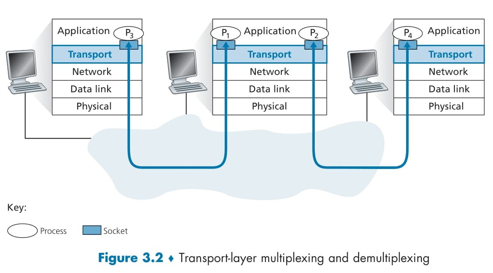
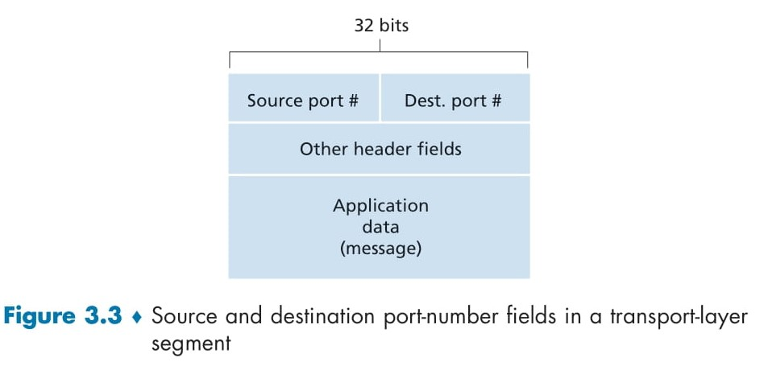
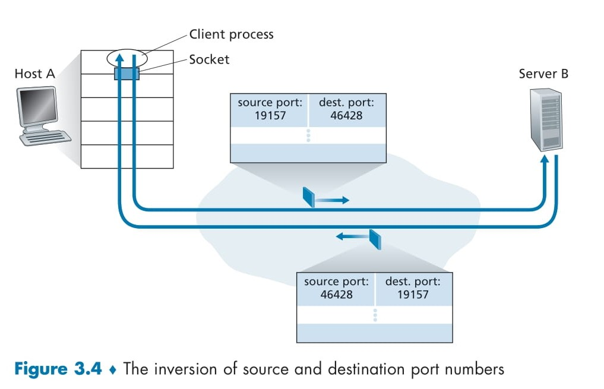
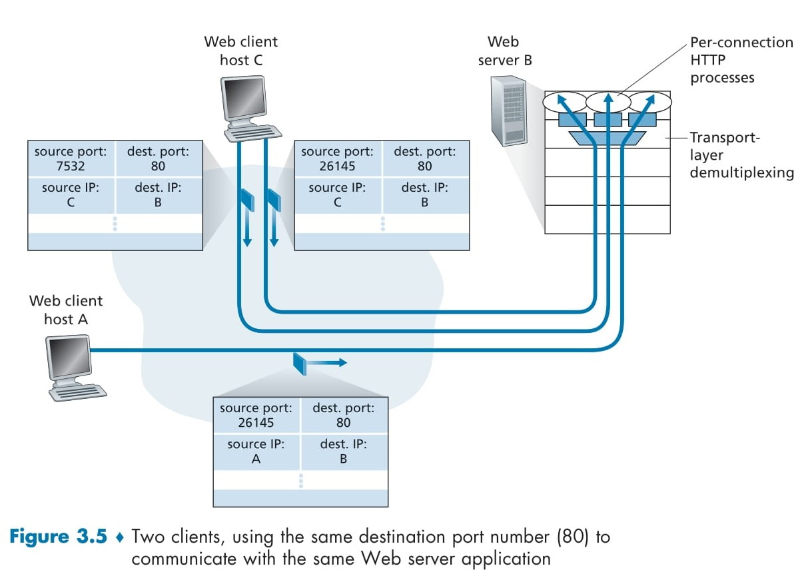

#  **Multiplexing & Demultiplexing** 🚚

When your computer runs multiple network applications at the same time (for example, two Telnet sessions, one FTP session, and one web-browser download), the **transport layer** must sort and deliver data to the correct program. This involves two complementary tasks:

1. **Multiplexing** 🔀

   * **At the sender**, the transport layer **gathers** data from different application sockets, adds transport-header information (port numbers), and passes the resulting segments down to the network layer.

2. **Demultiplexing** 🔄

   * **At the receiver**, the transport layer **examines** the incoming segment’s header, finds the matching socket, and delivers the payload to the correct application process.

<div align="center">
  
</div>

## 📺 Figure 3.2: How Demultiplexing Works

> **Visual Summary:** Three hosts on a network, each running multiple processes (P₁, P₂, P₃, P₄).
> Blue arrows show segments traveling through the network to the transport layer, then up into the correct socket and process.

* Each **process** (e.g., your FTP client or web browser) communicates via a **socket** (a virtual “door”).
* Sockets are uniquely identified so incoming data is routed correctly.
* The transport layer in the middle host must both:

  1. **Demultiplex** incoming segments to P₁ or P₂, and
  2. **Multiplex** outgoing data from P₁/P₂ back into segments.


## 🔢 Figure 3.3: Transport Segment Header Fields

<div align="center">
  
</div>

</br>

```
|  Source Port #  |  Destination Port #  |  Other Header Fields  |  Application Data ...  |
        16 bits              16 bits
```

1. **Source Port Number**

   * Identifies the sender’s socket (so replies can be routed back).

2. **Destination Port Number**

   * Identifies the receiver’s socket (so data goes to the right process).

3. **Port Number Range**

   | Range         | Meaning                                    |
   | ------------- | ------------------------------------------ |
   | 0 – 1023      | **Well-known ports** (reserved by IANA)    |
   | 1024 – 49151  | **Registered ports** (user or application) |
   | 49152 – 65535 | **Dynamic/private ports** (ephemeral use)  |

> ✨ Common examples:
>
> * **HTTP** uses port **80**
> * **FTP** uses port **21**

---

## 🏠 Mail-Room Analogy

* **Household** = your computer
* **Mail carrier** = the network layer delivering packets
* **Letters addressed to each kid** = transport segments with port numbers
* **Bill sorting mail by name** = **demultiplexing** (reading “To:” and handing letters to the right child)
* **Ann collecting outgoing mail** = **multiplexing** (gathering letters from all kids and giving to the mail carrier)

---

## 📋 Why This Matters

* Without multiplexing/demultiplexing, your computer couldn't handle more than one application at a time!
* Port numbers let many applications share the same network interface seamlessly.
* Both **UDP** and **TCP** use this scheme—TCP adds extra fields for reliability, while UDP keeps things lightweight.

---

#  **Connectionless Multiplexing & Demultiplexing**🔗

When applications use **UDP** (User Datagram Protocol), they send and receive data without setting up a steady connection. To manage multiple apps at once, UDP uses **multiplexing** and **demultiplexing**—just like TCP, but lighter!

## 🏷️ 1. Creating & Binding a UDP Socket

```python
from socket import *
# Client creates a UDP socket
clientSocket = socket(AF_INET, SOCK_DGRAM)
```

* **Automatic port assignment**

  * By default, your system picks a free port between **1024–65535**.
* **Manual binding**

  * To use a specific port (e.g., 19157), add:

    ```python
    clientSocket.bind(('', 19157))
    ```
  * This “locks” your socket to port **19157** on your machine.

> 😎 **Tip:**
>
> * **Clients** usually let the OS pick a port automatically.
> * **Servers** often bind to a **well-known port** (like port 53 for DNS).

## 🚀 2. Sending a UDP Segment (Multiplexing)

1. **Application** generates data to send.

2. **Transport layer** builds a UDP segment:

   * **Source port**: your socket’s port (e.g., 19157)
   * **Destination port**: the server’s port (e.g., 46428)
   * **Other fields**: checksum, length, etc.
   * **Data**: your application message

3. **Network layer** wraps the segment in an IP packet and sends it over the Internet.

## 📬 3. Receiving a UDP Segment (Demultiplexing)

1. **Network layer** on Host B delivers the IP packet to UDP.
2. **UDP** examines the **destination port** (e.g., 46428).
3. UDP finds **the matching socket** bound to port 46428.
4. UDP hands the **data** to the application listening on that socket.

> 🔍 **Remember:**
> UDP uses the pair **(IP address, port)** to identify a socket.
>
> * Two segments with the same destination port but different source info still go to the same socket.

## 🔄 4. Source Port as “Return Address”

* The **source port** in each segment tells Host B **where to reply**.
* When Host B wants to send data back to Host A, it uses:

  * **Destination IP** = Host A’s IP
  * **Destination port** = the **source port** from the received segment

This way, **without a formal “connection”**, UDP apps can still exchange messages back and forth!

---

# **Connection-Oriented Multiplexing & Demultiplexing** 🔗

When applications use **TCP** (Transmission Control Protocol), they establish a **connection** before sending data. To handle multiple simultaneous connections, TCP uses **multiplexing** (combining data) and **demultiplexing** (routing data back) in a more sophisticated way than UDP. Let’s break it down! 😊

<div align="center">
  
</div>

## 1️⃣ TCP Socket Identification: The 4-Tuple

A **TCP socket** is uniquely identified by four values:

| Field                      | Description                                           |
| -------------------------- | ----------------------------------------------------- |
| 🌐 **Source IP Addr**      | IP address of the client host                         |
| 🔢 **Source Port #**       | Port number chosen by the client                      |
| 🌐 **Destination IP Addr** | IP address of the server host                         |
| 🔢 **Destination Port #**  | Port number the server listens on (e.g., 80 for HTTP) |

> **Why four?**
>
> * Distinguishes multiple connections even if they share one IP or port.
> * Ensures data from each client goes to the correct connection socket.

## 2️⃣ How a TCP Connection Is Established

1. **Server “welcoming socket”** 🛎️

   * Listens on a **well-known port** (e.g., 12000).
   * Waits for incoming **SYN** (synchronize) requests.

2. **Client creates & connects** 🔌

   ```python
   clientSocket = socket(AF_INET, SOCK_STREAM)
   clientSocket.connect((serverName, 12000))
   ```

   * OS picks a **source port** (e.g., 49152+).
   * Sends a **SYN** segment to server’s port 12000.

3. **Server accepts** ✔️

   ```python
   connectionSocket, addr = serverSocket.accept()
   ```

   * `accept()` creates a **new socket** bound to the 4-tuple:
     `(client IP, client port, server IP, server port)`
   * The **welcoming socket** stays free to accept more connections.

4. **Handshake completes** 🤝

   * After SYN/SYN-ACK/ACK exchange, both sides have a dedicated socket for their conversation.

## 3️⃣ Demultiplexing Incoming Segments

Whenever a TCP segment arrives at the server:

1. **Examine the 4-tuple** in the TCP/IP header.
2. **Match** it to the correct connection socket (from step 3).
3. **Deliver** the data to the right application process (or thread).

> 🔍 Even if two clients use the **same source port** by chance, their **different source IPs** guarantee unique 4-tuples—no mix-ups! 🚀


<div align="center">
  
</div>

## 4️⃣ Example: Multiple Web Connections (Figure 3.5)

* **Host C** opens two browser tabs to **Web Server B**:

  * Tab 1: source port 26145 → dest port 80
  * Tab 2: source port  7532    → dest port 80
* **Host A** opens one tab to **Server B**:

  * source port 26145 → dest port 80

**Server B** sees three distinct 4-tuples:

| Client | Source IP | Source Port | Dest IP | Dest Port |
| ------ | --------- | ----------- | ------- | --------- |
| C–Tab1 | C         | 26145       | B       | 80        |
| C–Tab2 | C         | 7532        | B       | 80        |
| A–Tab1 | A         | 26145       | B       | 80        |

Each connection gets its own socket, so data flows correctly to each browser tab. ❤️

## 5️⃣ Web Servers & Connection Handling

* **Traditional model**: One process per connection.
* **Modern servers**:

  * Single process, multiple **threads** or **async handlers**.
  * Each thread/handler uses a different connection socket (unique 4-tuple).

## 6️⃣ Persistent vs. Non-Persistent HTTP

| Mode                 | Connection Usage                                                      |
| -------------------- | --------------------------------------------------------------------- |
| ⏳ **Non-Persistent** | New TCP connection **per** HTTP request/response.                     |
| 🔄 **Persistent**    | **One TCP connection** used for **multiple** HTTP requests/responses. |

* **Non-persistent**: Frequent socket creation/tear-down can slow busy servers.
* **Persistent**: Reuse the same socket, reducing overhead and improving performance.

---