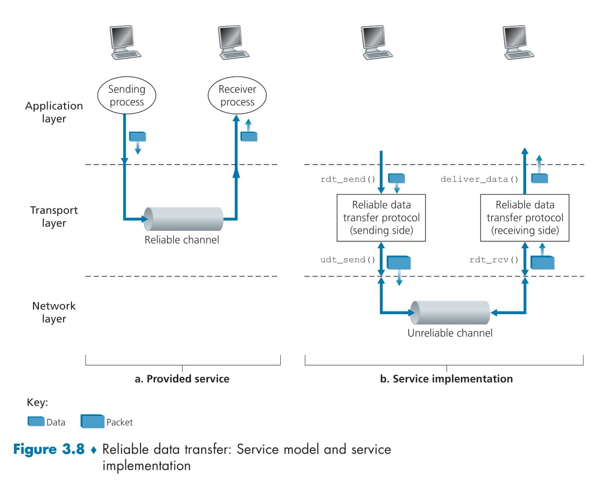
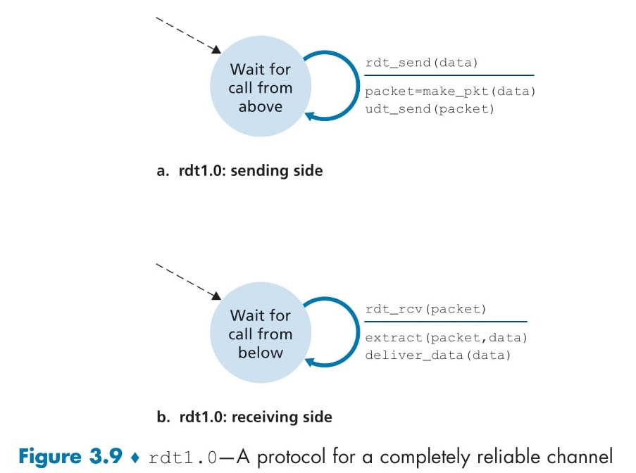

# **Understanding UDP Connectionless** 🥳

**UDP (User Datagram Protocol)** is the simplest way for applications to send messages over the Internet. Think of it like sending postcards—each one goes off on its own, with no guarantee it arrives, but there’s almost no delay in sending.


## 1. What UDP Does 📬

1. **Adds Port Numbers**

   * Every message gets a **source port** (who sent it) and a **destination port** (who should receive it).
   * This lets your computer talk to many programs at once.

2. **Minimal Error Check**

   * UDP header has a tiny checksum to catch corrupted data, but it won’t try to fix errors.

3. **No Handshakes**

   * Unlike TCP, UDP **does not** say “Hello, ready to talk?” before sending.
   * It just **blasts** your message off immediately.


## 2. Why “Connectionless”? 🔌✂️

* **No setup or teardown**: There’s no “three-way handshake” like TCP.
* **Stateless**: Your computer doesn’t keep track of who it’s talking to.

*Result:* Very fast startup, but no built-in guarantee that messages arrive or arrive in order.

## 3. When to Use UDP vs. TCP 🤔

| Feature                    | UDP                                  | TCP                                       |
| -------------------------- | ------------------------------------ | ----------------------------------------- |
| **Speed / Delay**          | ✅ Very low delay                     | ❌ Slower (establishes connection)         |
| **Reliability**            | ❌ No automatic retransmission        | ✅ Retries lost packets, in-order delivery |
| **Overhead (Header Size)** | 🔹 8 bytes                           | 🔹 20 bytes + options                     |
| **Control**                | ✅ You decide any extra error control | ❌ TCP controls timing and rate            |

**Use UDP when:**

* You need the **fastest** possible delivery (e.g., live video, voice calls). 🎥📞
* You can tolerate **some lost packets** (a few missing frames won’t ruin a stream).
* You want to build your own custom retry or error-handling at the application level.

**Use TCP when:**

* Every byte matters (e.g., web pages, file downloads). 🌐📂
* You need guaranteed, in-order delivery and congestion control.


## 4. Real-World Examples 🌍

* **DNS Queries** 🧐

  * Quick “What is google.com?” lookups. If no reply, try again or ask another server.
* **Video Streaming & VoIP** 🎞️📱

  * Live video calls or online radio. Small glitches are OK; smooth flow is more important.
* **QUIC Protocol** 🚀

  * Google’s new transport for HTTP/3: runs over UDP but adds reliable delivery on top.


## 5. Pros & Cons of UDP 👍👎

### 👍 Advantages

* **Ultra-low startup delay**
* **Small header** = less overhead
* **Easier to handle many clients** (no per-connection state)

### 👎 Disadvantages

* **No built-in reliability**
* **No congestion control** (can overload networks if not careful)
* **Application must handle errors/retries** if needed

---

**A list of common Internet applications** and **which transport protocol** they typically use:

| **Application**            | **App-Layer Protocol** | **Transport Protocol** | **Why? (in simple terms)**                                                |
| -------------------------- | ---------------------- | ---------------------- | ------------------------------------------------------------------------- |
| **Electronic mail**        | SMTP                   | TCP                    | Mail must arrive intact and in order, so we use TCP’s reliability.        |
| **Remote terminal access** | Telnet                 | TCP                    | Interactive sessions (typing commands) need reliable delivery.            |
| **Secure remote access**   | SSH                    | TCP                    | Same as Telnet but encrypted—still needs all data reliably.               |
| **Web (HTTP/1-2)**         | HTTP                   | TCP                    | Web pages (text, images) must download fully and in order.                |
| **Web (HTTP/3)**           | HTTP/3                 | UDP                    | Newer HTTP runs over UDP (via QUIC) for faster connection setup.          |
| **File transfer**          | FTP                    | TCP                    | Whole files must arrive without missing bytes—use TCP.                    |
| **Remote file server**     | NFS                    | Typically UDP          | NFS can afford occasional retries and wants low overhead.                 |
| **Streaming multimedia**   | DASH                   | TCP                    | DASH is adaptive-bitrate streaming over HTTP/TCP (to simplify firewalls). |
| **Internet telephony**     | (proprietary)          | UDP or TCP             | Voice apps often choose UDP for low delay, but may fall back to TCP.      |
| **Network management**     | SNMP                   | Typically UDP          | Management queries need to work even under heavy network stress.          |
| **Name translation (DNS)** | DNS                    | Typically UDP          | Quick lookups—avoids TCP’s connection delay and overhead.                 |

---

### A bit more on **why TCP vs. UDP**:

* **TCP** = **Reliable & Ordered**

  * Guarantees every byte arrives and in the right order.
  * Good for email, file transfer, web pages—where you can’t tolerate missing data.

* **UDP** = **Fast & Lean**

  * No handshakes, minimal headers, no built-in retries.
  * Great for quick queries (DNS), real-time media (voice/video), and cases where your app will handle any lost packets.

---

# **UDP Segment Structure** 🚀

UDP’s simplicity comes from having a **tiny header** (just 8 bytes) and treating the rest as “payload” (your application data). Let’s break down every field, see how the **length** works, and walk through the **checksum** calculation with a clear example.

## 1. UDP Segment Layout 🗂️

```
  0        16       32 bits
  ┌────────────┬────────────┬────────────┬────────────┐
  │ Source Port│Dest. Port  │ Length     │ Checksum   │  ← 8 bytes = 4 fields × 2 bytes
  ├────────────┼────────────┼────────────┼────────────┤
  │                Application Data (payload)         │
  │                           …                        │
  └────────────────────────────────────────────────────┘
```

| Field           | Size (bytes) | Description                                                                                 |
| --------------- | ------------ | ------------------------------------------------------------------------------------------- |
| **Source Port** | 2            | Port number of the sender’s application process                                             |
| **Dest. Port**  | 2            | Port number of the receiver’s application process (used for demultiplexing)                 |
| **Length**      | 2            | Total size of UDP segment (header **+** data), in bytes                                     |
| **Checksum**    | 2            | 1’s-complement checksum over header, data, and parts of IP header → for **error detection** |

## 2. The **Length** Field 📏

* **Why**: Because UDP doesn’t pad to a fixed size, the receiver needs to know where the user data ends.

* **Value**:

  > `Length = 8 (bytes of header) + N (bytes of application data)`

* **Example**:
  If your application sends 100 bytes,
  `Length = 8 + 100 = 108` → this 108 is put in the Length field.

## 3. The **Checksum** Field ✅❌

### 3.1 Purpose

* Catches **bit errors** that may happen:

  * Over an unreliable link
  * In router memory
  * On any path where link-layer checks aren’t guaranteed

* Follows the **end-to-end principle**: even if lower layers check errors, UDP must still verify the data once it arrives.

### 3.2 How It’s Computed

1. **Form 16-bit words**:

   * Treat the entire UDP segment (header + data) as a sequence of 16-bit (2-byte) words.
   * If the data has an odd number of bytes, pad with one zero byte at the end.

2. **Sum the words** using a **1’s-complement addition**:

   * Add all 16-bit words.
   * **If there’s overflow** beyond 16 bits, “wrap around” (i.e., add the overflow back into the low-order bits).

3. **Take the 1’s-complement** of that sum:

   * Invert every bit (0→1, 1→0).
   * Store this 16-bit result in the Checksum field.

4. **At the receiver**:

   * Sum *all* 16-bit words **including** the checksum.
   * A correct segment yields a sum of all-ones: `0xFFFF` (i.e., no detected errors).

### 3.3 Step-by-Step Example

Suppose our UDP segment (header+data) yields **three 16-bit words**:

```
 Word 1: 0110 0110 0110 0000   (0x6660)
 Word 2: 0101 0101 0101 0101   (0x5555)
 Word 3: 1000 1111 0000 1100   (0x8F0C)
```

#### a) Sum Word 1 + Word 2

```
  0110 0110 0110 0000  (Word 1)
+ 0101 0101 0101 0101  (Word 2)
──────────────────────
  1011 1011 1011 0101  (Intermediate Sum)
```

#### b) Add Word 3

```
  1011 1011 1011 0101  (Intermediate)
+ 1000 1111 0000 1100  (Word 3)
──────────────────────
1 0100 1010 1100 0010  (Raw 17-bit result)
```

* **Overflow bit** (the leftmost `1`) “wraps around”—add it back into the low 16 bits:

```
  Low 16 bits:     0100 1010 1100 0010 
+ Overflow (0x0001) 0000 0000 0000 0001
─────────────────────────────────────────
  Final Sum:       0100 1010 1100 0011
```

#### c) Compute 1’s-Complement

Invert every bit of `0100 1010 1100 0011`:

```
  0100 1010 1100 0011  (Sum)
→ 1011 0101 0011 1100  (Checksum)
```

So the **Checksum field** = `0xB53C`.

## 4. What Happens on Error? 🛑

* **Receiver sums** all words (including checksum).
* If the result ≠ `0xFFFF`, **an error is detected**.

  * Some UDP stacks **discard** the bad segment silently.
  * Others **deliver** it to the application but set an error flag.

---

#  **Principles of Reliable Data Transfer** 🔒

When two programs (sender and receiver) communicate over an **unreliable channel** (where packets can be lost or corrupted), we need a **reliable data transfer (RDT) protocol** to make sure:

1. ✅ **No bits are corrupted**
2. 📦 **No packets are lost**
3. 🔢 **Packets arrive in order**

This is exactly what **TCP** does for your web browser, but the same ideas apply at the link layer, application layer, and elsewhere!

<div align="center">
  
</div>

## 🖼️ Fig. 3.8(a): **Service Model** (What the upper layer **expects**)

```text
Application
   │   rdt_send(data)
   ▼
Transport layer (RDT)
   │   deliver_data(data)
   ▼
Network (reliable!)
```

* **Provided service**: a **reliable channel**

  * You call `rdt_send()` to send data.
  * You receive data via `deliver_data()`—with **no errors**, **no losses**, and **in correct order**.
* **Magic**: the layer below looks like a perfect pipe!

## 🔧 Fig. 3.8(b): **Service Implementation** (How RDT is actually built)

```text
   Application                     Application
      │                                ▲
      │ rdt_send(data)                 │ deliver_data(data)
      ▼                                │
 ┌───────────────────┐       ┌───────────────────┐
 │ Reliable Data     │       │ Reliable Data     │
 │ Transfer Protocol │       │ Transfer Protocol │
 │   (sender side)   │       │ (receiver side)   │
 └───────────────────┘       └───────────────────┘
      │                                ▲
      │ udt_send(pkt)                  │ rdt_rcv(pkt)
      ▼                                │
 ┌───────────────────┐        ┌───────────────────┐
 │ Unreliable        │◀───────┤ Unreliable        │
 │ Channel           │        │ Channel           │
 └───────────────────┘        └───────────────────┘
```

1. **`rdt_send(data)`**

   * Called by your application to send a chunk of data.

2. **`udt_send(pkt)`**

   * The RDT sender wraps `data` into a **packet** (adds headers, checksums, sequence numbers) and calls `udt_send()`.
   * **`udt_send()`** hands the packet to the **unreliable channel** (packets may get lost or corrupted).

3. **Unreliable Channel**

   * Can **lose** packets entirely or **corrupt** their bits.
   * **Assumption**: does **not** reorder packets.

4. **`rdt_rcv(pkt)`**

   * When a packet arrives, the RDT receiver is invoked.
   * It checks for **corruption** (via checksum) and **sequence correctness**.

5. **`deliver_data(data)`**

   * If packet is good **and** in order, the RDT receiver extracts `data` and delivers it to the application.
   * Otherwise, it discards or asks for **retransmission** (via ACK/NACK).


## 🎯 Key Building Blocks

1. **Checksums** 🧾

   * Detect bit errors.
   * Sender computes checksum; receiver recomputes and compares.

2. **Sequence Numbers** 🔢

   * Tag each packet (e.g., 0, 1, 2, …) so the receiver can detect losses or duplicates.

3. **Acknowledgments (ACKs) & Retransmissions** ↩️

   * Receiver sends an **ACK** when it gets a good packet.
   * If sender doesn’t get ACK in time, it **retransmits**.

4. **Timeouts** ⏲️

   * Sender starts a timer after sending.
   * If timer expires before ACK arrives, **re-send** the packet.

## 💡 Analogy: **Reliable Courier Service**

| Concept              | Courier Analogy                            |
| -------------------- | ------------------------------------------ |
| Packet               | A sealed envelope with a tracking number   |
| Checksum             | Tamper-evident seal                        |
| Sequence Number      | “Letter #5 of 10” label                    |
| ACK                  | Signed delivery receipt                    |
| Timeout & Retransmit | If no receipt arrives, resend the envelope |

A **reliable protocol** ensures **every letter** arrives **intact**, **in order**, or else gets **re-sent** until the receipt (ACK) is received.

---

#  **rdt1.0: Reliable Data Transfer over a **Perfectly Reliable** Channel** 📦

In **rdt1.0**, we assume the network below is **perfect**—no packets are ever lost or corrupted, and the receiver can always keep up with the sender. Because nothing can go wrong, the protocol is extremely simple!

<div align="center">
  
</div>

## 🏗️ Sender-Side FSM (Figure 3.9a)

```text
      ┌──────────────────────────────┐
      │ Wait for call from above    │  ←── initial state
      └──────────────────────────────┘
                  │
    rdt_send(data)│
                  ▼
      ┌──────────────────────────────┐
      │  Actions:                    │
      │ 1. packet = make_pkt(data)   │
      │ 2. udt_send(packet)          │
      │ 3. (no state change)         │
      └──────────────────────────────┘
                  │
                  └───loops back───▶
```

* **State**: “Waiting for data from the application.”
* **Event**: `rdt_send(data)`

  * Triggered when the application calls `rdt_send()` with new data.
* **Actions**:

  1. **Create a packet**: `packet = make_pkt(data)`
  2. **Send it**: `udt_send(packet)`
* **No feedback** or additional states—straight back to waiting for more data.

## 🏗️ Receiver-Side FSM (Figure 3.9b)

```text
      ┌──────────────────────────────┐
      │ Wait for packet from below  │  ←── initial state
      └──────────────────────────────┘
                  │
     rdt_rcv(packet)│
                  ▼
      ┌──────────────────────────────┐
      │  Actions:                    │
      │ 1. extract(packet, data)     │
      │ 2. deliver_data(data)        │
      │ 3. (no state change)         │
      └──────────────────────────────┘
                  │
                  └───loops back───▶
```

* **State**: “Waiting for a packet from the (perfect) channel.”
* **Event**: `rdt_rcv(packet)`

  * Triggered when `udt_send()`’s packet arrives intact.
* **Actions**:

  1. **Unpack data**: `extract(packet, data)`
  2. **Deliver up**: `deliver_data(data)` to the application.
* **No ACKs**, **no checksums**, **no sequence numbers**—just straight delivery.

## 🎯 Why rdt1.0 Is So Simple

1. **Perfect channel** ✅

   * **No losses** → no retransmissions needed.
   * **No corruptions** → no checksums or error detection.
2. **Infinite speed** ⚡

   * Receiver is assumed fast enough; no flow-control necessary.
3. **No feedback loop** 🔄

   * Since nothing can go wrong, the receiver never needs to tell the sender anything.

---