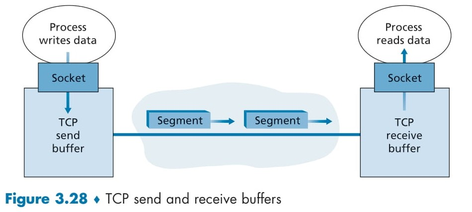
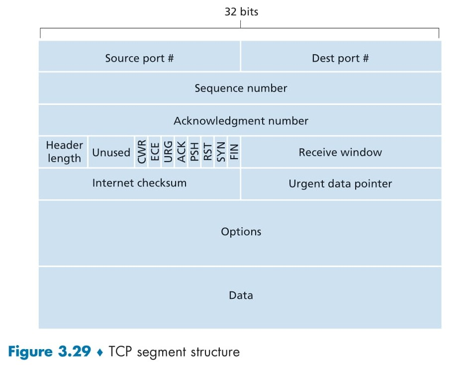
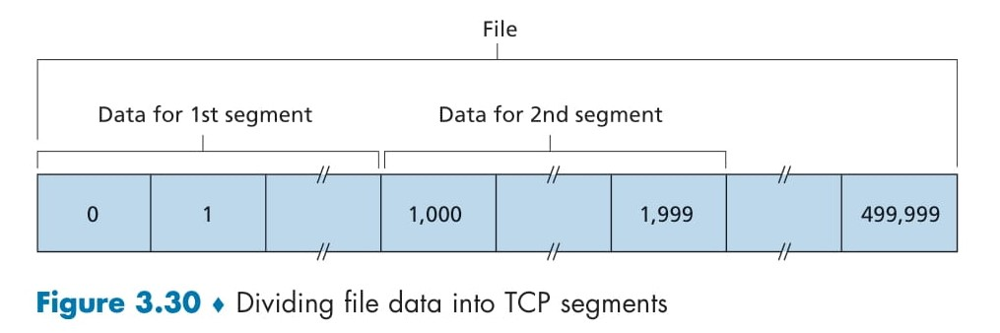
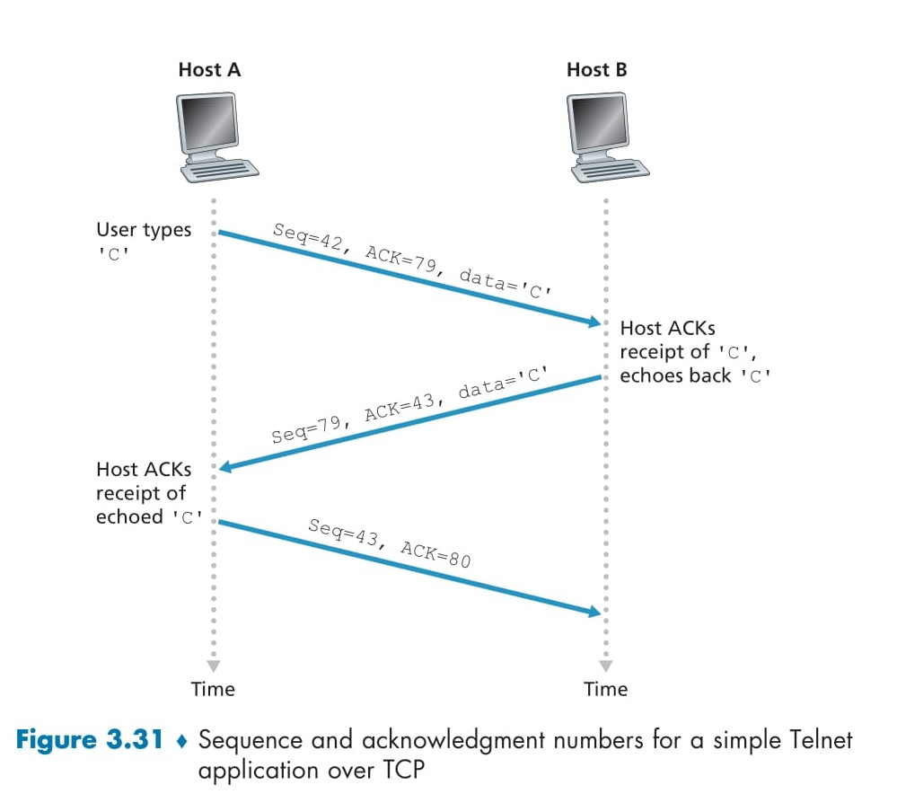

#  **TCP Connection Oriented** 🔗

Below is a step-by-step breakdown of **how TCP sets up a connection** and **manages data** once the connection is established. We’ll use **Figure 3.28** (TCP send/receive buffers) to guide our explanation. 😊

## 1️⃣ TCP Is Connection-Oriented

* **Logical “Handshake”** 🤝

  * Before any data flows, the two endpoints perform a **three-way handshake**:

    1. **SYN** from client → server
    2. **SYN+ACK** from server → client
    3. **ACK** from client → server
  * This sets up shared **state variables** (e.g., initial sequence numbers, buffer sizes).

* **Full-Duplex Service** ↔️

  * Data can flow simultaneously **both ways** (client→server and server→client).
  * Each direction has **its own buffers** and sequence numbering.

* **End-to-End Only** 🌐

  * **Routers** and **switches** in the middle are **stateless** with respect to TCP.
  * They simply forward IP packets; they don’t know about the TCP connection.

## 2️⃣ Figure 3.28: TCP Send & Receive Buffers

<div align="center">
  
</div>

### 🔹 **Send Buffer** (Left Side)

1. **Application** writes a stream of bytes into the **socket**.
2. **TCP** in the sender **queues** that data in its **send buffer**.
3. TCP chops the buffer into **segments** (up to the **MSS**) and sends each segment into the network.

   * **MSS (Maximum Segment Size)** = typically \~1460 bytes on Ethernet.
4. **Un-ACKed segments** stay in the buffer in case they need **retransmission** (due to loss or corruption).

### 🔹 **Receive Buffer** (Right Side)

1. As each **segment** arrives, TCP checks:

   * **Checksum** (for bit errors)
   * **Sequence number** (for ordering/duplicates)
2. **Valid data** is placed in the **receive buffer** (even if some segments arrive out-of-order).
3. **Application** reads from the buffer via the socket, consuming the in-order byte stream.

## 3️⃣ Socket & Buffer Roles

| Component          | Role                                                         |
| ------------------ | ------------------------------------------------------------ |
| **Socket**         | The “door” between application and TCP layer.                |
| **Send Buffer**    | Holds application data **waiting** to be sent or ACKed.      |
| **Receive Buffer** | Holds received data **waiting** for the application to read. |

✨ **Why buffers matter**:

* **Flow control**: TCP advertises how much receive-buffer space remains, so the sender won’t overflow the receiver.
* **Retransmission**: Old data must be kept until the sender receives an ACK.
* **Reordering**: Receiver may buffer out-of-order segments until missing ones arrive.


## 4️⃣ Putting It All Together

1. **Connection Establishment**

   * Three-way handshake sets up initial sequence numbers and buffer sizes.

2. **Data Transfer**

   * **Application** → socket → **send buffer** → segmented → network → segmented → **receive buffer** → socket → **application**.
   * TCP ensures **reliability** (retransmit lost packets), **ordering**, and **flow control** (never overwhelm the receiver).

3. **Connection Teardown**

   * Four-way handshake (FIN/ACK) to **gracefully close** each direction.

---

# 🚢 **TCP Segment Structure & Sequence Numbers**

## 📑 Figure 3.29: TCP Segment Header Fields

<div align="center">
  
</div>

* **Source & Destination Ports**: Identify which application on each host.
* **Sequence Number** (32 bits) 📏: Number of the first data byte in this segment.
* **Acknowledgment Number** (32 bits) ✔️: Next byte the opposite side is expecting.
* **Flags** (6 bits):

  * **SYN/FIN**: for opening/closing connections
  * **ACK**: “this segment carries a valid ack number”
  * **PSH**: “push data up immediately” (rarely used)
  * **URG**: “urgent data” (rarely used)
  * **CWR/ECE**: for congestion signals
* **Window** (16 bits) 🚦: How many bytes beyond the ack number the receiver can accept.
* **Checksum** (16 bits) 🔍: Protects header+data from bit errors.
* **Urgent Pointer** (16 bits) ⚡: End of urgent data, if URG flag is set.
* **Options** (0–40 bytes) ⚙️: Negotiations—MSS, timestamps, large windows, etc.
* **Data**: Up to **MSS** bytes of application payload.

## 📂 Figure 3.30: Breaking a File into Segments

<div align="center">
  
</div>

Imagine sending a **500 000-byte file** with an MSS of **1 000 bytes**:

```
File bytes:   [0……999][1000……1999] … [499 000……499 999]
Segment #    Seq=0      Seq=1000        Seq=499000
```

* **Segment 1** carries bytes **0–999**, so its **Sequence Number = 0**.
* **Segment 2** carries bytes **1000–1999**, so **Seq = 1000**.
* … continuing until the end of the file.

✨ **TCP numbers every **byte**, not every segment**. The sequence number points to the **first byte** in that segment.

## 🔄 Figure 3.31: Sequence & Acknowledgment in Telnet

<div align="center">
  
</div>

A simple **Telnet** example—typing a single character “C”:

| Step | From → To | Seq # | ACK # | Data         | Meaning                                                                               |
| :--: | :-------- | :---- | :---- | :----------- | :------------------------------------------------------------------------------------ |
|   1  | A → B     | 42    | 79    | “C” (1 byte) | Client sends “C” (first byte = #42). Client is still waiting for server byte #79.     |
|   2  | B → A     | 79    | 43    | “C” (1 byte) | Server ACKs up to byte #42 → **ACK=43**, and echoes back “C” (its byte #79).          |
|   3  | A → B     | 43    | 80    | (none)       | Client ACKs up to server’s #79 → **ACK=80**. No data to send, so data field is empty. |

* **ACK Number = next byte expected**

  * After receiving “C” (#42), server expects **byte 43** → ACK=43.
  * After client receives echo “C” (#79), client expects **byte 80** → ACK=80.
* **Piggybacking**

  * ACKs often travel inside data segments (step 2).
* **No data?**

  * Pure ACKs still carry sequence numbers (step 3) even with an empty data field.

---

#  **TCP Round-Trip Time Estimation & Retransmission Timeout** ⏱️

TCP uses a **timeout & retransmit** mechanism (like our rdt3.0) to recover from lost segments or ACKs. Choosing the **right timeout** is critical: too short ⇒ needless retransmits; too long ⇒ slow recovery. TCP dynamically estimates the network **Round-Trip Time (RTT)** and its **variation**, then sets the timeout accordingly. Let’s dive in! 🚀

## 1️⃣ Measuring SampleRTT

* **SampleRTT** = time between **sending** a segment and **receiving** its ACK.
* **One-at-a-time**: TCP measures SampleRTT for **one outstanding** segment at a time (to avoid ambiguity).
* **No retransmits**: Only measure for segments sent **once** (ignore retransmitted ones).


## 2️⃣ Computing EstimatedRTT (Smoothed RTT)

Because SampleRTT fluctuates (network queueing, router load, etc.), TCP computes an **exponential weighted moving average** (EWMA):

$$
\text{EstimatedRTT} \;=\; (1 - \alpha)\,\times \text{EstimatedRTT} \;+\; \alpha\,\times \text{SampleRTT}
$$

* **α (alpha)** = 0.125 (1/8) is recommended.
* **Interpretation**: 12.5% weight on the **new** sample; 87.5% on the **old** estimate.
* **Effect**: Smooths out spikes while staying responsive to changes.

## 3️⃣ Measuring RTT Variation: DevRTT

To account for how wildly the RTT bounces around, TCP tracks the **mean deviation**:

$$
\text{DevRTT} \;=\; (1 - \beta)\,\times \text{DevRTT} \;+\; \beta\,\times \bigl|\text{SampleRTT} - \text{EstimatedRTT}\bigr|
$$

* **β (beta)** = 0.25 (1/4) is recommended.
* **Purpose**: When RTT fluctuates a lot, DevRTT grows large; when stable, DevRTT shrinks.


## 4️⃣ Selecting the Retransmission Timeout

With **EstimatedRTT** and **DevRTT**, set the timeout to give a margin for variation:

$$
\boxed{
\text{TimeoutInterval} \;=\; \text{EstimatedRTT} \;+\; 4 \times \text{DevRTT}
}
$$

* **Why +4·DevRTT?**

  * If RTT varies ±DevRTT, then 4·DevRTT covers most fluctuations (like ±2σ in statistics).
* **Initial value**: 1 second (until enough measurements exist).
* **Backoff on timeout**: If a timeout actually fires, **double** the TimeoutInterval (TCP’s exponential backoff) to avoid spamming retransmissions in a congested network.

## 5️⃣ Visualizing RTT & Timeout (Figure 3.32)

<div align="center">
  
</div>

* **Blue line**: raw **SampleRTT** measurements (each RTT measurement).
* **Black line**: smoothed **EstimatedRTT** tracking the trend.
* Notice how **EstimatedRTT** moves smoothly, ignoring brief spikes.


## 6️⃣ Putting It All Together

1. **Send** a new segment; **start** its timer using current TimeoutInterval.
2. When **ACK** arrives (and this segment wasn’t retransmitted):

   * Compute **SampleRTT**.
   * Update **EstimatedRTT** & **DevRTT**.
   * **Stop** the timer.
   * Recompute **TimeoutInterval**.
3. If **timer expires** before ACK:

   * **Retransmit** the segment.
   * **Double** the TimeoutInterval (exponential backoff).
   * **Restart** the timer.

✨ **Result**:

* **Adaptive**: Keeps timeouts just above actual RTT.
* **Robust**: Backoffs gracefully under severe congestion.
* **Efficient**: Minimizes unnecessary retransmissions while still recovering promptly from losses.

---
